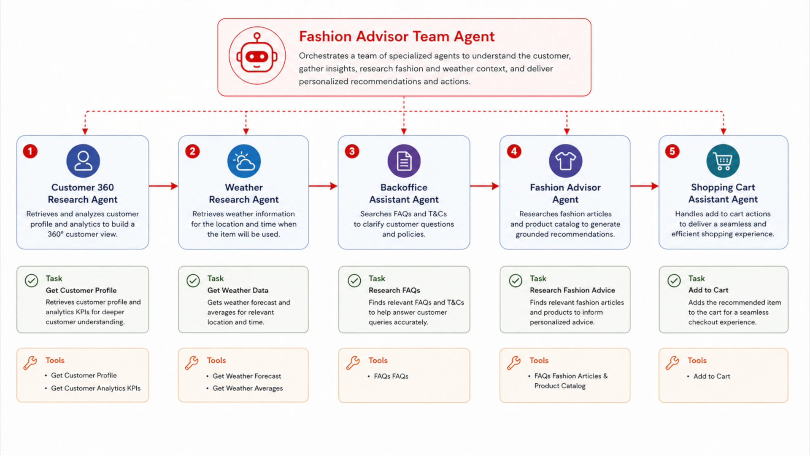
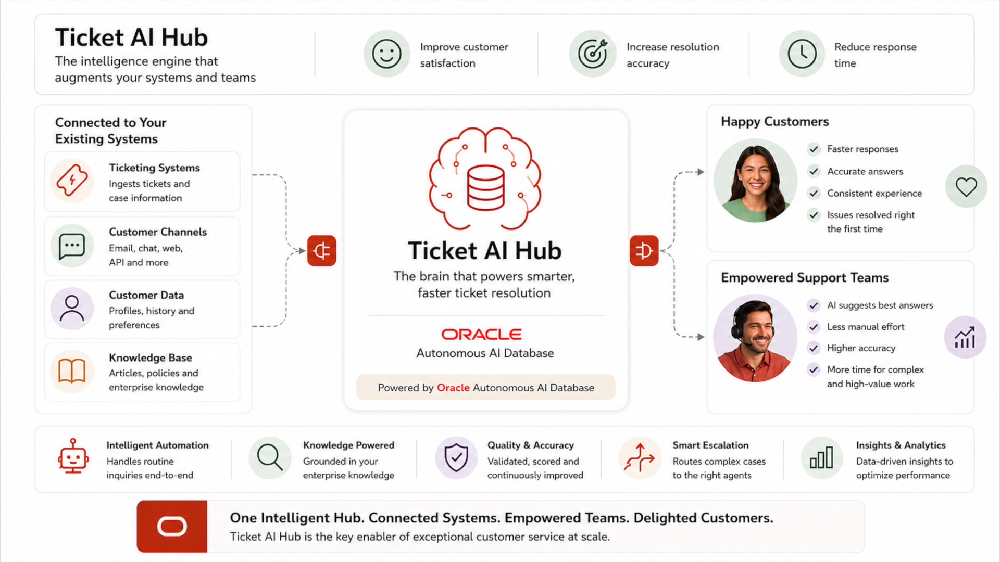

# Live AI Hub

- Live AI Hub is the practical way to take AI from concept to real business outcomes.
- It’s a pattern that brings AI to your data where it already lives, so you can use live, federated enterprise information across SaaS applications, databases, data lakes, catalogs, and content repositories. That’s what enables users and agents to talk to data and reason across data with the right governance in place.
- It makes sense because most organizations aren’t blocked by models they’re blocked by disconnected data, stale copies, and the complexity of moving and reshaping information. When AI runs on live data in place, you get more timely answers, better context, and higher trust, without waiting for a long data platform transformation.
- The benefits are very tangible: faster time-to-value with quick wins that can scale, better outcomes because the AI is grounded in current enterprise context, lower cost and risk by reducing replication and ETL sprawl, and production readiness with the controls enterprises need—security, resiliency, observability, and scalability.

### Retail Hub demo

### Ticket Hub demo

