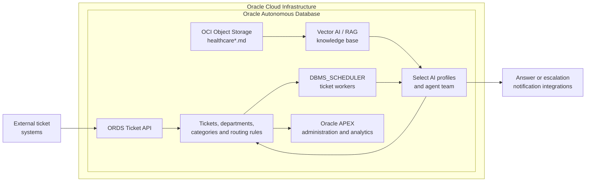

# Oracle Cloud Foundation Terraform Solution - Deploy Ticket-AI-Hub demo


## Table of Contents
1. [Overview](#overview)
1. [Deliverables](#deliverables)
1. [Architecture](#architecture)
1. [Executing Instructions](#instructions)
    1. [Prerequisites](#prerequisites)
    2. [Important](#important)
    3. [Deploy Using Oracle Resource Manager](#deploy-using-oracle-resource-manager)
    4. [Deploy Using the Terraform CLI](#deploy-using-the-terraform-cli)
        1. [Repository Files](#repository-files)
        2. [Autonomous Database](#autonomous-database)
        3. [AI and LLM Settings](#ai-and-llm-settings)
        4. [Object Storage](#object-storage)
        5. [Provisioner](#provisioner)
        6. [Running the Code](#running-the-code)
        7. [What to Do After Deployment](#what-to-do-after-deployment)
1. [Runtime Operations](#runtime-operations)
1. [Documentation](#documentation)
1. [The Team](#team)
1. [Feedback](#feedback)
1. [Known Issues](#known-issues)
1. [Contribute](./CONTRIBUTING.md)


## <a name="overview"></a>Overview

Ticket AI Hub is an Oracle Autonomous Database workload that receives support tickets through Oracle REST Data Services (ORDS), processes them asynchronously with an AI agent team, and returns an answer or escalation payload to external notification integrations. An Oracle APEX application provides administration, operational visibility, access control, and analytics.

The solution uses Oracle Autonomous Database as the execution and data platform for:

- ticket intake and lifecycle management
- department, category, routing-rule, prompt, threshold, and knowledge-base configuration
- Select AI profiles for natural-language-to-SQL, agent execution, attachment processing, judging, and retrieval-augmented generation
- scheduler-based workers that claim and process queued tickets
- semantic retrieval from documents stored in OCI Object Storage
- answer scoring, escalation routing, status history, and operational analytics
- ORDS endpoints and OAuth configuration
- an Oracle APEX administration and monitoring application

The Terraform deployment currently provisions and configures:

- one Oracle Autonomous Database through the reusable `adb` module
- one OCI Object Storage bucket through the reusable object-storage module
- the `TICKET_AIHUB` database schema and required grants
- the Ticket AI Hub data model and seed data
- Select AI profiles, credentials, vector index, runtime packages, jobs, ORDS modules, and OAuth client
- the APEX workspace, APEX user, application import, and application ACL role assignment


## <a name="deliverables"></a>Deliverables

This repository encloses the following deliverables:

- A Terraform reference implementation that provisions the required OCI resources.
- An Oracle Autonomous Database configured for the Ticket AI Hub workload.
- An OCI Object Storage bucket containing the Ticket AI Hub knowledge-base documents.
- SQL automation for:
  - administrator prerequisites and schema grants
  - the Ticket AI Hub relational data model
  - reference-data and ticket seed data
  - Select AI profiles and OCI credentials
  - Vector AI and RAG configuration
  - routing-rule embeddings
  - ticket-processing packages and scheduler workers
  - ORDS modules, handlers, OAuth roles, privileges, and client
  - runtime validation of compiled PL/SQL objects
- An Oracle APEX workspace and imported Ticket AI Hub application.
- Automated application access control that assigns the configured APEX user the required application role.
- Terraform outputs for database access and, when present in the root `outputs.tf`, APEX application access details.
- A working Ticket AI Hub demo that can:
  - accept support tickets
  - categorise and route them
  - retrieve knowledge-base context
  - generate and score answers
  - resolve eligible tickets automatically
  - escalate tickets that require human review
  - expose operational and analytical data in APEX


## <a name="architecture"></a>Architecture-Diagram

The following diagram shows the logical architecture deployed by this solution.



Terraform module mapping:

```text
module.adb
  └─ Oracle Autonomous Database

module.os
  └─ OCI Object Storage bucket

null_resource.upload_files_to_object_storage
  └─ Uploads local healthcare/ files to the configured bucket

module.provisioner
  ├─ Creates and configures TICKET_AIHUB
  ├─ Applies the data model and seed data
  ├─ Creates Select AI, Vector AI, ORDS, OAuth, and worker objects
  └─ Creates the APEX workspace, imports the application, and assigns ACL access
```


## <a name="instructions"></a>Executing Instructions

## <a name="prerequisites"></a>Prerequisites

The deployment workstation or OCI Resource Manager environment requires:

- Terraform installed and available in `PATH`
- OCI CLI installed and available as the `oci` command
- SQLcl installed and available as the `sql` command
- an OCI API signing key
- an OCI CLI configuration that can upload objects to the target bucket
- access to the Oracle Autonomous Database wallet generated by the database module
- a local `healthcare/` directory containing the RAG knowledge-base files
- permission and service limits to create:
  - Oracle Autonomous Database
  - OCI Object Storage buckets and objects
  - database users, credentials, jobs, ORDS objects, and APEX objects inside the Autonomous Database

The OCI identity used for deployment must be able to manage the required Autonomous Database and Object Storage resources in the selected compartment.

The database user used by the provisioner must also be allowed to call the OCI Generative AI and Object Storage services through the OCI credential created by the runtime SQL template.

If you do not have the required permissions or service limits, contact your tenancy administrator.

## <a name="important"></a>Important

### Model and region availability

The Terraform module defines separate model and region settings for:

- NL2SQL
- agent execution
- attachment processing
- judge/scoring
- RAG generation
- embeddings

Review the values in `modules/provisioner/variables.tf` before deployment. OCI Generative AI model availability varies by region, so each selected model must be available in its configured region.

Official reference:

- [OCI Generative AI Models by Region](https://docs.oracle.com/en-us/iaas/Content/generative-ai/model-endpoint-regions.htm#top)

### Knowledge-base upload order

The runtime creates a vector index that reads from the Object Storage location derived in `main.tf`. The knowledge-base files should therefore be uploaded before the runtime provisioner creates or refreshes the vector index.

The recommended Terraform dependency is:

```hcl
module "provisioner" {
  source = "./modules/provisioner"

  depends_on = [
    null_resource.upload_files_to_object_storage
  ]

  # Existing parameters remain unchanged.
}
```

This prevents the provisioner from running concurrently with the Object Storage upload.

### Demo credentials

The supplied `main.tf` currently passes demo database and APEX credentials directly to the provisioner. For shared, production, or source-controlled environments:

- replace hardcoded passwords with sensitive Terraform variables
- do not expose passwords through non-sensitive outputs
- store secrets in OCI Vault or another approved secret-management system
- rotate any credential that has appeared in Terraform or SQLcl logs

Example:

```hcl
ticket_aihub_password   = var.ticket_aihub_password
apex_builder_password   = var.apex_builder_password
```

### Destructive data-model deployment

The data-model script recreates database objects and is intended for a new or explicitly reset demo environment. Review the script before applying it to an environment that contains data that must be preserved.


# <a name="deploy-using-oracle-resource-manager"></a>Deploy Using Oracle Resource Manager

1. Click [](https://cloud.oracle.com/resourcemanager/stacks/create?region=home&zipUrl=https://github.com/oracle-devrel/terraform-oci-oracle-cloud-foundation/releases/download/v1.0.0/Ticket-AI-Hub-RM.zip)


If you aren't already signed in, when prompted, enter the tenancy and user credentials.

2. Review and accept the terms and conditions.
3. Select the region where you want to deploy the stack.
4. Follow the on-screen prompts and instructions to create the stack.
5. After creating the stack, click **Terraform Actions**, and select **Plan**.
6. Wait for the job to be completed, and review the plan.
    To make any changes, return to the Stack Details page, click **Edit Stack**, and make the required changes. Then, run the **Plan** action again.
7. If no further changes are necessary, return to the Stack Details page, click **Terraform Actions**, and select **Apply**.


# <a name="deploy-using-the-terraform-cli"></a>Deploy Using the Terraform CLI

## Clone the Module

```bash
git clone https://github.com/oracle-devrel/terraform-oci-oracle-cloud-foundation.git
cd terraform-oci-oracle-cloud-foundation/Live-AI-Hub/reusable-assets/Ticket-AI-Hub
ls
```

## Deployment

- Install Terraform.
- Install and configure OCI CLI.
- Install SQLcl.
- Generate an OCI API signing key and upload the public key to the OCI user.
- Set the tenancy, user, fingerprint, private-key path, compartment, and region values.
- Review the Autonomous Database, Object Storage, and Generative AI configuration.
- Run `terraform init`, `terraform plan`, and `terraform apply`.

### Prepare Terraform Provider Values

The root Terraform configuration uses the following OCI values:

| Variable | Purpose |
|---|---|
| `tenancy_ocid` | OCI tenancy OCID used by the provider and Object Storage module. |
| `user_ocid` | OCI user OCID used for Terraform and the database OCI credential. |
| `fingerprint` | Fingerprint of the OCI API signing public key. |
| `private_key_path` | Local path to the OCI API signing private key. |
| `region` | OCI deployment region and Object Storage endpoint region. |
| `compartment_id` | Compartment where the database and bucket are created. |

The `main.tf` file reads the private key with:

```hcl
oci_private_key_pem = file(var.private_key_path)
```

The local account running Terraform must therefore be able to read `private_key_path`.

### Derived local values in `main.tf`

| Local | Definition | Purpose |
|---|---|---|
| `adb_host` | `module.adb.database_fully_qualified_name` | ORDS/ADB hostname passed to the provisioner. |
| `conn_db` | `${lower(var.adw_db_name)}_tp` when `adw_db_name` is not empty | SQLcl service name used for database connections. |
| `oci_private_key_sql` | Private-key text normalised for SQL literals | Prepared OCI key content. The provisioner currently receives `file(var.private_key_path)` directly. |
| `rag_object_storage_location` | Object Storage URL ending in `/o/healthcare*.md` | Source pattern used to build the RAG vector index. |


## <a name="repository-files"></a>Repository Files

* **healthcare/** - Contains the Markdown knowledge-base documents uploaded recursively to OCI Object Storage.

* **images/** - Contains architecture or application images referenced by the documentation, when present.

* **modules/** - Contains the reusable Terraform modules and Ticket AI Hub provisioning assets.

* **modules/cloud-foundation-library/database/adb/** - Reusable Autonomous Database module invoked as `module.adb`.

* **modules/cloud-foundation-library/object-storage/** - Reusable Object Storage module invoked as `module.os`.

* **modules/provisioner/** - Contains the database, runtime, seed, ORDS, OAuth, and APEX automation.

### Files inside `modules/provisioner/`

#### SQL templates and SQL scripts

* **atp-ticket-aihub-v0.02-admin.sql.tftpl** - Administrator template that creates `TICKET_AIHUB`, grants database roles and package privileges, enables ORDS, and creates the network ACL required by the schema.

* **ticket_agent_data_model.sql** - Creates the Ticket AI Hub tables, constraints, indexes, triggers, duality views, operational views, and analytical views.

* **ticket_response_agent_seed_english.sql** - Populates reference data such as departments, categories, and routing rules.

* **tickets_seed_and_translate_english.sql** - Populates the demo ticket dataset used by APEX and the worker workload.

* **ticket_agent_runtime.sql.tftpl** - Creates the OCI credential, Select AI profiles, Vector AI/RAG configuration, embeddings, agent tools, worker packages, scheduler jobs, ticket APIs, ORDS handlers, OAuth objects, and runtime validation.

* **apex_workspace_setup.sql.tftpl** - Creates or configures the APEX workspace and APEX developer/application user.

* **apex_import_wrapper.sql.tftpl** - Sets the target workspace, schema, application ID, alias, and name before importing the APEX export.

* **apex_app_acl_setup.sql.tftpl** - Assigns the configured APEX user the required application Access Control role after import.

* **f101-ticket-ai-hub-2026-06-23-16-52.sql** - Oracle APEX application export imported by the wrapper. Update the filename in `provisioner.tf` when replacing the export.

#### Terraform files inside `modules/provisioner/`

* **variables.tf** - Declares all input variables and defaults required by the provisioner module.

* **outputs.tf** - Declares outputs exposed by the provisioner module, when required.

* **provisioner.tf** - Generates SQL templates and executes the database, seed, runtime, APEX, and ACL deployment sequence through SQLcl.

### Main repository files

* **CONTRIBUTING.md** - Contribution guidelines.

* **LICENSE** - Repository licence terms.

* **locals.tf** - Autonomous Database and Object Storage parameter maps used by the reusable modules.

* **main.tf** - Main Terraform orchestration for Autonomous Database, Object Storage, knowledge-base upload, and the provisioner module.

* **outputs.tf** - Root Terraform outputs, including database and APEX access details when configured.

* **provider.tf** - OCI Terraform provider configuration.

* **README.md** - Main Ticket AI Hub deployment documentation.

* **schema.yaml** - OCI Resource Manager schema, when provided.

* **variables.tf** - Root Terraform input variables.


## <a name="autonomous-database"></a>Autonomous Database

The solution invokes the reusable Autonomous Database module as follows:

```hcl
module "adb" {
  source     = "./modules/cloud-foundation-library/database/adb"
  adw_params = local.adw_params
}
```

The complete Autonomous Database configuration is defined by `local.adw_params`, normally built in `locals.tf` from the root variables.

Common parameters include:

| Parameter | Purpose |
|---|---|
| `adw_db_name` | Autonomous Database name. It is also used to derive the `_tp` SQL service name and wallet filename. |
| `adw_db_password` | ADMIN password used by the SQLcl administrator steps. |
| `adw_db_compute_model` | Autonomous Database compute model. |
| `adw_db_compute_count` | Amount of database compute. |
| `adw_db_size_in_tbs` | Allocated database storage. |
| `adw_db_workload` | Autonomous Database workload type. |
| `adw_db_version` | Oracle Database version selected for the Autonomous Database. |
| `adw_db_enable_auto_scaling` | Enables or disables compute auto scaling. |
| `adw_db_is_free_tier` | Controls Always Free deployment when supported. |
| `adw_db_license_model` | Database licence model. |
| `adw_db_data_safe_status` | Data Safe registration state. |
| `adw_db_operations_insights_status` | Operations Insights state. |
| `adw_db_database_management_status` | Database Management state. |

The root `main.tf` derives:

```hcl
conn_db = lower(var.adw_db_name) != "" ? "${lower(var.adw_db_name)}_tp" : ""
```

The provisioner uses that value for both ADMIN and `TICKET_AIHUB` SQLcl connections.


## <a name="ai-and-llm-settings"></a>AI and LLM Settings

The runtime module exposes separate settings for each Select AI workload.

### Select AI profile settings

| Variable | Purpose |
|---|---|
| `profile_nl2sql_name` | Name of the NL2SQL Select AI profile. |
| `profile_nl2sql_region` | OCI Generative AI region used by NL2SQL. |
| `profile_nl2sql_model` | Model used to translate natural language into SQL. |
| `profile_agent_name` | Name of the main agent profile. |
| `profile_agent_region` | OCI Generative AI region used for agent execution. |
| `profile_agent_model` | Model used by the ticket-response agent. |
| `profile_attachments_name` | Name of the attachment-processing profile. |
| `profile_attachments_region` | OCI Generative AI region used for attachments. |
| `profile_attachments_model` | Model used to analyse attachments. |
| `profile_judge_name` | Name of the answer-scoring profile. |
| `profile_judge_region` | OCI Generative AI region used for judging. |
| `profile_judge_model` | Model used to score generated answers. |
| `profile_rag_kb_name` | Name of the RAG knowledge-base profile. |
| `ai_max_tokens` | Maximum token setting used by the AI runtime where supported. |

### RAG and Vector AI settings

| Variable | Purpose |
|---|---|
| `rag_region` | OCI Generative AI region used for RAG. |
| `rag_vector_index_name` | Name of the database vector index. |
| `rag_embedding_model` | Embedding model used for the knowledge-base vectors. |
| `rag_model` | Model used to generate RAG responses. |
| `rag_object_storage_location` | Object Storage source URL passed from `main.tf`. |
| `rag_object_storage_credential` | Database credential used to read the bucket. |
| `rag_vector_dimension` | Vector dimension expected by the selected embedding model. |
| `rag_vector_distance_metric` | Distance metric, such as `cosine`. |
| `rag_chunk_overlap` | Number of overlapping characters or tokens between chunks, according to the database API. |
| `rag_chunk_size` | Document chunk size used by the vector index. |
| `rag_refresh_rate_minutes` | Refresh interval for the RAG index. |
| `rag_match_limit` | Maximum number of matches returned for retrieval. |
| `rag_similarity_threshold` | Minimum similarity threshold used by retrieval. |

### Attachment settings

| Variable | Purpose |
|---|---|
| `attachment_object_storage_credential` | Credential used to access attachment objects. |
| `attachment_genai_credential` | OCI Generative AI credential used for attachment processing. |
| `attachment_genai_region` | Generative AI region for attachment processing. |
| `attachment_genai_compartment_ocid` | Compartment passed from `var.compartment_id`. |
| `attachment_max_bytes` | Maximum supported attachment size. |
| `attachment_genai_max_tokens` | Maximum generated tokens for attachment analysis. |

Review all current defaults in `modules/provisioner/variables.tf` and verify that the configured models are available in their configured regions before deployment.


## <a name="object-storage"></a>Object Storage

The solution invokes the reusable Object Storage module as follows:

```hcl
module "os" {
  source       = "./modules/cloud-foundation-library/object-storage"
  depends_on   = [module.adb]
  tenancy_ocid = var.tenancy_ocid

  bucket_params = {
    for k, v in local.bucket_params : k => v if v.compartment_id != ""
  }
}
```

The bucket configuration is built from `local.bucket_params`. The primary root variable used by `main.tf` is:

| Variable | Purpose |
|---|---|
| `files_bucket_name` | Name of the bucket receiving the Ticket AI Hub knowledge-base files. |

The Object Storage namespace is read dynamically:

```hcl
data "oci_objectstorage_namespace" "this" {
  compartment_id = var.compartment_id
}
```

### Knowledge-base upload

The `upload_files_to_object_storage` resource:

- waits for `module.os`
- uses `${path.root}/healthcare` as the local source directory
- obtains the Object Storage namespace dynamically
- uploads every file recursively
- preserves the relative file path as the Object Storage object name
- overwrites an object when it already exists because `--force` is enabled

The upload command is:

```hcl
oci os object put \
  -ns "$NAMESPACE" \
  -bn "$BUCKET" \
  --force \
  --name "$obj_name" \
  --file "$f"
```

The local OCI CLI configuration must be authorised to write to the selected bucket.

Although every file under `healthcare/` is uploaded, the current RAG URL matches only object names compatible with:

```text
healthcare*.md
```

Name knowledge-base files accordingly or update the `rag_object_storage_location` pattern.


# <a name="provisioner"></a>Provisioner

The provisioner module receives the following parameters from the root `main.tf`.

## Database and SQLcl parameters

| Parameter | Value in `main.tf` | Purpose |
|---|---|---|
| `db_name` | `var.adw_db_name` | Used to locate the database wallet. |
| `db_password` | `var.adw_db_password` | ADMIN password for administrator SQL scripts. |
| `conn_db` | `local.conn_db` | SQL service alias, derived as `<database-name>_tp`. |
| `wallet_zip_path` | `"wallet_${var.adw_db_name}.zip"` | SQLcl cloud-config wallet path. |
| `adb_host` | `local.adb_host` | Database/ORDS host used by the administrator ACL setup. |
| `ticket_aihub_password` | Demo value in `main.tf` | Password for the `TICKET_AIHUB` database schema. Replace with a sensitive variable outside demo use. |

## OCI identity parameters

| Parameter | Value in `main.tf` | Purpose |
|---|---|---|
| `oci_user_ocid` | `var.user_ocid` | OCI user used by the database OCI credential. |
| `oci_tenancy_ocid` | `var.tenancy_ocid` | OCI tenancy used by the database OCI credential. |
| `oci_fingerprint` | `var.fingerprint` | OCI API signing-key fingerprint. |
| `oci_private_key_pem` | `file(var.private_key_path)` | OCI API private key passed to the SQL template. |
| `oci_compartment_ocid` | `var.compartment_id` | Compartment used by OCI Generative AI and related operations. |

## ORDS, RAG, and attachment parameters

| Parameter | Value in `main.tf` | Purpose |
|---|---|---|
| `adb_ords_host` | `local.adb_host` | ORDS hostname used by runtime APIs and callbacks. |
| `rag_object_storage_location` | `local.rag_object_storage_location` | Object Storage URL used to create the vector index. |
| `attachment_genai_compartment_ocid` | `var.compartment_id` | Compartment used for Generative AI attachment analysis. |

Additional ORDS values such as schema path, module name, base path, handler paths, OAuth names, notification settings, SMTP settings, and retry settings are defined by defaults in `modules/provisioner/variables.tf` unless explicitly overridden by the root module.

## APEX parameters

| Parameter | Value in `main.tf` | Purpose |
|---|---|---|
| `apex_workspace_name` | `TICKET_AIHUB_WS` | APEX workspace created or selected by the deployment. |
| `apex_workspace_id` | `101010101` | Fixed workspace ID used by the setup script. |
| `apex_db_schema` | `TICKET_AIHUB` | Database schema mapped to the workspace. |
| `apex_builder_username` | `TICKET_AIHUB` | APEX developer and application user. |
| `apex_builder_password` | Demo value in `main.tf` | APEX password. Replace with a sensitive variable outside demo use. |
| `apex_app_id` | `101` | Target APEX application ID. |
| `apex_app_alias` | `TICKET-AI-HUB` | APEX application alias used in the friendly URL. |
| `apex_app_name` | `Ticket AI Hub` | Application display name. |

The APEX ACL script runs after the application import and grants the configured user the application role required by the `Reader Rights` authorisation scheme.

## Provisioning order

The provisioner should execute in this order:

1. `sqlcl_ticket_aihub_admin`
2. `sqlcl_ticket_agent_data_model`
3. `sqlcl_ticket_reference_data_seed`
4. `sqlcl_tickets_seed`
5. `sqlcl_ticket_agent_runtime`
6. `sqlcl_apex_workspace_setup`
7. `sqlcl_ticket_aihub_apex_app`
8. `sqlcl_apex_app_acl_setup`

The runtime template validates compiled procedures, functions, packages, package bodies, and triggers. The Terraform deployment stops if the runtime leaves invalid PL/SQL objects.


## <a name="running-the-code"></a>Running the Code

```bash
# Initialise Terraform and download providers/modules.
terraform init

# Review the proposed changes.
terraform plan

# Create the infrastructure and configure Ticket AI Hub.
terraform apply

# Display the deployment outputs.
terraform output
```

To destroy the deployment:

```bash
./cleanup_buckets.sh && terraform destroy --auto-approve
```

Empty the Object Storage bucket, including object versions where applicable, before destroying the bucket if the provider cannot delete a non-empty bucket.


## <a name="what-to-do-after-deployment"></a>What to Do After Deployment

### Open the APEX application

The direct APEX application URL follows this pattern:

```text
https://<ADB_ORDS_HOST>/ords/r/ticket_aihub_ws/ticket-ai-hub/home
```

Use:

```text
Workspace: TICKET_AIHUB_WS
Username:  TICKET_AIHUB
Password:  the configured apex_builder_password
```

The Terraform root `outputs.tf` should expose values such as:

```text
apex_base_url
apex_app_url
apex_workspace
apex_username
apex_password
apex_login_instructions
database_actions_url
```

Avoid publishing `apex_password` as a non-sensitive output in shared or production environments.

### Verify the database deployment

Connect as `TICKET_AIHUB` and run:

```sql
SELECT object_name,
       object_type,
       status
FROM user_objects
WHERE status = 'INVALID'
ORDER BY object_type, object_name;

SELECT name,
       type,
       line,
       position,
       text
FROM user_errors
ORDER BY name, type, sequence;
```

Both queries should return no invalid objects or compilation errors.

### Verify seed data

```sql
SELECT COUNT(*) AS departments_count FROM departments;
SELECT COUNT(*) AS categories_count FROM categories;
SELECT COUNT(*) AS routing_rules_count FROM routing_rules;
SELECT COUNT(*) AS tickets_count FROM tickets;

SELECT status,
       COUNT(*) AS ticket_count
FROM tickets
GROUP BY status
ORDER BY status;
```

### Verify RAG content

Confirm that:

- the target Object Storage bucket contains the uploaded Markdown files
- the object names match `healthcare*.md`
- the database OCI credential exists
- the Select AI profiles exist
- the vector index exists and is ready

### Verify APEX access

The configured APEX user should be added automatically to the application's Access Control list. The application should open without the `Reader Rights` access-denied error.


## <a name="runtime-operations"></a>Runtime Operations

Use the workload package instead of directly managing individual scheduler jobs.

### Start the workload

```sql
BEGIN
    tkt_ticket_workload.run_workload(
        p_worker_count             => 20,
        p_retry_cases              => 'AGENT_ERROR,RETRY_DISPATCH_ERROR,WORKER_CLAIM_EXPIRED',
        p_force_validation         => 'N',
        p_max_tickets              => 10,
        p_max_failed_resubmits     => 3,
        p_resubmit_repeat_interval => 'FREQ=MINUTELY;INTERVAL=15',
        p_resubmit_enabled         => 'Y',
        p_run_embedding_refresh    => 'N'
    );
END;
/
```

### Stop the workload gracefully

```sql
BEGIN
    tkt_ticket_workload.stop_workload(p_force => FALSE);
END;
/
```

`p_force => FALSE` allows active workflow executions to finish. New tickets can still be accepted while the workload is stopped and remain pending until processing restarts.

### Key runtime jobs

| Job | Purpose |
|---|---|
| `TKT_AGENT_WORKER_###` | Claims and processes eligible tickets. |
| `TKT_AGENT_WORKER_CLAIM_MONITOR` | Recovers expired claims when the owning worker is no longer running. |
| `TKT_AGENT_FAILED_RESUBMIT_MONITOR` | Resubmits eligible failed tickets within configured limits. |
| `REFRESH_ROUTING_RULE_EMBEDDINGS_JOB` | Refreshes embeddings used to shortlist routing rules. |

### Configuration locations

| Area | Primary location |
|---|---|
| Departments, categories, prompts, thresholds, routing rules, teams, and KB version | APEX administration pages and database tables. |
| Worker count and retry behaviour | `tkt_ticket_workload` parameters and `tkt_agent_config`. |
| Select AI profiles, models, regions, RAG, and attachment settings | `modules/provisioner/variables.tf` and the generated runtime SQL. |
| Knowledge-base documents | Local `healthcare/` directory and OCI Object Storage. |
| ORDS, OAuth, notification, Teams, Slack, and SMTP settings | Provisioner variables and runtime configuration. |

### Production notes

- Store OCI, Object Storage, ORDS, SMTP, OAuth, and notification credentials in OCI Vault or an approved enterprise secret manager.
- Update the department KB version whenever knowledge-base documents are added, updated, or removed.
- `receive_escalation`, `receive_answer`, `ESCALATIONS_HITL`, and `ANSWERS_DELIVERED` are demo or integration facilities and should be reviewed before production use.
- Teams, Slack, and email delivery are integration skeletons unless fully configured and tested.
- `sp_reset_ticket` and related reset utilities are test-only operations.
- Stop the workload gracefully before applying a planned runtime or configuration change.


## <a name="documentation"></a>Documentation

### Project documentation

- High-Level Design: `documentation/ticket-ai-hub-hld-v0.02.md`
- Low-Level Design: `documentation/ticket-ai-hub-lld-v0.02.md`
- End-User Manual: `documentation/ticket-ai-hub-end-user-manual-v0.02.md`
- Technical Operations Manual: `documentation/ticket-ai-hub-technical-operations-manual-v0.02.md`

### Oracle Cloud Infrastructure documentation

- [Autonomous Database Overview](https://docs.oracle.com/en-us/iaas/autonomous-database/index.html)
- [DBMS_CLOUD_AI Package](https://docs.oracle.com/en-us/iaas/autonomous-database-serverless/doc/dbms-cloud-ai-package.html)
- [Select AI Overview](https://docs.oracle.com/en-us/iaas/autonomous-database-serverless/doc/sql-generation-ai-autonomous.html)
- [Generative AI Models by Region](https://docs.oracle.com/en-us/iaas/Content/generative-ai/model-endpoint-regions.htm#top)
- [Object Storage Overview](https://docs.oracle.com/en-us/iaas/Content/Object/Concepts/objectstorageoverview.htm)
- [Oracle REST Data Services](https://docs.oracle.com/en/database/oracle/oracle-rest-data-services/)
- [Oracle APEX Documentation](https://docs.oracle.com/en/database/oracle/apex/)

### Terraform Registry documentation

- [Terraform Autonomous Database Resource](https://registry.terraform.io/providers/oracle/oci/latest/docs/resources/database_autonomous_database)
- [Terraform Object Storage Bucket Resource](https://registry.terraform.io/providers/oracle/oci/latest/docs/resources/objectstorage_bucket)


## <a name="team"></a>The Team

- **Owners**: [Panaitescu Ionel](https://github.com/ionelpanaitescu), [José Cruz](https://github.com/josecrcruz)


## <a name="feedback"></a>Feedback

We welcome your feedback. To post feedback, submit feature ideas, or report bugs, use the Issues section of this repository.


## <a name="known-issues"></a>Known Issues

**At the moment, there are no known issues**
