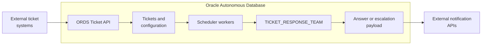

# Ticket AI Hub

Ticket AI Hub is an Oracle Autonomous Database workload that receives support tickets through ORDS, processes them asynchronously with an AI agent team, and sends answers or escalations to external notification APIs. An Oracle APEX application provides administration, operational visibility, and analytics.



## What It Does

- Accepts tickets through the ORDS Ticket API.
- Processes `RECEIVED` tickets with fixed `DBMS_SCHEDULER` workers.
- Validates, categorises, retrieves knowledge-base context, generates and scores answers, and routes escalations when required.
- Uses configurable departments, categories, routing rules, prompts, thresholds, and knowledge-base versions.
- Records workflow state, status history, scoring, and escalation information for operations and analytics.

## Repository Contents

| Area | Purpose |
|---|---|
| `code/ADB/` | Administrator prerequisites, data model, AI-agent workload, Select AI profiles, vector configuration, and ORDS endpoints. |
| `code/APEX/` | Oracle APEX application export. |
| `documentation/` | High-level design, low-level design, end-user manual, and technical operations manual. |

## Deployment Order

Apply releases in the following order:

1. Administrator prerequisite script.
2. Data-model script.
3. AI-agent workload and ORDS script.
4. APEX application export.
5. Verify compilation, ORDS, Select AI profiles, Vector AI/knowledge base, notification APIs, and scheduler jobs.

> **Warning:** Recreate JSON duality views when their underlying schema or tables change, then validate dependent middleware views and ORDS payloads.

## Start and Stop

Use the workload package rather than directly managing individual scheduler jobs.

```sql
BEGIN
    tkt_ticket_workload.run_workload(
        p_worker_count             => 20,
        p_retry_cases              => 'AGENT_ERROR,RETRY_DISPATCH_ERROR,WORKER_CLAIM_EXPIRED',
        p_force_validation         => 'N',
        p_max_tickets              => 10,
        p_max_failed_resubmits     => 3,
        p_resubmit_repeat_interval => 'FREQ=MINUTELY;INTERVAL=15',
        p_resubmit_enabled         => 'Y',
        p_run_embedding_refresh    => 'N'
    );
END;
/
```

Before a planned configuration or code change, stop gracefully so in-flight jobs are allowed to finish:

```sql
BEGIN
    tkt_ticket_workload.stop_workload(p_force => FALSE);
END;
/
```

`p_force => FALSE` avoids interrupting active workflow executions and reduces the risk of inconsistent ticket-processing data. The Ticket API can still accept new tickets while the workload is stopped; those tickets remain `RECEIVED` until processing restarts.

## Key Runtime Jobs

| Job | Purpose |
|---|---|
| `TKT_AGENT_WORKER_###` | Claims and processes `RECEIVED` tickets. |
| `TKT_AGENT_WORKER_CLAIM_MONITOR` | Recovers expired claims when the owning worker is not running. |
| `TKT_AGENT_FAILED_RESUBMIT_MONITOR` | Resubmits eligible failed tickets within configured bounds. |
| `REFRESH_ROUTING_RULE_EMBEDDINGS_JOB` | Maintains embeddings used to shortlist routing rules. |

## Configuration

| Area | Primary location |
|---|---|
| Categories, prompts, thresholds, routing rules, teams, and KB version | APEX administration pages. |
| Worker count, retry behaviour, Select AI profiles, RAG model, embedding model, and Vector AI settings | `tkt_agent_config` and the deployed workload configuration. |
| Knowledge-base documents | Approved OCI Object Storage source path. |
| API credentials and endpoints | OCI Vault or approved secret-management and integration configuration. |

The workload uses the Select AI profiles `select_ai_hub_agent`, `select_ai_hub_judge`, `select_ai_hub_attachments`, `select_ai_rag_kb`, and `select_ai_hub_nl2sql`. Model and region settings are defined by the corresponding `tkt_agent_config` constants.

## Production Notes

- Store OCI, Object Storage, ORDS, and notification credentials in OCI Vault or an approved enterprise secret manager. Never commit secrets.
- Update the department KB Version whenever documents are added, updated, or removed. Use a clear identifier such as `KB-YYYY-MM` or `KB-YYYY-MM-DD`.
- `receive_escalation`, `receive_answer`, `ESCALATIONS_HITL`, and `ANSWERS_DELIVERED` are demo/test facilities, not production delivery mechanisms.
- Teams, Slack, and email delivery are integration skeletons for future development; current production delivery uses the configured external notification APIs.
- `sp_reset_ticket` is a test-only utility and must never be used in production.

## Documentation

- High-Level Design: `documentation/ticket-ai-hub-hld-v0.02.md`
- Low-Level Design: `documentation/ticket-ai-hub-lld-v0.02.md`
- End-User Manual: `documentation/ticket-ai-hub-end-user-manual-v0.02.md`
- Technical Operations Manual: `documentation/ticket-ai-hub-technical-operations-manual-v0.02.md`

