# Ticket AI Hub - End User Manual

Author: José Cruz
Prepared: 2026-07-21  
Audience: end users, support operators, administrators, and operations managers  
Input sources: APEX application export (2026-07-09), workload code v0.02, data model v0.02, updated HLD/LLD, and supplied screenshots

## 1. About Ticket AI Hub

Ticket AI Hub is an application for managing AI-assisted customer support tickets. Incoming tickets are accepted through the ticket API, picked up asynchronously by fixed workers, then validated, categorised, optionally enriched with attachment context, answered from the knowledge base, scored, delivered, or escalated for review.

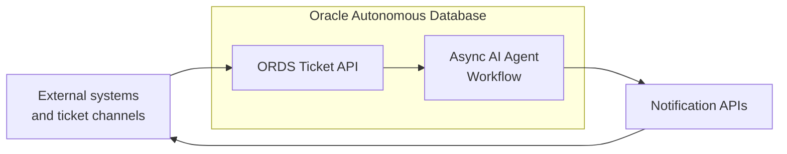
```mermaid
flowchart LR
    ext["External systems<br/>and ticket channels"] --> api
    subgraph adb["Oracle Autonomous Database"]
        api["ORDS Ticket API"]
        agent["Async AI Agent<br/>Workflow"]
        api --> agent
    end
    agent --> notify["Notification APIs"]
    notify --> ext
```

The application lets teams follow that lifecycle, review generated or suggested answers, manage escalations, and maintain the department, category, and routing policies that control automation. Regular approved answers and escalations are delivered through the configured external API. The Teams, Slack, and email options shown in configuration are future integration skeletons, not current production delivery channels.

The application is organized around four main areas:

| Area | What You Do There |
|---|---|
| Home | Review a quick dashboard of ticket activity and status. |
| Operations | Work with tickets, ticket details, attachments, escalations, accuracy scores, categorisation logs, status history, and test-only Ticket Playground actions. |
| Analytics | Measure throughput, answer quality, escalation rates, status timing, category performance, and KB quality. |
| Administration | Manage departments, categories, routing rules, and access control. |

## 2. Navigation Overview

Use the left navigation menu to move between the main areas. Most pages are reports or dashboards. Detail and form pages open when you select a record, create a new record, or drill into a report row. Use Ticket Detail as the normal starting point for an investigation; use Ticket Playground only for authorised demo or test work.

The next diagrams show the same navigation in smaller views so each area is easier to read.

This diagram shows the main page groups available from the application shell.

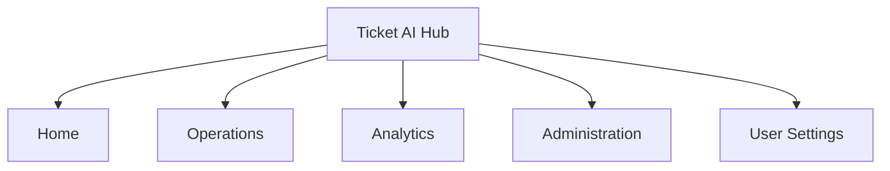
```mermaid
flowchart TD
    A["Ticket AI Hub"] --> H["Home"]
    A --> O["Operations"]
    A --> AN["Analytics"]
    A --> AD["Administration"]
    A --> U["User Settings"]
```

This diagram shows the operational pages used to find tickets, review ticket processing, work escalations, and inspect AI decisions.

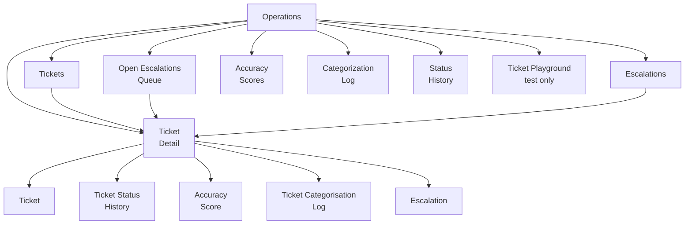
```mermaid
flowchart TD
    O["Operations"] --> T["Tickets"]
    O --> OE["Open Escalations<br/>Queue"]
    O --> TD["Ticket<br/>Detail"]
    O --> E["Escalations"]
    O --> AS["Accuracy<br/>Scores"]
    O --> CL["Categorization<br/>Log"]
    O --> SH["Status<br/>History"]
    O --> TP["Ticket Playground<br/>test only"]

    T --> TD
    OE --> TD
    E --> TD
    TD --> TF["Ticket"]
    TD --> TH["Ticket Status<br/>History"]
    TD --> ASF["Accuracy<br/>Score"]
    TD --> TCL["Ticket Categorisation<br/>Log"]
    TD --> EF["Escalation"]
```

This diagram shows the analytics pages used to measure ticket volume, automation, answer accuracy, routing outcomes, and knowledge-base quality.

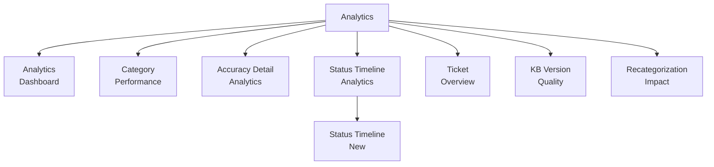
```mermaid
flowchart TD
    AN["Analytics"] --> DB["Analytics<br/>Dashboard"]
    AN --> CP["Category<br/>Performance"]
    AN --> ADA["Accuracy Detail<br/>Analytics"]
    AN --> STA["Status Timeline<br/>Analytics"]
    AN --> TO["Ticket<br/>Overview"]
    AN --> KB["KB Version<br/>Quality"]
    AN --> RI["Recategorization<br/>Impact"]
    STA --> STN["Status Timeline<br/>New"]
```

This diagram shows the administration pages used to configure the operating model and access control. Ticket Playground is shown with Operations because it is a test-only ticket workflow page.

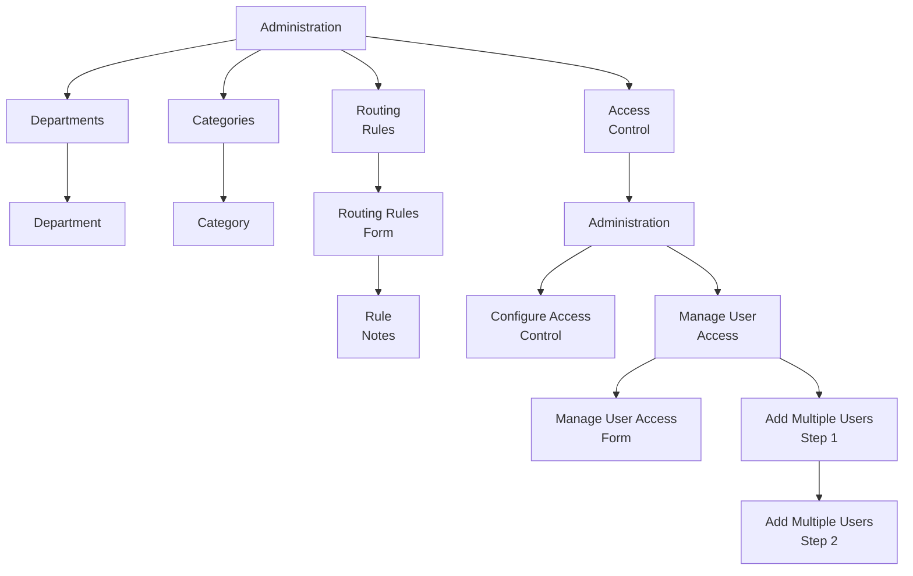
```mermaid
flowchart TD
    AD["Administration"] --> D["Departments"]
    AD --> C["Categories"]
    AD --> RR["Routing<br/>Rules"]
    AD --> AC["Access<br/>Control"]

    D --> DF["Department"]
    C --> CF["Category"]
    RR --> RRF["Routing Rules<br/>Form"]
    RRF --> RN["Rule<br/>Notes"]
    AC --> ADMIN["Administration"]
    ADMIN --> CAC["Configure Access<br/>Control"]
    ADMIN --> MUA["Manage User<br/>Access"]
    MUA --> MUAF["Manage User Access<br/>Form"]
    MUA --> AMU1["Add Multiple Users<br/>Step 1"]
    AMU1 --> AMU2["Add Multiple Users<br/>Step 2"]
```

The following table summarizes each page, who normally uses it, and when it is useful.

| Page | Persona | Purpose | How It Should Be Used |
|---|---|---|---|
| Global Page | All users | Provides the shared application shell and navigation. | Users do not open it directly; it defines the common header, menu, and visual layout. |
| Home | All users, operations manager | Gives a quick view of daily and overall ticket activity. | Start here to understand workload, automation, escalation, accuracy, and resolution trends. |
| Tickets | Support operator, reviewer, operations manager | Lists tickets with filters by source, department, status, and category. | Use it to find tickets, monitor progress, and open ticket details. |
| Ticket Detail | Support operator, reviewer, operations manager | Shows the full story of one ticket. | Use it to inspect the request, attachment-processing result, AI handling, answers, categorisation, status history, and escalation. |
| Ticket | Support operator, administrator | Shows or edits the core ticket record when permitted. | Use it only when a ticket needs direct record review or controlled update. |
| Ticket Status History | Support operator, operations manager | Shows one status transition for a ticket. | Use it to understand why a ticket moved from one status to another. |
| Accuracy Score | Reviewer, operations manager | Shows one AI answer scoring event. | Use it to understand whether an answer passed the required score and why. |
| Ticket Categorisation Log | Reviewer, administrator | Shows one category decision for a ticket. | Use it to understand how the AI selected or changed a ticket category. |
| Escalation | Reviewer, support operator | Shows one escalation record. | Use it to understand why a ticket was escalated and where it was sent. |
| Open Escalations Queue | Reviewer, support operator | Lists tickets waiting for human review or follow-up. | Use it as the main working queue for low-confidence answers and pending escalations. |
| Escalations | Support operator, operations manager | Lists escalation records across tickets. | Use it to monitor escalation volume, ownership, notification, and resolution. |
| Accuracy Scores | Reviewer, operations manager | Lists answer score records across tickets. | Use it to audit answer quality and identify failed score thresholds. |
| Categorization Log | Reviewer, administrator | Lists AI category decisions across tickets. | Use it to check category accuracy, overrides, and KB cluster matches. |
| Status History | Support operator, operations manager | Lists workflow transitions across tickets. | Use it to troubleshoot process movement and timing. |
| Analytics Dashboard | Operations manager, service owner | Shows ticket volume, automation, escalation, and accuracy trends. | Use it for daily and weekly performance review. |
| Category Performance | Operations manager, administrator | Shows performance by category. | Use it to identify categories with high escalation, low automation, or poor accuracy. |
| Accuracy Detail Analytics | Reviewer, operations manager | Provides deeper answer scoring analysis. | Use it to compare relevance, completeness, faithfulness, and composite scores. |
| Status Timeline Analytics | Operations manager | Shows how long tickets spend in each workflow stage. | Use it to find bottlenecks and unusual stage duration. |
| Ticket Overview | Operations manager, support operator | Provides a broad reporting view of tickets. | Use it for exports, cross-ticket analysis, and end-to-end ticket review. |
| KB Version Quality | Operations manager, knowledge owner | Measures answer quality by KB version. | Use it after KB updates to confirm whether answer quality improved. |
| Recategorization Impact | Operations manager, administrator | Shows how category changes affect outcomes. | Use it to see whether AI or human recategorisation improves automation and resolution. |
| Status Timeline New | Operations manager | Alternate status timeline report. | Use it for quick transition searches when enabled. |
| Departments | Administrator | Lists departments and escalation destinations. | Use it to create, edit, or review teams that own categories and escalations. |
| Department | Administrator | Creates or edits one department. | Use it to maintain department name, description, contact details, active flag, and KB version. |
| Categories | Administrator, knowledge owner | Lists categories and automation settings. | Use it to manage category ownership, thresholds, KB tags, and automation flags. |
| Category | Administrator, knowledge owner | Creates or edits one category. | Use it to define how the AI should answer, route, and score a ticket type. |
| Routing Rules | Administrator | Lists escalation routing rules. | Use it to manage the candidate rules used for semantic routing and policy-based team selection. |
| Routing Rules Form | Administrator | Creates or edits one routing rule. | Use it to configure the destination department, effective dates, notification destination, and routing notes. |
| Rule Notes | Administrator | Shows long routing instructions. | Use it to read the full notes for a selected routing rule. |
| Ticket Playground | Administrator, tester | Provides a controlled place to test ticket processing. | Use it in demo or test scenarios to inspect agent behavior. |
| Login Page | All users | Signs users into the application. | Use it at the start of a session. |
| Administration | Access administrator | Administration landing page for access-control tasks. | Use it to review access-control settings and open user-management pages. |
| Configure Access Control | Access administrator | Controls broad application access policy. | Use it when deciding whether access is restricted to listed users. |
| Manage User Access | Access administrator | Lists users and roles. | Use it to review, add, or update application access. |
| Manage User Access Form | Access administrator | Adds or edits one user role assignment. | Use it to grant or change access for a single user. |
| Add Multiple Users - Step 1 | Access administrator | Starts bulk user access setup. | Use it to enter users and select the role to apply. |
| Add Multiple Users - Step 2 | Access administrator | Confirms a bulk user access import. | Use it to review valid and invalid users before adding them. |
| Settings | All users | Opens personal user settings. | Use it to manage user-specific options. |
| Push Notifications | All users | Manages browser or app push notification subscription. | Use it to subscribe or unsubscribe from notifications when enabled. |

## 3. Personas and High-Level Workflows

This section summarises the people who use Ticket AI Hub and their high-level journeys. The tutorials that follow explain the page actions and fields in detail.

| Persona | Primary Goal | High-Level Application Interaction |
|---|---|---|
| Support operator | Find and investigate ticket work. | Uses Tickets and Ticket Detail to search for a ticket, inspect its processing history, attachments, AI output, scores, and escalation context. |
| Human reviewer | Handle tickets that need a person. | Uses Open Escalations Queue and Ticket Detail to review the request and AI context, save resolution notes, and resolve eligible IN_REVIEW tickets. |
| Operations manager | Monitor service health and outcomes. | Starts on Home, then uses the analytics pages to review volume, automation, escalations, quality, timing, and SLA trends. |
| Administrator | Maintain the ticket operating model. | Uses Departments, Categories, and Routing Rules to maintain ownership, valid automation policy, KB references, and routing criteria. |
| Knowledge owner | Improve answer quality and category fit. | Reviews KB Version Quality, Accuracy Detail Analytics, Category Performance, Categories, and Routing Rules to identify knowledge or policy improvements. |
| Access administrator | Control who can use the application. | Uses Administration and its access-control dialogs to review ACL settings and assign user roles. |
| Tester | Exercise non-production ticket workflows. | Uses Ticket Playground only in authorised test or demo environments to submit, resubmit, inspect, or reset test tickets. |

**Operational personas**

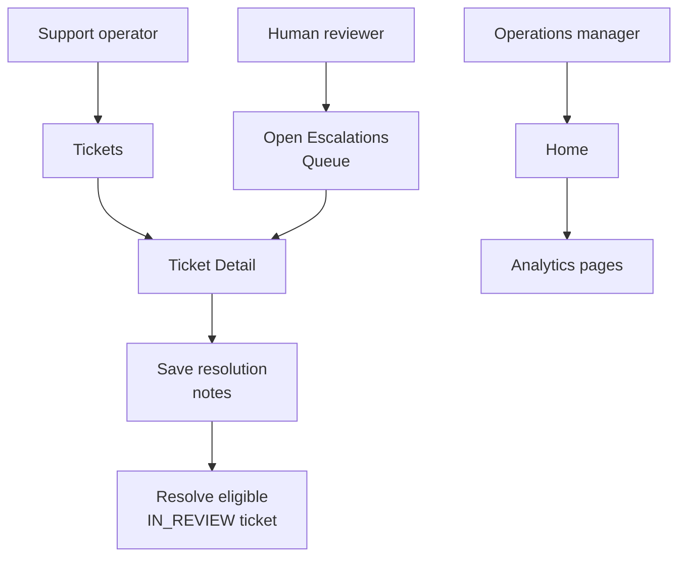
```mermaid
flowchart TD
    operator["Support operator"] --> tickets["Tickets"]
    tickets --> detail["Ticket Detail"]
    reviewer["Human reviewer"] --> queue["Open Escalations<br/>Queue"]
    queue --> detail
    detail --> notes["Save resolution<br/>notes"]
    notes --> resolve["Resolve eligible<br/>IN_REVIEW ticket"]
    manager["Operations manager"] --> home["Home"]
    home --> analytics["Analytics pages"]
```

**Governance and test personas**

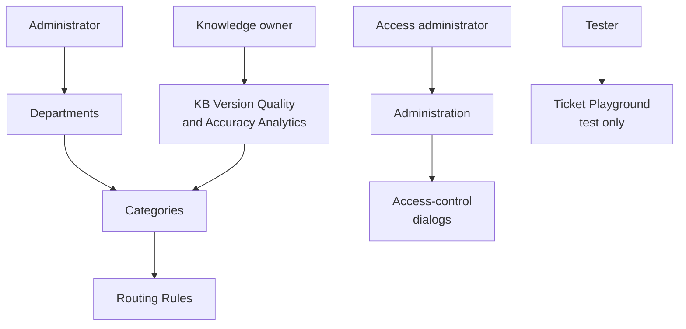
```mermaid
flowchart TD
    administrator["Administrator"] --> departments["Departments"]
    departments --> categories["Categories"]
    categories --> routing["Routing Rules"]
    knowledge["Knowledge owner"] --> quality["KB Version Quality<br/>and Accuracy Analytics"]
    quality --> categories
    access["Access administrator"] --> admin["Administration"]
    admin --> acl["Access-control<br/>dialogs"]
    tester["Tester"] --> playground["Ticket Playground<br/>test only"]
```

## 4. Tutorial: Admin Setup

This tutorial explains the normal setup order for an administrator. Use the **Page Reference** section after the tutorials as a field dictionary when you need to confirm what each department, category, routing, or access-control field does.

### 4.1 Create Departments

1. Open **Administration > Departments**.
2. Select **Create** or open an existing department.
3. Enter `Department Code`, `Department Name`, and `Description`.
4. Add the department escalation information required by the configured external API integration.
5. Set `KB Version` to the current knowledge-base version used by that department.
6. Set `Is Active` to `Y`.
7. Save the department.

### 4.2 Create Categories

1. Open **Administration > Categories**.
2. Create a new category or open an existing one.
3. Select the owning `Department`.
4. Enter `Category Code`, `Category Name`, and `Description`.
5. Enter a `KB Cluster Tag` that matches the knowledge topic for this category.
6. Set `Accuracy Threshold`; this controls how good the AI answer must be before automatic delivery.
7. Enter `Routing Rule Evaluation Logic` when the category can be escalated to more than one team. Write clear business criteria that distinguish the correct destination, such as the request type, customer situation, or mandatory routing condition. The workload uses this logic after it has shortlisted relevant routing rules from their notes; it scores the candidate rules with the category criteria and the rule priority boost to select the final route. Do not use it to repeat the category description or as free-form technical instructions.

A good evaluation prompt is a decision policy, not a restatement of the category description. It should:

- State which rule fields may be used as evidence, normally `rule_name` and `rule_notes`.
- Define the ticket facts to extract and the situations in which a fact may be inferred.
- Use explicit match states, such as `MATCHES`, `CONTRADICTS`, and `NOT_SPECIFIED`.
- Define non-negotiable exclusions, a transparent score, tie-breaks, and the required decision record.
- Use business terms that match the actual routing rules for this category; avoid generic or ambiguous criteria.

Example `Routing Rule Evaluation Logic` prompt:

> **Instruction:** Evaluate every candidate routing rule using only the explicit
> text in `rule_name` and `rule_notes`. Do not invent or assume information.
>
> **Goal:** Select the rule that best matches the customer's request.
>
> **1. Extract:** Identify the requested location, specialty or service, and
> clinician only when each is explicit. Infer a specialty only when there is one
> clear clinical association; otherwise use `NOT_SPECIFIED`. For clinician names,
> ignore titles, case, accents, punctuation, and repeated spaces, but require at
> least a first name and surname.
>
> **2. Classify:** For every rule and criterion, assign exactly one state:
> `MATCHES`, `CONTRADICTS`, or `NOT_SPECIFIED`. Never treat `NOT_SPECIFIED` as
> `MATCHES`. A clinician match does not prove a specialty, and location must not
> be inferred from a specialty or clinician.
>
> **3. Exclude:** Exclude a rule with a contradictory location whenever a
> location match exists. Exclude a contradictory specialty when another rule
> matches both the requested location and specialty. A generic label, such as
> "All Specialties", matches only when the rule explicitly includes the requested
> specialty.
>
> **4. Score:** Location `MATCHES` +60; specialty or service `MATCHES` +30;
> clinician `MATCHES` +10; clinician `CONTRADICTS` -10; specialty or service
> `CONTRADICTS` -30; `NOT_SPECIFIED` 0.
>
> **5. Select:** Choose the highest score. Break ties by location match, then
> specialty or service match, then clinician match, then the most specific rule.
>
> **Output:** For every rule, return the three criterion states, score, and a
> short evidence-based reason. Then identify the winning rule. If no rule clearly
> applies, use the category fallback destination.

8. Choose one of the valid automation policies below. All supported automated category flows require `Auto Route = Y`.

| `Auto Answer` | `Auto Route` | `Auto Answer Auto Route` | Result |
|---|---|---|---|
| `Y` | `Y` | `N` | Generate a KB-grounded answer. Deliver it when it passes the category threshold; otherwise route the ticket for escalation. |
| `N` | `Y` | `N` | Do not generate an AI answer. Route the ticket directly and close it after successful notification. |
| `Y` | `Y` | `Y` | Generate and score an answer, then route it regardless of the score. The escalation payload includes the generated answer. |

9. Do not use `Auto Route = N` for an automated category flow. Do not set `Auto Answer Auto Route = Y` unless both of the other flags are `Y`; the data model rejects that combination.
10. Set the category notification method and destination fields only for the external integration that is available in the environment. The current production delivery path is API; Teams, Slack, and email are retained as future integration placeholders.
11. Save the category.

### 4.3 Create Routing Rules

Routing rules define the possible destination teams for a category. Each rule should describe one concrete routing option: where it applies, what service it covers, and which team should receive the escalation. During routing, the workload uses `Rule Notes` to shortlist relevant rules, then applies the category's `Routing Rule Evaluation Logic` and the rule's `Priority Boost` to choose the winner.

Keep the two responsibilities separate:

- Put the destination-specific evidence in `Rule Name` and `Rule Notes`.
- Put shared comparison rules, exclusions, scoring, and tie-breaks in the category `Routing Rule Evaluation Logic`.
- Use the same evidence vocabulary in both places: location, specialty/service, and clinician when applicable.
- Do not use a generic rule such as "All Specialties" unless its notes explicitly state which specialties it covers.

1. Open **Administration > Routing Rules**.
2. Create a new rule.
3. Select the category and destination department/team.
4. Enter a clear `Rule Name`.
5. Add clear `Rule Notes` that describe the ticket characteristics and business criteria for the route. The workload uses the notes to shortlist candidate rules, then applies the category routing-evaluation logic and priority boost to select the final rule.

Example routing rule, aligned with the Section 4.2 evaluation logic:

> **Rule Name:** Lisbon Hospital - Cardiology - Dr. Ana Cruz
>
> **Destination Department:** Cardiology Appointments
>
> **Rule Notes:** Use this rule when the request explicitly concerns the Lisbon
> Hospital, a cardiology service, or an appointment with Dr. Ana Cruz. The
> clinician name must include both a first name and surname. Do not use this rule
> for another location or an explicitly different specialty.

6. Set `Priority Boost` only when it should influence the final selection between otherwise suitable rules. Enter an integer from `0` (minimum and default) to `10` (maximum and highest priority).
7. Add API destination overrides when this rule uses a different receiving team or configured API destination than the category.
8. Set `Effective From`, optional `Effective To`, and `Is Active`.
9. Save the rule.

### 4.4 Set Up Knowledge Base References

1. Use `KB Version` on the Department page to identify the knowledge release used by that department.
2. Update `KB Version` whenever the knowledge base changes: when documents are updated, added, or removed. Tickets retain the KB version used during processing, so a new value makes the KB Version Quality analysis more accurate and traceable.
3. Use a value that clearly identifies that a change occurred and when. Use at least the year and month, for example `KB-2026-07`; add the day when that level of granularity is needed, for example `KB-2026-07-21`.
4. Use `KB Cluster Tag` on the Category page to connect categories to relevant knowledge topics.
5. After a KB update, monitor **Analytics > KB Version Quality** to see whether answer quality improves or declines.
6. If quality drops, review category descriptions, KB cluster tags, and KB content with the knowledge owner.

Note: Uploading, indexing, and testing KB files is handled by a technical or knowledge operations owner outside the end-user APEX pages. The RAG and vector settings must be tested for the specific knowledge base and intended workload before a KB release is used for automated answers.

## 5. Tutorial: Monitor System Performance

Use this flow to understand how many tickets arrived, how they were processed, and how well the AI and KB are performing. Use the **Page Reference** section after the tutorials to learn what each chart, filter, and report column means.

1. Open **Home** for a quick visual summary.
2. Open **Analytics > Analytics Dashboard**.
3. Review:
   - `Tickets Received` to see incoming volume.
   - `Auto Answered` to see automated resolution.
   - `Escalated` to see human workload.
   - `Auto Answer Rate %` to measure automation success.
   - `Escalation Rate %` to measure how often tickets need human help.
   - `Avg Accuracy Score Trend` to monitor answer quality.
4. Open **Analytics > Category Performance** to identify categories with high escalation or low accuracy.
5. Open **Analytics > Accuracy Detail Analytics** to inspect detailed scores by model, status, or category.
6. Open **Analytics > KB Version Quality** after KB updates to compare score quality by KB version.
7. Open **Analytics > Recategorization Impact** to see whether category changes improve or hurt answer success.
8. Open **Analytics > Status Timeline Analytics** to find bottlenecks in validation, answering, scoring, or review.

Recommended monitoring questions:

| Question | Page to Use |
|---|---|
| How many tickets arrived today? | Analytics Dashboard, Ticket Overview. |
| How many were answered automatically? | Analytics Dashboard, Category Performance. |
| How many were escalated? | Analytics Dashboard, Open Escalations Queue. |
| Which categories are weak? | Category Performance, Accuracy Detail Analytics. |
| Did the latest KB improve answer quality? | KB Version Quality. |
| Where is the workflow slow? | Status Timeline Analytics. |

## 6. Tutorial: Check a Ticket and Understand What Happened

Use this flow when a user asks what happened to a specific ticket. Use the **Page Reference** section after the tutorials to interpret the fields on Tickets, Ticket Detail, Status History, Accuracy Scores, Categorisation Log, and Escalations.

1. Open **Operations > Tickets**.
2. Use the search box or filters to find the ticket by ticket ID, subject, status, category, source, or department.
3. Open the ticket detail.
4. Review the ticket summary:
   - Check `Status`.
   - Check `Category Name`.
   - Check `Generated Answer` or `Suggested Answer`.
   - Check `Accuracy Score`.
   - Check `Origin Ticket ID` if the request is related to a previous ticket.
5. Review **Ticket Attachments** to see whether any files were stored or processed.
6. Review **Ticket Status Histories** to see every step the ticket passed through.
7. Review **Categorisation Log** to see whether the AI changed the category.
8. Review **Accuracy Scores** to see whether the AI answer passed the category threshold.
9. Review **Escalations** to see whether the ticket was routed to a team.
10. If the ticket was resolved by a human, check `Resolution Notes` and resolved timestamps.
11. If the ticket is escalated or in review, open **Open Escalations Queue** to see current ownership.

Useful status meanings:

| Status | Meaning |
|---|---|
| `RECEIVED` | Ticket was created or requeued and is waiting for an eligible worker claim. |
| `QUEUED` | A scheduler worker or controlled submit action has claimed the ticket and is preparing the AI workflow. |
| `VALIDATING` | The AI is checking that the ticket body is coherent and suitable for processing. |
| `CATEGORIZING` | The AI is selecting and persisting the best active category and its policy. |
| `ANSWERING` | The AI is generating a KB-grounded answer, optionally using processed attachment context. |
| `SCORING` | The AI judge is evaluating relevance, completeness, faithfulness, and the composite quality score. |
| `ANSWERED` | A regular approved auto-answer is ready for, or is being sent through, the external answer-delivery API. |
| `ESCALATED` | The ticket requires routing, escalation notification, or human handling; this includes low-score, no-KB, route-only, and answer-and-route cases. |
| `IN_REVIEW` | The ticket is held for human review or manual routing. |
| `RESOLVED` | The ticket is closed after successful API delivery, route-only handling, or a completed manual resolution. |
| `FAILED` | Validation, agent processing, worker dispatch, or API notification failed. Review the latest status-history reason before an authorised retry; Ticket Playground resubmit is for demo/test use only. |

## 7. Tutorial: Work Tickets in Review

Use this flow when handling tickets in the **Open Escalations Queue**. Use the **Page Reference** section after the tutorials to confirm what each escalation, score, status, attachment, and resolution field means.

### 7.1 Find Pending Review Work

1. Open **Operations > Open Escalations Queue**.
2. Filter by `Escalation State`, `Priority`, `Notification Method`, or search text.
3. Prioritize high-priority tickets and oldest open escalations.
4. Open the ticket or escalation detail.

### 7.2 Review the AI Context

1. Read the original ticket `Subject` and `Body`.
2. Review the assigned `Category` and `Department`.
3. Check `Accuracy Score` and compare it with the category threshold.
4. Read the `Suggested Answer`, if available.
5. Review `Escalation Reason` and `Routing Rule Notes`.
6. Check attachments and processed attachment context if available. Attachment processing can be skipped by configuration, so the presence of a stored attachment does not always mean an AI attachment summary exists.

### 7.3 Provide a Manual Answer

Use one of these approaches:

| Approach | When to Use | What to Do |
|---|---|---|
| Start from suggested answer | AI answer is mostly correct but needs human adjustment. | Copy the suggested answer, edit it for accuracy and tone, then record the final response in `Resolution Notes`. |
| Write from scratch | AI answer is missing, low quality, or not appropriate. | Draft a new response using the ticket, KB, and team knowledge, then record it in `Resolution Notes`. |

### 7.4 Resolve the Ticket

1. Confirm the final customer response and handoff actions are complete through the approved operational process.
2. Save clear `Resolution Notes` on the ticket.
3. Use the Ticket Detail resolve action when the ticket is in `IN_REVIEW`. The action requires saved resolution notes and an existing escalation record.
4. The action notifies the configured escalation API. If that API call fails, the resolution is rolled back and the ticket remains open; correct the integration issue before trying again.
5. Confirm the status is `RESOLVED` and review status history to verify the resolution was recorded.

## 8. Page Reference

### 8.1 Global Page

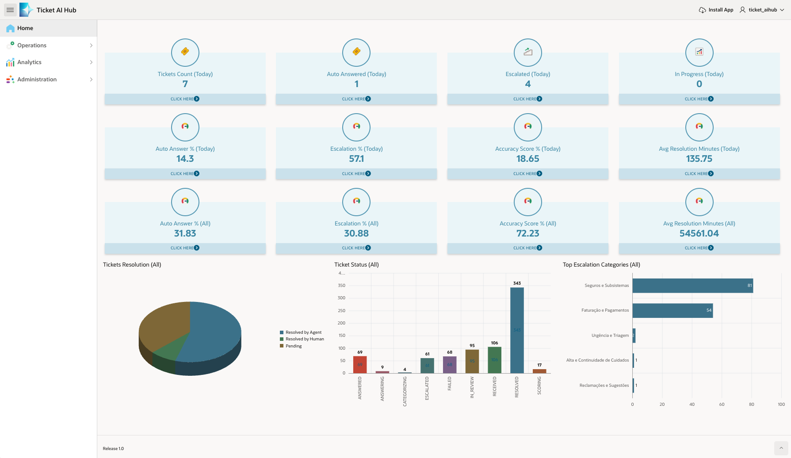

| Item | Description |
|---|---|
| Purpose | Provides the shared page shell, visual style, icons, and global layout used by all pages. |
| Contains | Header, left navigation, shared styling, application icon behavior. |
| When to use | Users do not open this page directly. It controls the common look and feel. |

| Field / Element | Used For |
|---|---|
| Header | Shows the application name and user/account controls. |
| Left navigation | Lets users move between Home, Operations, Analytics, and Administration. |
| Shared icons and styling | Makes page groups and navigation entries visually recognizable. |

### 8.2 Home

| Item | Description |
|---|---|
| Purpose | Provides a dashboard-style landing page for overall ticket activity. |
| Contains | Summary cards and charts for categories, resolution status, and ticket status. |
| When to use | Start here to get a quick operational view before drilling into reports. |

| Field / Element | Used For |
|---|---|
| Tickets Count (Today) | Shows how many tickets arrived today. |
| Auto Answered (Today) | Shows how many tickets were answered automatically today. |
| Escalated (Today) | Shows how many tickets were escalated today. |
| In Progress (Today) | Shows tickets still moving through the process today. |
| Auto Answer % | Shows the share of tickets answered automatically, for today or all time. |
| Escalation % | Shows the share of tickets sent to a human/team, for today or all time. |
| Accuracy Score % | Shows the average AI answer score, for today or all time. |
| Avg Resolution Minutes | Shows average time to resolution, for today or all time. |
| Tickets Resolution Chart | Splits tickets by resolved by agent, resolved by human, and pending. |
| Ticket Status Chart | Shows the number of tickets in each workflow status. |
| Top Escalation Categories | Shows which categories are generating the most escalations. |

### 8.3 Departments

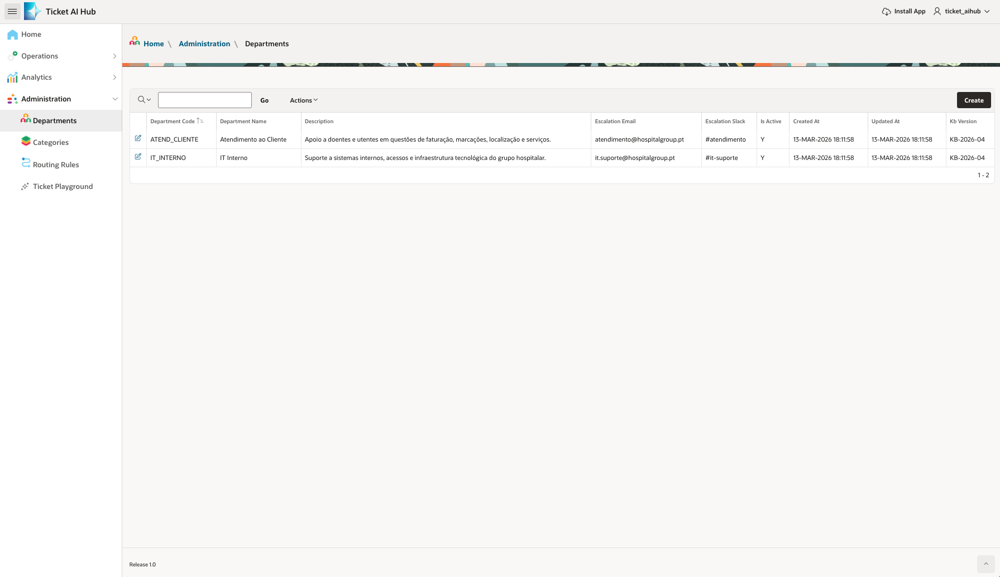

| Item | Description |
|---|---|
| Purpose | Lists the departments or teams that own categories and receive escalations. |
| Contains | Interactive report of department records. |
| When to use | Use this page to review existing departments or open a department form. |

| Field / Element | Used For |
|---|---|
| Department Code | Short unique code used to identify the department. |
| Department Name | Full display name of the department. |
| Description | Explains what the department handles. |
| Escalation Email | Future email-integration destination retained for later implementation. |
| Escalation Slack | Future Slack-integration destination retained for later implementation. |
| KB Version | Current knowledge-base version associated with the department. |
| Is Active | Shows whether the department is available for use. |

### 8.4 Department

| Item | Description |
|---|---|
| Purpose | Creates or edits one department. |
| Contains | Department form fields and save/cancel actions. |
| When to use | Use this page when setting up a new team or changing escalation details. |

| Field | Used For |
|---|---|
| KB Version | Stores the KB version currently used by this department. |
| Department ID | Internal identifier for the department. Usually read-only. |
| Department Code | Short unique code, such as a team or business unit code. |
| Department Name | Name displayed in reports and routing views. |
| Description | Human-readable description of the department responsibility. |
| Escalation Email | Future email-integration destination retained for later implementation. |
| Escalation Slack | Future Slack-integration destination retained for later implementation. |
| Is Active | Turns the department on or off for routing and reporting. |
| Created At | Shows when the record was created. |
| Updated At | Shows when the record was last changed. |

### 8.5 Categories

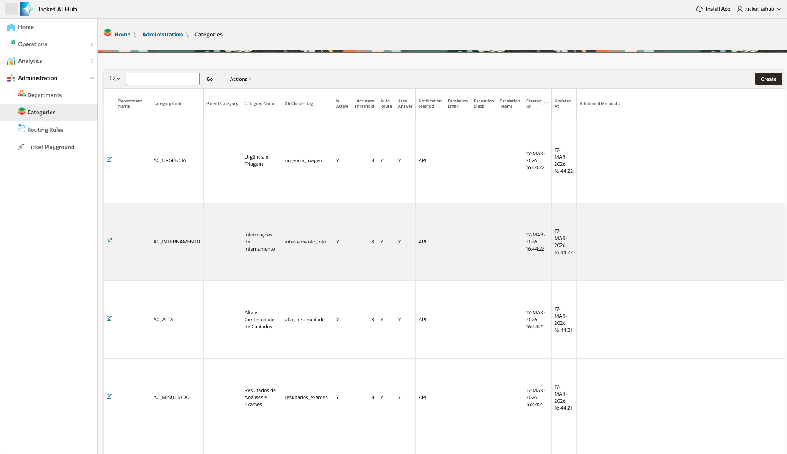

| Item | Description |
|---|---|
| Purpose | Lists the ticket categories the AI can assign and use for automation rules. |
| Contains | Interactive report of category records. |
| When to use | Use this page to inspect categories, automation settings, and KB cluster mapping. |

| Field / Element | Used For |
|---|---|
| Category Code | Short unique code for the category. |
| Category Name | Display name used by users and the AI. |
| Department | Department that owns the category. |
| KB Cluster Tag | Connects the category to related knowledge-base content. |
| Accuracy Threshold | Minimum answer quality score required for automatic answer delivery. |
| Auto Answer | Controls whether the AI should generate an answer. |
| Auto Route | Must be `Y` for each supported automated category flow. It lets the workload route an escalation through the configured integration. |
| Auto Answer Auto Route | When `Y`, both `Auto Answer` and `Auto Route` must be `Y`; the answer is included in the escalation payload. |
| Notification Method | Preferred escalation channel. API is the implemented delivery path; Teams, Slack, and email are future integration skeletons. |
| Is Active | Shows whether the category is available for use. |

### 8.6 Category

| Item | Description |
|---|---|
| Purpose | Creates or edits one ticket category and its automation behavior. |
| Contains | Category identity, ownership, threshold, notification, and automation fields. |
| When to use | Use this page when defining how the AI should handle a type of ticket. |

| Field | Used For |
|---|---|
| Accuracy Threshold | Minimum AI answer score needed before sending an answer automatically. |
| Routing Rule Evaluation Logic | Category-specific business criteria used when more than one shortlisted routing rule could apply. Write clear destination-selection criteria; the workload evaluates them with each rule's priority boost during escalation routing. |
| Escalation Email | Future email-integration destination retained for later implementation. |
| Escalation Slack | Future Slack-integration destination retained for later implementation. |
| Auto Route | Set to `Y` for every supported automated category flow. |
| Auto Answer | If `Y`, the AI can generate a KB-grounded answer when relevant KB content exists. |
| Additional Metadata | Optional extra configuration for advanced use cases. |
| Escalation Teams | Future Teams-integration destination retained for later implementation. |
| Notification Method | API is the implemented delivery channel. Teams, Slack, and email entries are future integration placeholders. |
| Auto Answer Auto Route | Set to `Y` only with `Auto Answer=Y` and `Auto Route=Y`; the AI answers and routes the same ticket. |
| Category ID | Internal identifier for the category. Usually read-only. |
| Department ID | Department that owns this category. |
| Category Code | Short unique code for the category. |
| Category Name | User-friendly category name. |
| Description | Helps users and the AI understand what belongs in this category. |
| Parent Category ID | Optional parent category for grouping. |
| KB Cluster Tag | Tag that connects the category to KB topics. |
| Is Active | Makes the category available or unavailable. |
| Created At | Shows when the category was created. |
| Updated At | Shows when the category was last changed. |

### 8.7 Routing Rules

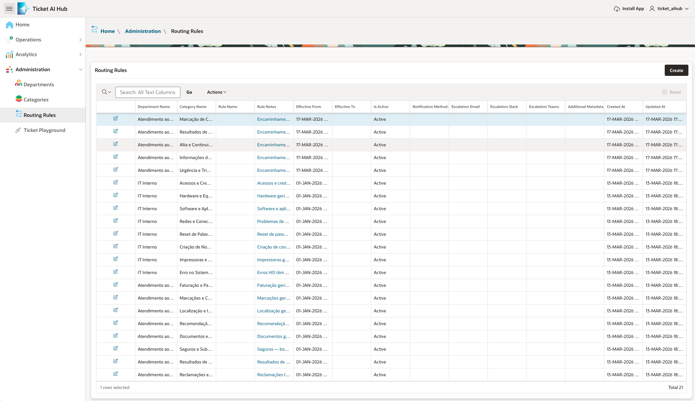

| Item | Description |
|---|---|
| Purpose | Lists rules that tell the system where escalated tickets should go. |
| Contains | Interactive reports or grids of routing rules. |
| When to use | Use this page to review routing destinations, effective dates, and notification overrides. |

| Field / Element | Used For |
|---|---|
| Department Name | Department that receives tickets matching the rule. |
| Category Name | Category this rule applies to. |
| Rule Name | Friendly name for the routing rule. |
| Rule Notes | Business criteria and handling instructions for the route. The workload semantically shortlists rules from these notes, then applies category policy and priority to select the final route. |
| Effective From / To | Date range when the rule is valid. |
| Is Active | Shows whether the rule is currently available. |
| Notification Method | API is the implemented delivery channel; other configured channel values are future integration placeholders. |
| Escalation Email / Slack / Teams | Future integration destination overrides retained for later implementation. |
| Additional Metadata | Extra routing details maintained by administrators. |
| Created At / Updated At | Shows when the rule was created or last changed. |

### 8.8 Routing Rules Form

| Item | Description |
|---|---|
| Purpose | Creates or edits one routing rule. |
| Contains | Rule ownership, priority, dates, contact destinations, and metadata. |
| When to use | Use this page when defining or changing escalation routing. |

| Field | Used For |
|---|---|
| Rule ID | Internal identifier for the routing rule. |
| Category ID | Category that triggers this rule. |
| Department ID | Team that receives matching escalations. |
| Priority Boost | Integer from `0` (minimum and default) to `10` (maximum). It adds weighted business priority when selecting between otherwise suitable routing rules, but cannot override a mandatory conflict. |
| Rule Notes | Business criteria used to shortlist candidates and explain when or why the rule applies. |
| Is Active | Enables or disables the rule. |
| Effective From | Start date for the rule. |
| Effective To | Optional end date for the rule. |
| Rule Name | Human-readable rule name. |
| Escalation Email | Future email-integration override retained for later implementation. |
| Escalation Slack | Future Slack-integration override retained for later implementation. |
| Escalation Teams | Future Teams-integration override retained for later implementation. |
| Additional Metadata | Optional extra rule configuration. |
| Notification Method | API is the implemented channel; other values retain future delivery contracts. |

### 8.9 Rule Notes

| Item | Description |
|---|---|
| Purpose | Displays the long-form notes for a routing rule. |
| Contains | Rule identifier and full rule notes text. |
| When to use | Use this page when rule notes are too long for the grid view. |

| Field | Used For |
|---|---|
| Rule ID | Identifies the routing rule. |
| Rule Notes | Full text of routing instructions or explanation. |

### 8.10 Tickets

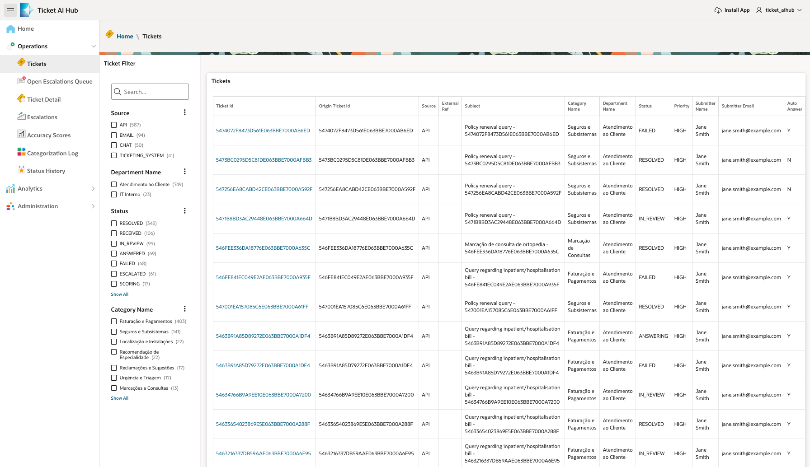

| Item | Description |
|---|---|
| Purpose | Main operational list of tickets. |
| Contains | Search, filters, and ticket report columns. |
| When to use | Use this page to find tickets, inspect status, and drill into details. |

| Field / Element | Used For |
|---|---|
| Search | Finds tickets by visible report text. |
| Source Filter | Filters by API, email, chat, or ticketing system. |
| Department Name Filter | Filters by owning department. |
| Status Filter | Filters by current lifecycle status. |
| Category Name Filter | Filters by assigned category. |
| Ticket ID | Unique ticket identifier. |
| Origin Ticket ID | Related or original ticket reference, when the request is linked to another ticket. |
| Source | Channel where the ticket arrived. |
| External Ref | External system reference, if any. |
| Subject | Ticket subject. |
| Category Name | Category assigned by submitter, AI, or human. |
| Department Name | Department responsible for the ticket. |
| Status | Current state, such as `QUEUED`, `RESOLVED`, `IN_REVIEW`, or `FAILED`. |
| Priority | Ticket priority. |
| Submitter Name / Email | Customer or requester details. |
| Auto Answer / Auto Route | Shows category policy copied to the ticket. |
| Accuracy | AI answer score, when available. |
| KB Version | Knowledge-base version used for the ticket. |
| Timestamps | Received, updated, and resolved times. |

### 8.11 Ticket Detail

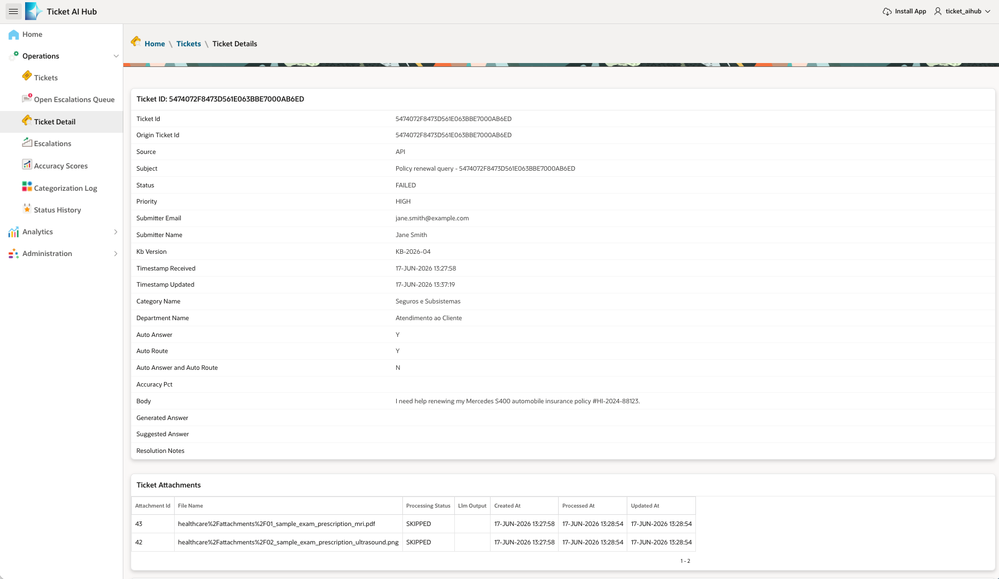

| Item | Description |
|---|---|
| Purpose | Shows a complete view of one ticket and what happened to it. |
| Contains | Ticket details, attachments, status history, accuracy scores, categorisation log, and escalations. |
| When to use | Use this page to investigate how a ticket was processed, answered, resolved, or escalated. |

| Field / Region | Used For |
|---|---|
| Ticket ID / Origin Ticket ID | Identifies the ticket inside Ticket AI Hub and in the originating system. |
| Source | Shows where the ticket came from, such as API, email, chat, or ticketing system. |
| Subject / Body | Shows the request title and the full user message. |
| Status / Priority | Shows the current workflow state and urgency. |
| Submitter Email / Name | Identifies the person who submitted the request. |
| Category / Department | Shows the assigned category and responsible department. |
| Auto Answer / Auto Route | Shows the automation policy applied to this ticket. |
| Auto Answer and Auto Route | Shows whether the ticket is configured to both generate an answer and route the request. |
| Accuracy Pct | Shows the AI answer score when one is available. |
| Generated Answer | Shows the answer generated by the AI, when available. |
| Suggested Answer | Shows an AI draft that a human reviewer can reuse or edit. |
| Resolution Notes | Shows the final human resolution notes, when entered. |
| Ticket Attachments | Shows files attached to the ticket and whether they were processed. |
| Attachment Processing Status | Shows whether each attachment is `RECEIVED`, `PROCESSING`, `PROCESSED`, `SKIPPED`, or `FAILED`. |
| Attachment LLM Output / Error | Shows extracted attachment context or the processing error when available. |
| Run Agent | Starts controlled processing of the selected ticket. Use only when your operating procedure authorises manual execution. |
| Clear Ticket | Resets ticket processing data for test use. It must never be used in production. |
| Resolve Ticket | Available for an eligible `IN_REVIEW` ticket after resolution notes are saved. It also requires successful notification to the configured escalation API. |

### 8.12 Ticket

| Item | Description |
|---|---|
| Purpose | Displays or edits the main ticket record. |
| Contains | Ticket identity, category, status, answer, score, and timestamps. |
| When to use | Use this form to inspect or update a specific ticket when permitted. |

| Field | Used For |
|---|---|
| Ticket ID | Unique identifier for the ticket. |
| Source | Channel where the ticket arrived. |
| External Ref | Reference in the original external system. |
| Department ID | Owning department. |
| Subject | Short title of the request. |
| Body | Full request text. |
| Submitted Category | Original category supplied with the ticket. |
| Category ID | Final category assigned to the ticket. |
| Category Source | Shows whether category came from submitter, AI, or human. |
| Status | Current lifecycle state. |
| Priority | Ticket urgency. |
| Submitter Email / Name | Requester contact information. |
| Accuracy Score | AI answer quality score. |
| Accuracy Threshold | Minimum score required for auto-answer. |
| Assigned Team ID | Team assigned to handle escalation. |
| Generated Answer | AI-generated answer text. |
| Suggested Answer | AI answer shown as a suggestion for review. |
| Resolution Notes | Final human notes or manual answer details. |
| KB Version | Knowledge-base version used. |
| Origin Ticket ID | Related or original ticket reference, when available. |
| Auto Answer / Auto Route / Auto Answer Auto Route | Automation policy copied from the selected category. |
| Timestamps | Received, updated, resolved, and created times. |

### 8.13 Ticket Status History

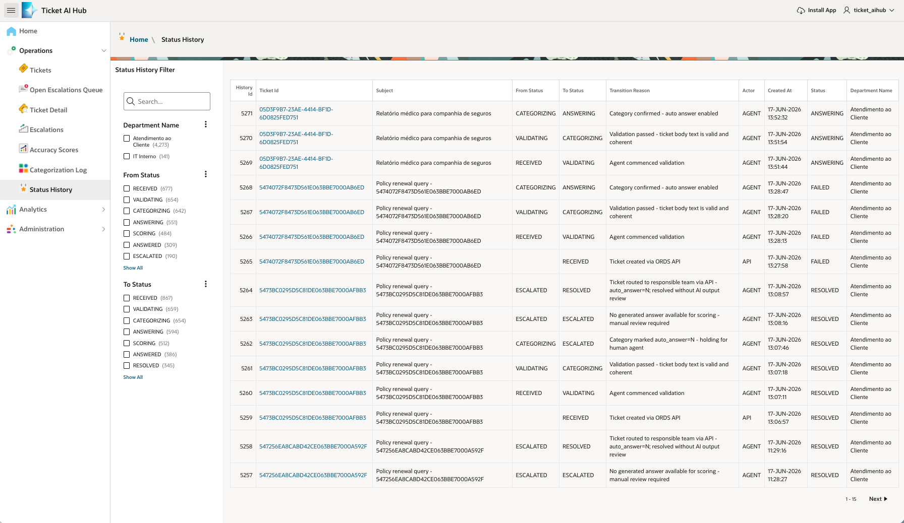

| Item | Description |
|---|---|
| Purpose | Shows one status transition record. |
| Contains | From/to status, reason, actor, and timestamp. |
| When to use | Use this page to inspect why a status changed. |

| Field | Used For |
|---|---|
| History ID | Internal identifier for the transition. |
| Ticket ID | Ticket that changed status. |
| From Status | Previous status. |
| To Status | New status. |
| Transition Reason | Explanation for the change. |
| Actor | Who or what made the change. |
| Created At | Time of the transition. |

### 8.14 Accuracy Score

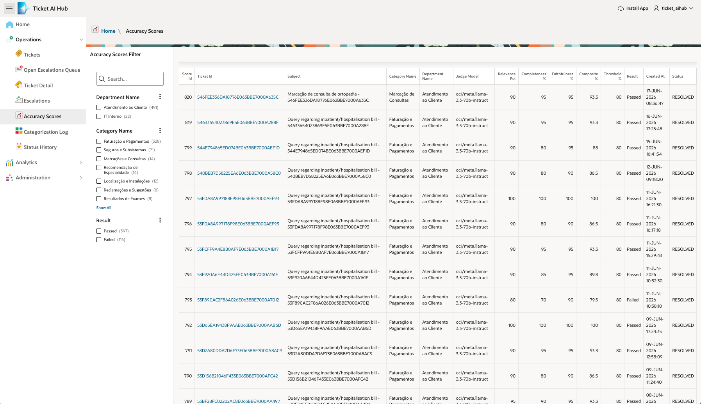

| Item | Description |
|---|---|
| Purpose | Shows one AI answer scoring event. |
| Contains | Judge model, dimension scores, composite score, threshold result, and raw response. |
| When to use | Use this page to understand why an answer passed or failed. |

| Field | Used For |
|---|---|
| Score ID | Internal scoring record identifier. |
| Ticket ID | Ticket that was scored. |
| Judge Model | AI model used to evaluate the answer. |
| Relevance Score | How closely the answer addressed the question. |
| Completeness Score | How fully the answer covered the request. |
| Faithfulness Score | How well the answer stayed grounded in KB content. |
| Composite Score | Overall score used for routing. |
| Threshold Applied | Minimum score required. |
| Passed Threshold | Shows whether the answer passed. |
| Scoring Prompt Hash | Identifier for the scoring prompt version. |
| Raw Judge Response | Full scoring output for audit/debugging. |
| Created At | Time the score was created. |

### 8.15 Ticket Categorisation Log

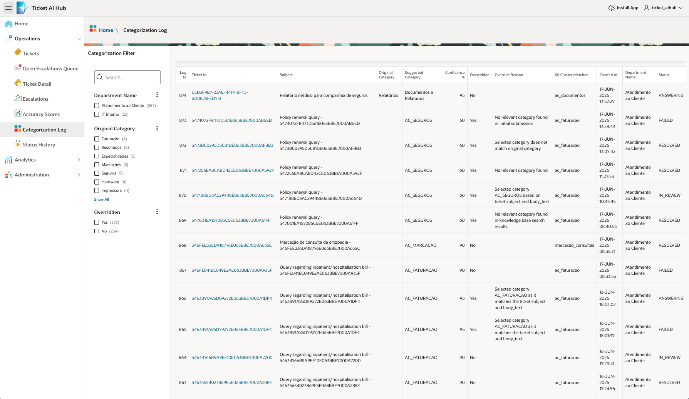

| Item | Description |
|---|---|
| Purpose | Shows one categorisation decision. |
| Contains | Original category, AI-suggested category, confidence, and override details. |
| When to use | Use this page to see how and why the AI categorised a ticket. |

| Field | Used For |
|---|---|
| Log ID | Internal log identifier. |
| Ticket ID | Ticket that was categorised. |
| Original Category | Category originally submitted. |
| Suggested Category ID | Category selected by the AI. |
| Suggested Category | Display name of the selected category. |
| Confidence Score | AI confidence in the selected category. |
| Was Overridden | Shows whether the original category was changed. |
| Override Reason | Explanation for changing the category. |
| KB Cluster Matched | KB topic cluster used as evidence. |
| Created At | Time of categorisation. |

### 8.16 Escalation

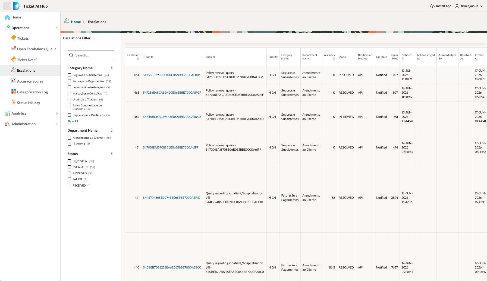

| Item | Description |
|---|---|
| Purpose | Shows one escalation record. |
| Contains | Ticket, assigned team, accuracy score, suggested answer, notification, and routing details. |
| When to use | Use this page to review why a ticket was escalated and where it was sent. |

| Field | Used For |
|---|---|
| Rule Name | Routing rule that selected the escalation path. |
| Escalation Email / Slack / Teams | Future integration destinations retained in the escalation record; they are not current production delivery channels. |
| Additional Metadata | Extra routing or notification details. |
| Routing Rule Accuracy Score | Confidence in the selected routing rule. |
| Escalation ID | Internal escalation identifier. |
| Ticket ID | Ticket being escalated. |
| Department ID | Team assigned to the escalation. |
| Accuracy Score | AI answer score at escalation time. |
| Suggested Answer | AI-generated answer offered as a starting point. |
| Notified At | Time the configured external API notification succeeded. |
| Notification Method | Configured notification method. API is the implemented delivery path in the current version. |
| Acknowledged At / By | Human acknowledgement details. |
| Resolved At | Time escalation was resolved. |
| Created At | Time escalation was created. |

### 8.17 Escalations

| Item | Description |
|---|---|
| Purpose | Lists escalation records across tickets. |
| Contains | Escalation report and filters for category, department, and status. |
| When to use | Use this page to monitor escalation volume and team workload. |

| Field / Element | Used For |
|---|---|
| Escalation ID | Unique identifier for the escalation record. |
| Ticket ID | Opens the ticket linked to the escalation. |
| Subject | Shows the ticket request title. |
| Category Name / Department Name | Shows why and where the ticket was escalated. |
| Accuracy % | Shows the score that influenced whether review was needed. |
| Status | Shows the current ticket state. |
| Notification Method | Shows the configured delivery method; API is the current implemented path. |
| Esc State | Shows whether the escalation was notified, acknowledged, or resolved. |
| Open Mins | Shows how long the escalation has been open. |
| Notified / Acknowledged / Resolved At | Shows key escalation handling timestamps. |

### 8.18 Accuracy Scores

| Item | Description |
|---|---|
| Purpose | Lists AI answer scoring records. |
| Contains | Interactive report and filters for score details. |
| When to use | Use this page to inspect score results across many tickets. |

| Field / Element | Used For |
|---|---|
| Department Name Filter | Limits scores by department. |
| Category Name Filter | Limits scores by category. |
| Result Filter | Filters pass/fail result. |
| Judge Model | Shows model used for scoring. |
| Composite Score | Overall answer score. |
| Relevance / Completeness / Faithfulness | Detailed scoring dimensions. |
| Passed Threshold | Shows if the answer was good enough for automation. |

### 8.19 Categorization Log

| Item | Description |
|---|---|
| Purpose | Lists categorisation decisions across tickets. |
| Contains | Report and filters for original category, suggested category, overrides, and KB cluster. |
| When to use | Use this page to check whether the AI is choosing categories correctly. |

| Field / Element | Used For |
|---|---|
| Department Name Filter | Filters by owning department. |
| Original Category Filter | Filters by submitted category text. |
| Overridden Filter | Shows tickets where the AI changed the category. |
| KB Cluster Matched | Shows KB cluster evidence. |
| Confidence Score | Indicates AI certainty. |
| Override Reason | Explains why the category changed. |

### 8.20 Status History

| Item | Description |
|---|---|
| Purpose | Lists status transitions across tickets. |
| Contains | Report and filters by department, current status, from status, to status, and actor. |
| When to use | Use this page to troubleshoot workflow movement and timing. |

| Field / Element | Used For |
|---|---|
| Department Name Filter | Limits transitions by department. |
| Status Filter | Filters current ticket status. |
| From Status | Previous status. |
| To Status | New status. |
| Actor | Shows whether the transition was made by the agent, API, or user. |
| Transition Reason | Explains why the transition happened. |
| Created At | Time of transition. |

### 8.21 Analytics Dashboard

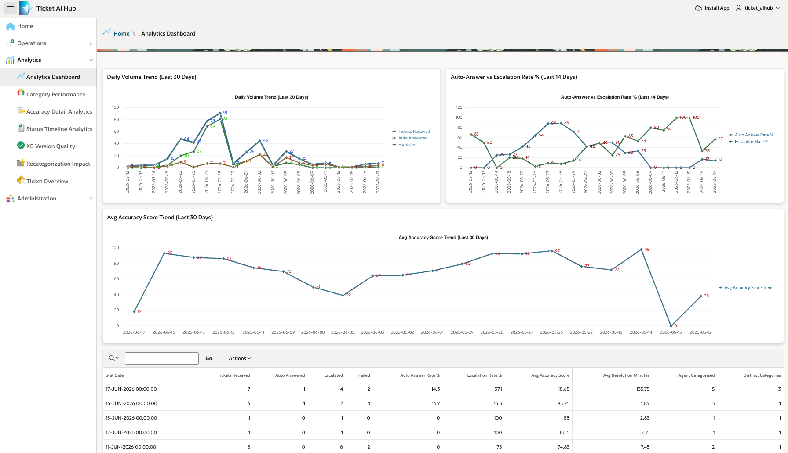

| Item | Description |
|---|---|
| Purpose | Shows daily ticket volume, answer rate, escalation rate, and accuracy trends. |
| Contains | Charts and reports based on daily agent statistics. |
| When to use | Use this page for operational monitoring and trend review. |

| Field / Element | Used For |
|---|---|
| Daily Volume Trend | Compares tickets received, auto answered, and escalated over the last 30 days. |
| Auto-Answer vs Escalation Rate % | Shows how automation and escalation rates move over the last 14 days. |
| Avg Accuracy Score Trend | Shows answer quality movement over the last 30 days. |
| Stat Date | Date represented by a report row. |
| Tickets Received | Number of tickets received that day. |
| Auto Answered / Escalated / Failed | Daily counts for major outcomes. |
| Auto Answer Rate % / Escalation Rate % | Daily percentages for automation and escalation. |
| Avg Accuracy Score | Average scored answer quality for the day. |
| Avg Resolution Minutes | Average time to resolution for the day. |

### 8.22 Category Performance

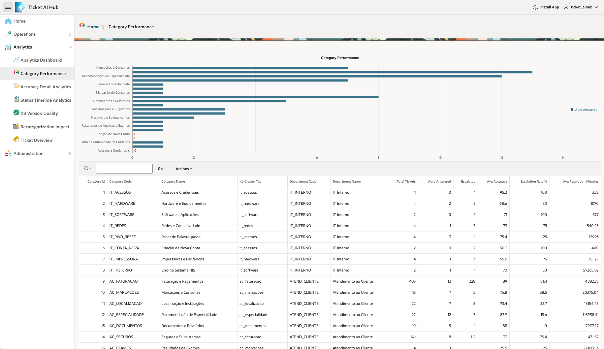

| Item | Description |
|---|---|
| Purpose | Shows performance by category. |
| Contains | Reports and charts for ticket count, auto-answer rate, escalation rate, and accuracy by category. |
| When to use | Use this page to find categories where the AI or KB may need improvement. |

| Field / Element | Used For |
|---|---|
| Category Performance Chart | Shows auto-answered volume by category. |
| Category Code / Name | Identifies the category being measured. |
| KB Cluster Tag | Shows the knowledge-base topic linked to the category. |
| Department Code / Name | Shows the department that owns the category. |
| Total Tickets | Number of tickets in the category. |
| Auto Answered | Number of tickets answered automatically. |
| Escalated | Number of tickets routed to a human/team. |
| Avg Accuracy | Average answer score for the category. |
| Escalation Rate % | Share of category tickets that escalated. |
| Avg Resolution Minutes | Average time to resolve category tickets. |

### 8.23 Open Escalations Queue

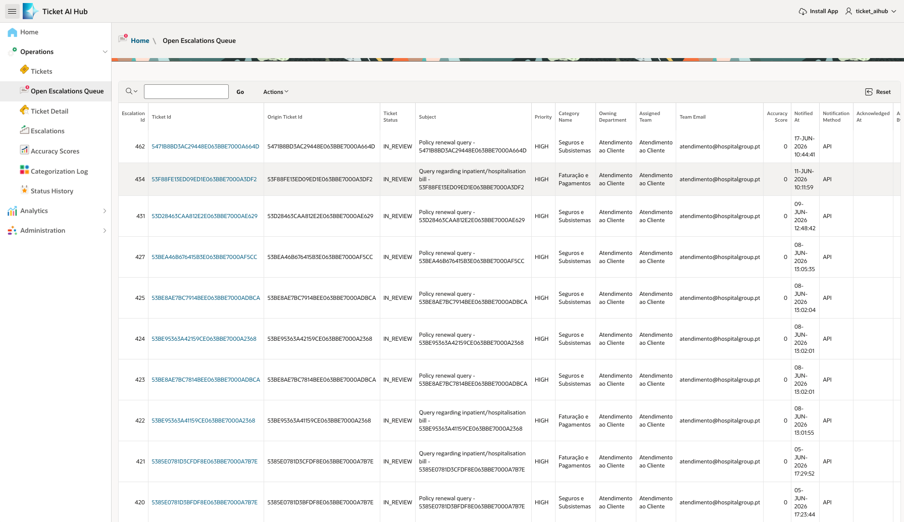

| Item | Description |
|---|---|
| Purpose | Shows tickets currently waiting for human review or action. |
| Contains | Searchable queue of open escalation records that need review or follow-up. |
| When to use | Use this page to work the manual review queue. |

| Field / Element | Used For |
|---|---|
| Escalation ID | Unique queue item identifier. |
| Ticket ID | Opens the ticket that needs review. |
| Origin Ticket ID | Reference from the originating system. |
| Ticket Status | Shows whether the ticket is still in review, escalated, or otherwise active. |
| Subject | Short description of the request. |
| Priority | Helps reviewers triage urgent work first. |
| Category Name | Shows the category assigned to the ticket. |
| Owning Department | Department accountable for the ticket. |
| Assigned Team / Team Email | Team expected to handle the escalation and its stored contact reference. |
| Accuracy Score | Shows why the ticket may need human review. |
| Notified At / Notification Method | Shows when the external API notification succeeded and the configured delivery method. |
| Acknowledged At / By | Shows whether someone has accepted ownership. |

### 8.24 Accuracy Detail Analytics

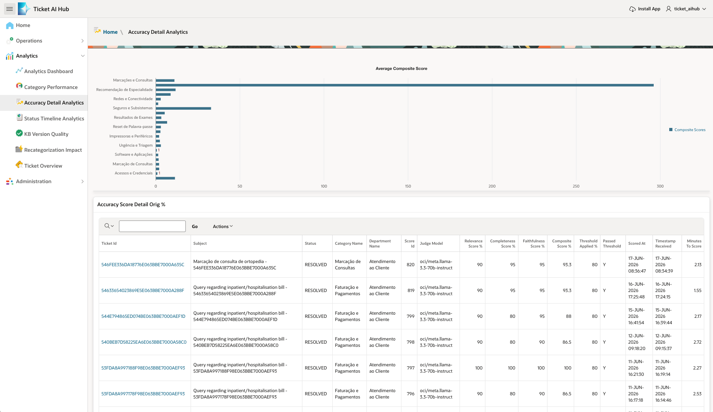

| Item | Description |
|---|---|
| Purpose | Provides deeper analysis of answer quality scores. |
| Contains | Accuracy detail report, filters, and score charts. |
| When to use | Use this page to understand which answers, categories, or models are underperforming. |

| Field / Element | Used For |
|---|---|
| Average Composite Score Chart | Compares answer quality by category. |
| Ticket ID / Subject | Identifies the ticket and request being scored. |
| Status | Shows the ticket state when reviewed. |
| Category / Department | Shows where the ticket belongs. |
| Score ID | Identifies the scoring event. |
| Judge Model | Shows the model used to score the answer. |
| Relevance / Completeness / Faithfulness Score % | Shows the quality dimensions used by the score. |
| Composite Score % | Overall answer quality score. |
| Threshold Applied % | Minimum score required for automation. |
| Passed Threshold | Shows whether the answer was good enough to send automatically. |
| Minutes To Score | Shows how long scoring took after ticket receipt. |

### 8.25 Status Timeline Analytics

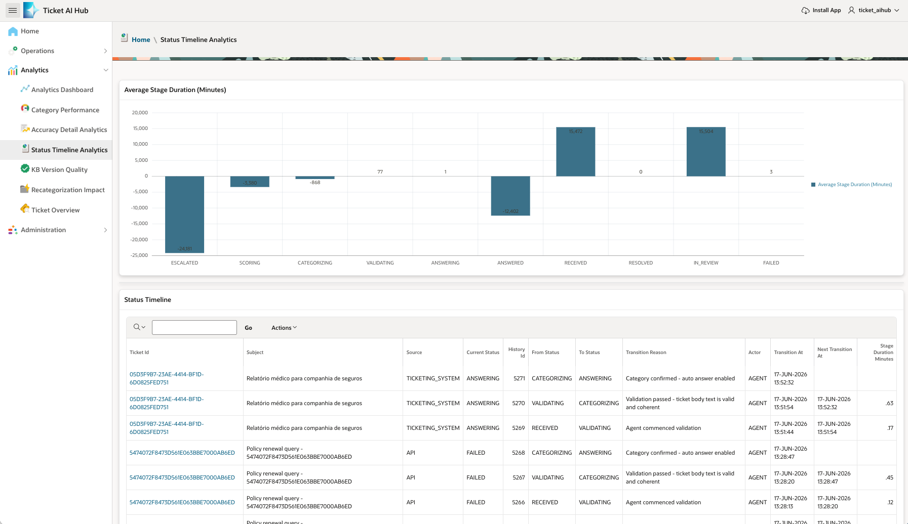

| Item | Description |
|---|---|
| Purpose | Shows how long tickets spend in each status. |
| Contains | Timeline report, stage duration charts, and filters. |
| When to use | Use this page to find bottlenecks in validation, answering, scoring, or review. |

| Field / Element | Used For |
|---|---|
| Average Stage Duration Chart | Shows average time spent in each workflow stage. |
| Ticket ID / Subject | Identifies the ticket and request being measured. |
| Source | Shows where the ticket came from. |
| Current Status | Shows the ticket status at the time of the report. |
| History ID | Identifies the status-change record. |
| From Status / To Status | Shows the status transition. |
| Transition Reason | Explains why the status changed. |
| Actor | Shows whether the change was made by the agent, API, or a user. |
| Transition At / Next Transition At | Shows the timing used for duration calculation. |
| Stage Duration Minutes | Time spent in that stage. |

### 8.26 Ticket Overview

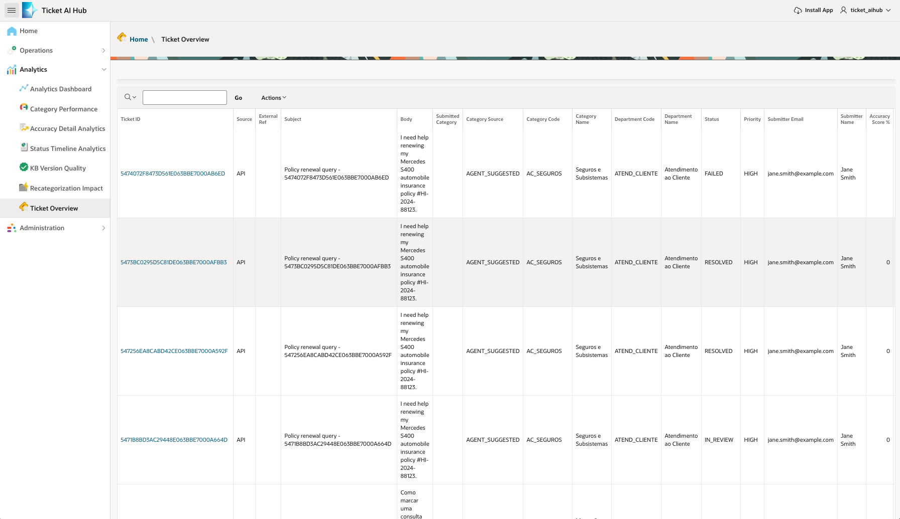

| Item | Description |
|---|---|
| Purpose | Provides a broad report of tickets with key denormalized details. |
| Contains | Ticket overview report and filters. |
| When to use | Use this page for reporting, exports, and broad ticket analysis. |

| Field / Element | Used For |
|---|---|
| Ticket ID | Opens the ticket record. |
| Source / External Ref | Shows where the ticket came from and the external reference. |
| Subject / Body | Shows the request summary and full text. |
| Submitted Category | Shows the category supplied with the original request, if any. |
| Category Source | Shows whether the final category came from the submitter, agent, or human override. |
| Category Code / Name | Shows the final category. |
| Department Code / Name | Shows the responsible department. |
| Status / Priority | Shows current progress and urgency. |
| Submitter Email / Name | Shows requester details. |
| Accuracy Score % | Shows the AI answer score, when available. |

### 8.27 KB Version Quality

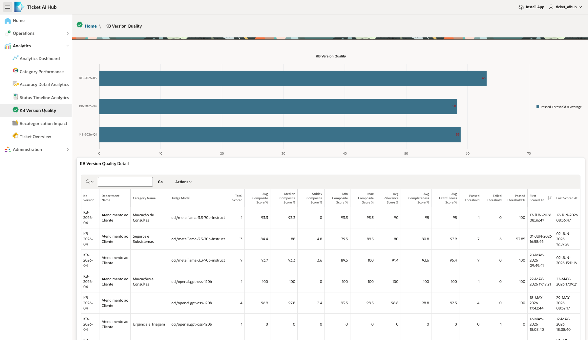

| Item | Description |
|---|---|
| Purpose | Measures answer quality by knowledge-base version. |
| Contains | Report, filters, and chart for threshold pass rate. |
| When to use | Use this page after KB updates to check whether answer quality improved or declined. |

| Field / Element | Used For |
|---|---|
| Search | Finds records. |
| Judge Model | Filters score records by judge model. |
| KB Version | Groups quality by KB release/version. |
| Passed Threshold % Average | Shows pass rate for the KB version. |
| Avg Composite Score | Shows average answer quality. |
| First / Last Scored At | Shows the activity period for that KB version. |

### 8.28 Recategorization Impact

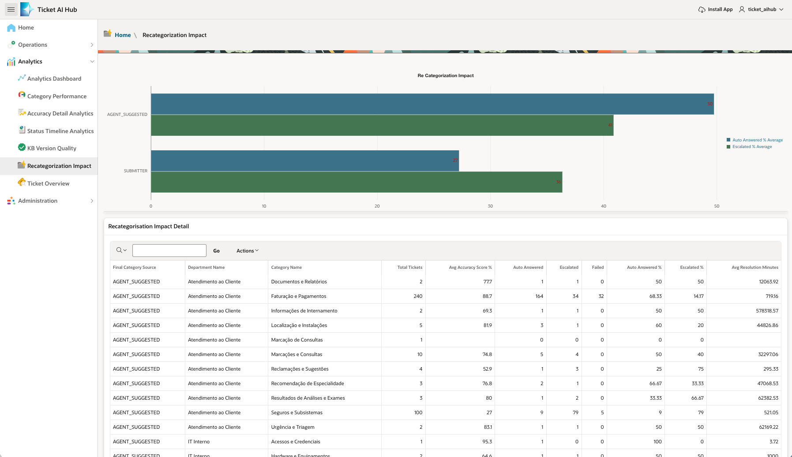

| Item | Description |
|---|---|
| Purpose | Shows how category changes affect answer success, escalation, and resolution time. |
| Contains | Impact report, filters, and charts for auto-answer and escalation percentages. |
| When to use | Use this page to determine whether miscategorisation hurts performance. |

| Field / Element | Used For |
|---|---|
| Search | Finds records. |
| Department Name | Filters by department. |
| Category Name | Filters by category. |
| Final Category Source | Shows whether the category came from submitter, AI, or human override. |
| Auto Answered % Average | Measures successful automation by category path. |
| Escalated % Average | Measures escalation impact by category path. |
| Avg Resolution Minutes | Shows time impact. |

### 8.29 Status Timeline New

| Item | Description |
|---|---|
| Purpose | Alternate status timeline report page. |
| Contains | Search results and status timeline filters. |
| When to use | Use this page for quick status transition searches. |

| Field / Element | Used For |
|---|---|
| Source | Filters by ticket source. |
| Current Status | Filters by current state. |
| Search | Searches ticket/status text. |
| From Status | Previous status. |
| To Status | New status. |
| Transition Reason | Explanation of the movement. |
| Actor | Who changed the status. |

### 8.30 Ticket Playground

| Item | Description |
|---|---|
| Purpose | Demo and testing page for ticket processing. |
| Contains | Ticket detail-style regions and buttons to submit, resubmit, or clear processing. |
| When to use | Use this page only in non-production or authorised demo situations to inspect agent behavior. |

| Field / Element | Used For |
|---|---|
| Ticket ID | Selects the ticket to inspect or test. |
| Order By | Controls report sorting. |
| Submit Ticket | Starts the agent processing flow for the selected ticket in a demo/test scenario. |
| Resubmit Ticket | Requeues a `FAILED` ticket using the stored failure reason and safest resume point. Use only under an authorised test procedure. |
| Clear Ticket | Resets previous processing data for testing. It calls the test-only reset procedure and must never be used in production. |
| Ticket Attachments | Shows stored attachments. |
| Status Histories | Shows workflow transitions. |
| Accuracy Scores | Shows scoring results. |
| Categorisation Log | Shows category decisions. |
| Escalations | Shows routing/escalation records. |

### 8.31 Login Page

| Item | Description |
|---|---|
| Purpose | Signs users into the application. |
| Contains | Username, password, remember-me, language, and persistent login options. |
| When to use | Use this page when starting a new session. |

| Field | Used For |
|---|---|
| Language | Selects page language if enabled. |
| Username | User login name. |
| Password | User password. |
| Remember | Remembers the username or session preference. |
| Persistent Auth | Keeps the user signed in when allowed by policy. |

### 8.32 Administration

| Item | Description |
|---|---|
| Purpose | Administration landing page. |
| Contains | Access-control information, user counts, and administration links. |
| When to use | Use this page to manage application access and admin tasks. |

| Field / Element | Used For |
|---|---|
| ACL Information | Shows whether access is restricted to the ACL or open to all users. |
| User Counts Report | Shows number of users by access role. |
| Administration Links | Opens access-control and user-management pages. |

### 8.33 Configure Access Control

| Item | Description |
|---|---|
| Purpose | Controls whether the application is ACL-only or open to all users. |
| Contains | Access scope setting. |
| When to use | Use this page when changing broad application access policy. |

| Field | Used For |
|---|---|
| Allow Other Users | Controls whether users outside the ACL can access the app. |

### 8.34 Manage User Access

| Item | Description |
|---|---|
| Purpose | Lists users who have application roles. |
| Contains | Interactive report of ACL users and roles. |
| When to use | Use this page to review or update user access. |

| Field / Element | Used For |
|---|---|
| User Name | Application user. |
| Role | Role assigned to the user. |
| Administrator | Can administer app settings and access. |
| Contributor | Can contribute to operational data where permitted. |
| Reader | Can view reports and pages where permitted. |

### 8.35 Manage User Access Form

| Item | Description |
|---|---|
| Purpose | Adds or edits one user access record. |
| Contains | User and role assignment fields. |
| When to use | Use this page when granting or changing access for one user. |

| Field | Used For |
|---|---|
| ID | Internal access record identifier. |
| Application ID | Application receiving the role assignment. |
| User Name | User to grant access to. |
| Role IDs | One or more roles assigned to the user. |

### 8.36 Add Multiple Users - Step 1

| Item | Description |
|---|---|
| Purpose | Starts bulk user access setup. |
| Contains | Role selection and list of users to add. |
| When to use | Use this page when adding several users at once. |

| Field | Used For |
|---|---|
| Role | Role to assign to the listed users. |
| Preliminary Users | Usernames or email addresses to validate. |
| Username Format | Expected username format. |

### 8.37 Add Multiple Users - Step 2

| Item | Description |
|---|---|
| Purpose | Reviews valid and invalid users before bulk creation. |
| Contains | Exception report, counts, and confirmation controls. |
| When to use | Use this page to confirm a bulk user import. |

| Field / Element | Used For |
|---|---|
| Exceptions | Lists users that cannot be added. |
| Role | Role selected in Step 1. |
| Valid Count | Number of users ready to add. |
| Invalid Count | Number of users with validation issues. |

### 8.38 Settings

| Item | Description |
|---|---|
| Purpose | User settings landing page. |
| Contains | Cards and links to user-specific settings. |
| When to use | Use this page to manage personal application options. |

| Field / Element | Used For |
|---|---|
| User Settings Cards | Opens available user settings pages. |
| Push Notifications Link | Opens push notification settings. |

### 8.39 Push Notifications

| Item | Description |
|---|---|
| Purpose | Lets a user subscribe or unsubscribe from push notifications. |
| Contains | Enable toggle and subscription actions. |
| When to use | Use this page if browser/app push notifications are enabled for your environment. |

| Field / Element | Used For |
|---|---|
| Enable Push | Turns push notifications on or off. |
| Subscribe | Registers the current browser/device. |
| Unsubscribe | Removes the current browser/device. |

## 9. Tips for End Users

| Tip | Why It Helps |
|---|---|
| Use filters before searching broadly. | Reports can contain many tickets. |
| Start with Ticket Detail for investigations. | It brings together status, scores, category logs, and escalations. |
| Check score and threshold together. | A low score only matters relative to the category threshold. |
| Review KB Version Quality after KB updates. | It helps detect whether a knowledge change improved or harmed answer quality. |
| Keep category descriptions clear. | The AI uses category descriptions to choose the right category. |
| Keep routing notes specific. | Clear notes improve routing and human review decisions. |
| Use the Page Reference when a field is unclear. | It explains each page, report column, button, and field after the tutorials. |
| Treat Ticket Playground as a test-only page. | Submit, resubmit, and especially clear/reset actions change processing state; the clear/reset action must never be used in production. |

## 10. Glossary

| Term | Meaning |
|---|---|
| Auto Answer | Category setting that allows the AI to generate a KB-grounded answer when relevant knowledge is available. |
| Auto Route | Category setting required by each supported automated category flow; it allows routing through the configured integration. |
| Auto Answer Auto Route | Category setting where the AI generates and scores an answer, then routes the same ticket. It is valid only when both Auto Answer and Auto Route are `Y`. |
| Accuracy Score | AI judge score measuring answer quality. |
| Accuracy Threshold | Minimum score required for automatic answer delivery. |
| KB | Knowledge base used to ground AI answers. |
| KB Version | Version of the knowledge base used by a department or ticket. |
| KB Cluster Tag | Topic tag linking a category to relevant KB content. |
| Origin Ticket ID | Related or original ticket reference detected from the request or assigned by the system. |
| Process Attachments | Ticket setting that controls whether stored attachments are processed by the attachment AI model. |
| Queued | Status meaning a scheduler worker has claimed the ticket for AI processing. |
| No-KB escalation | Manual-review route used when the knowledge base has no relevant evidence for an automated answer. |
| Resubmit Ticket | Test/admin action that requeues a failed ticket from the safest saved processing point. |
| Escalation | A ticket handoff to a human team. |
| Suggested Answer | AI-generated answer offered to a human reviewer. |
| Resolution Notes | Final notes or manual answer recorded when the ticket is resolved. |
