# Ticket AI Hub - AI Workload Design Document

Author: José Cruz
Prepared: 2026-07-20  
Document type: High-Level Design (HLD)  
Source artifacts:

- `atp-ticket-aihub-v0.02.sql`
- `ticket_agent_data_model-v0.02.sql`
- `f101-ticket-ai-hub-2026-07-09-15-49.sql`

## 1. Executive Summary

### 1.1 Purpose

This document describes the high-level architecture for Ticket AI Hub, an AI-enabled ticket response workload built on Oracle Autonomous Database, Oracle Select AI Agents, ORDS, DBMS_SCHEDULER, Object Storage, OCI Generative AI, and Oracle APEX.

The goal is to give architects, business owners, reviewers, and delivery teams a complete system view without requiring them to read the implementation scripts.

### 1.2 Business Problem

Service teams receive tickets across channels such as email, chat, API, and external ticketing systems. Manual triage, categorisation, knowledge-base lookup, attachment review, answer drafting, quality review, routing, notification, retry handling, and status tracking can create delays and inconsistent responses.

Ticket AI Hub automates this process while preserving human-in-the-loop escalation for low-confidence, policy-restricted, no-knowledge-base, notification-failed, or manually routed cases.

### 1.3 Solution Overview

Ticket AI Hub accepts incoming tickets through ORDS APIs, stores ticket, attachment, audit, scoring, retry, routing-rule embedding, and escalation data in Autonomous Database, and uses a fixed DBMS_SCHEDULER worker queue to invoke a Select AI Agent team asynchronously. The agent team validates the ticket, detects origin-ticket references, categorises it, optionally processes Object Storage attachments through a multimodal model, retrieves approved knowledge-base content through Select AI RAG, generates a grounded answer, scores it with an LLM-as-judge pattern, and either delivers an answer or creates an escalation. Escalation routing now uses a two-stage design: semantic routing-rule shortlist from embeddings, followed by category-specific business-rule scoring by the escalation agent.

At the highest level, the workload receives tickets from external systems, persists them through the ORDS API, processes them asynchronously through the database-hosted AI agent workflow, and sends the resulting answer or escalation through notification APIs.

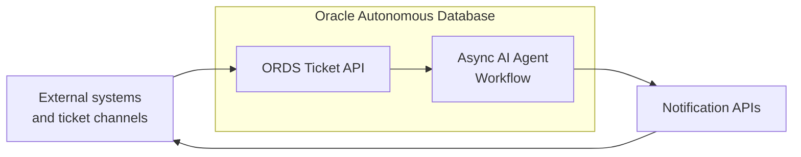

Oracle APEX provides operational screens, administration screens, ticket detail views, ticket retry/reset actions, escalation queues, analytics dashboards, and a ticket playground for demo and testing workflows.

### 1.4 AI Workload Summary

| Area | Design Summary |
|---|---|
| AI pattern | Sequential multi-agent workflow with RAG, deterministic PL/SQL tools, multimodal attachment processing, LLM-as-judge evaluation, and semantic-plus-policy routing-rule selection. |
| Runtime | Oracle Autonomous Database with `DBMS_CLOUD_AI_AGENT`, `DBMS_CLOUD_AI`, `DBMS_CLOUD`, `DBMS_CLOUD_NOTIFICATION`, `DBMS_SCHEDULER`, ORDS, and APEX. |
| Knowledge | Object Storage documents indexed through a Select AI vector index and queried by a RAG tool. |
| Attachments | Ticket attachment rows are stored for all submissions; optional LLM processing is controlled by `tickets.process_attachments`. |
| Human control | Escalation path, configurable category policies, routing rules, quality thresholds, manual resolution, retry, reset procedures, and demo/test callback simulation tables. |
| Reliability | Fixed scheduler workers claim tickets with durable claim fields, retry transient AI timeouts, recover expired claims, normalize incomplete agent runs, and optionally auto-resubmit selected failed-ticket classes. |
| Auditability | Ticket status history, categorisation log, accuracy scores, escalation records, routing-rule scores, attachment processing output, demo callback simulation payloads, retry metadata, embedding status/error fields, and analytics views. |
| User interface | Oracle APEX application for operations, analytics, administration, access control, ticket detail, ticket playground, and user settings. |

### 1.5 Key Design Decisions

| Decision | Rationale |
|---|---|
| Use Autonomous Database as the control plane | Keeps data, tools, agent orchestration, APIs, retry state, and reporting close together. |
| Use Select AI Agents for orchestration | Provides native database-hosted agent, team, task, and tool primitives. |
| Use fixed DBMS_SCHEDULER workers | Decouples API response time from LLM processing and avoids per-ticket child-job sprawl. |
| Use durable worker claims | Enables safe recovery of claimed work if a worker fails or stops running. |
| Use RAG for answer grounding | Restricts customer answers to approved knowledge-base content. |
| Use optional multimodal attachment processing | Lets the workload include attachment context while keeping attachment LLM cost under a ticket-level flag. |
| Use LLM-as-judge scoring before delivery | Adds a quality gate before autonomous answer delivery. |
| Use category-level policy flags | Allows business teams to choose auto-answer, auto-route, and combined answer-plus-route behavior per category. |
| Use APEX for operations | Provides a low-code operational UI over the same database model and reporting views. |

### 1.6 Architecture Snapshot

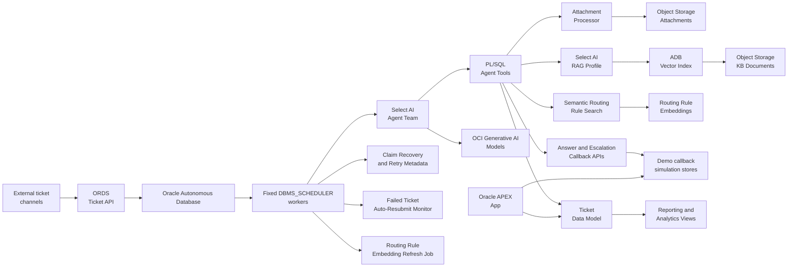

## 2. Business Context

### 2.1 Business Goals

| Goal | Description | Current Status |
|---|---|---|
| Faster first response | Reduce time from ticket creation to answer or escalation. | Supported by ORDS intake and async fixed worker processing. |
| Consistent answers | Ground responses in approved KB content and citations. | Supported by Select AI RAG and answer generation rules. |
| Attachment-aware handling | Use submitted files as supplemental ticket context when enabled. | Supported by `ticket_attachments` and the attachment processor. |
| Controlled automation | Auto-answer only when category policy and quality score allow it. | Supported by category flags and thresholds. |
| Transparent escalation | Route low-confidence, no-KB, policy-restricted, or routing-only tickets to teams. | Supported by semantic routing-rule shortlist, category-specific routing evaluation logic, escalation tables, and callback payloads. |
| Retryable operations | Recover from transient AI timeouts, expired worker claims, selected notification failures, and failed dispatch cases. | Supported by retry metadata, `/tickets/retry`, scheduler claim recovery, and the failed-ticket auto-resubmit monitor. |
| Operational visibility | Track throughput, accuracy, SLA, KB quality, pipeline health, and bottlenecks. | Supported by reporting and analytics views. |

### 2.2 Stakeholders

| Stakeholder | Interest |
|---|---|
| Executive sponsor | Operational efficiency, quality, risk control, adoption. |
| Product owner | Ticket workflow, user experience, reporting, policy behavior. |
| Solution architect | System design, integration, security, scalability, governance. |
| Support team lead | Routing, escalation visibility, SLA compliance. |
| Knowledge manager | KB coverage, answer quality, category-to-KB mapping. |
| ADB/APEX engineer | Schema, PL/SQL, ORDS, scheduler, APEX, deployment. |
| AI engineer | Agent behavior, prompts, tools, RAG, attachment processing, evaluation. |

### 2.3 User Personas

| Persona | Primary Needs |
|---|---|
| Ticket submitter | Receive a clear, timely, grounded response. |
| Support operator | Review escalations, inspect ticket and attachment context, resolve manually. |
| Operations manager | Monitor volume, bottlenecks, escalation rates, failure rates, and SLA. |
| Knowledge owner | Identify weak KB areas, recategorisation impact, and quality regressions by version. |
| Administrator | Manage departments, categories, routing rules, access, and policy flags. |

### 2.4 Use Cases

| Use Case | Description | Primary Components |
|---|---|---|
| Create ticket | External system submits a ticket and optional attachment metadata through ORDS. | ORDS `POST /tickets/create`, `create_ticket`, `tickets`, `ticket_attachments`. |
| Process ticket | Fixed scheduler worker claims one `RECEIVED` ticket and runs the agent team. | `tkt_ticket_workers`, `TICKET_RESPONSE_TEAM`, `DBMS_CLOUD_AI_AGENT.RUN_TEAM`. |
| Process attachments | Agent processes stored attachment objects only when the persisted ticket flag allows it. | `PROCESS_ATTACHMENTS_TASK`, `process_ticket_attachments`, Object Storage, multimodal LLM. |
| Auto-answer ticket | High-quality generated answer is delivered to a downstream answer endpoint. | RAG, answer generator, scorer, `notify_answer_api`; `answers_delivered` is a demo/test inbound API simulator. |
| Escalate ticket | Low-confidence, no-KB, policy-restricted, or route-only tickets are routed to a team. | `get_routing_rule`, routing-rule embeddings, category `routing_rule_evaluation_logic`, escalation tool, `notify_api`, `escalations`; `escalations_hitl` is a demo/test inbound API simulator. |
| Retry failed ticket | Failed work is requeued from a durable checkpoint, with optional force for validation failures and optional automatic resubmission for configured failure classes. | ORDS `POST /tickets/retry`, `resubmit_failed_ticket`, `auto_resubmit_failed_tickets`, failed-resubmit monitor, worker queue. |
| Resolve ticket | External API or APEX UI closes a ticket with resolution notes. | ORDS `PATCH /tickets/resolve`, `resolve_ticket`, `internal_resolve_ticket`. |
| Inspect ticket detail | Consumers retrieve a full JSON document including child records. | ORDS `GET /tickets/detail`, `ticket_detail_dv`. |
| Monitor operations | Managers review dashboards and analytics. | APEX, reporting views, analytics views. |

### 2.5 Success Metrics

| Metric | Definition | Source |
|---|---|---|
| Auto-answer rate | Share of tickets resolved through autonomous answer delivery. | `v_agent_daily_stats`, `v_category_performance`. |
| Escalation rate | Share of tickets routed to human teams or manual review. | `v_agent_daily_stats`, `v_analytics_channel_performance`. |
| Average accuracy score | LLM-as-judge composite score. | `accuracy_scores`, `v_ticket_accuracy_detail`. |
| Attachment processing rate | Share of ticket attachments processed, skipped, or failed. | `ticket_attachments`, ticket detail views. |
| Retry rate | Share of tickets requeued after transient errors or explicit retry. | `tickets.agent_retry_count`, `ticket_status_history`. |
| Resolution time | Time from receipt to terminal status. | `tickets`, `v_analytics_resolution_timings`. |
| SLA compliance | Escalation acknowledgement and resolution SLA rates. | `v_analytics_escalation_sla`. |
| KB version quality | Score trends by KB version. | `v_analytics_agent_kb_version_quality`. |

Target values are not defined in the source scripts and should be agreed during project delivery.

## 3. Functional Architecture

### 3.1 End-to-End Workflow

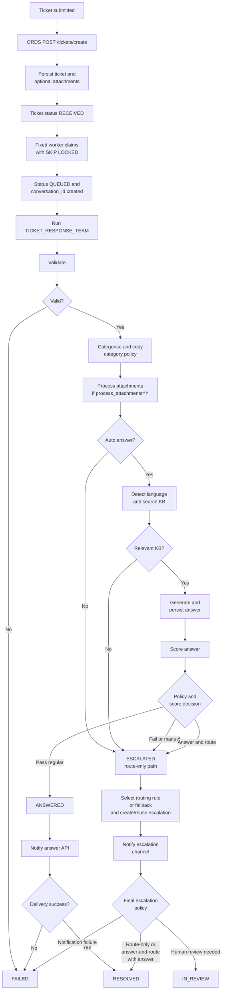

#### 3.1.1 Category Automation Flow Matrix

| Object / Item | Type | Concise Description | Used By |
|---|---|---|---|
| `categories.auto_answer` | Policy flag | Enables KB-grounded answer generation. | Categorisation and answer tasks. |
| `categories.auto_route` | Policy flag | Enables automated routing/escalation dispatch. | Escalation task. |
| `categories.auto_answer_auto_route` | Policy flag | Forces answer generation and route notification for the same ticket. | Scoring and notification tasks. |
| `tickets.auto_answer` | Snapshot flag | Ticket-level copy of category answer policy. | Agent runtime. |
| `tickets.auto_route` | Snapshot flag | Ticket-level copy of category routing policy. | Agent runtime. |
| `tickets.auto_answer_auto_route` | Snapshot flag | Ticket-level copy of combined answer-and-route policy. | Agent runtime. |
| `tickets.process_attachments` | Runtime flag | Controls whether stored attachments are processed by the attachment LLM. | Attachment processor and answer generator. |
| `categories.routing_rule_evaluation_logic` | Routing policy text | Category-specific business logic used to score semantically shortlisted routing rules. | Routing engine and escalation task. |
| `routing_rules.rule_notes_embedding` | Vector field | Embedding of routing rule notes used only to shortlist candidate rules. | Routing engine. |

The workload supports three valid automation policies. The data model enforces `auto_answer_auto_route = 'Y'` only when both `auto_answer = 'Y'` and `auto_route = 'Y'`; in addition, the documented workload flows require `auto_route = 'Y'` so tickets either follow the answer path, the route-only path, or the combined answer-and-route path.

| `auto_answer` | `auto_route` | `auto_answer_auto_route` | Valid? | Implemented Flow |
|---|---|---|---|---|
| `Y` | `Y` | `N` | Yes | Generate an answer. If score passes, deliver answer. If score fails, route/escalate. |
| `N` | `Y` | `N` | Yes | Do not generate an answer. Route/escalate the request directly and close after notification. |
| `Y` | `Y` | `Y` | Yes | Generate and score an answer, then route/escalate regardless of score. Escalation payload includes the generated answer. |
| `Y` | `N` | `N` | No | Invalid workload policy: automated category flows require `auto_route = 'Y'`. |
| `N` | `N` | `N` | No | Invalid workload policy: automated category flows require `auto_route = 'Y'`. |
| `Y` | `N` | `Y` | No | Rejected by constraint. |
| `N` | `Y` | `Y` | No | Rejected by constraint. |
| `N` | `N` | `Y` | No | Rejected by constraint. |

##### Flow 1: Auto Answer `Y`, Auto Route `Y`, Auto Answer and Route `N`

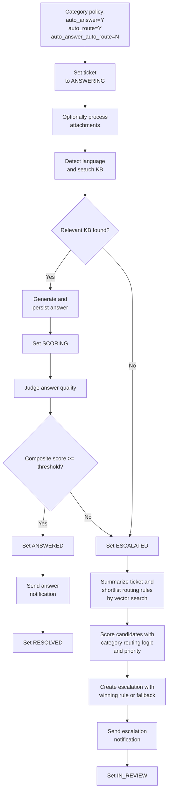

##### Flow 2: Auto Route `Y`, Auto Answer `N`, Auto Answer and Route `N`

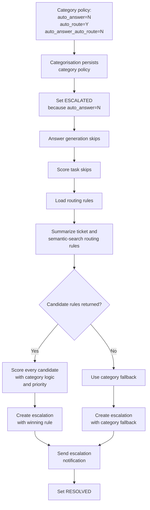

##### Flow 3: Auto Route `Y`, Auto Answer `Y`, Auto Answer and Route `Y`

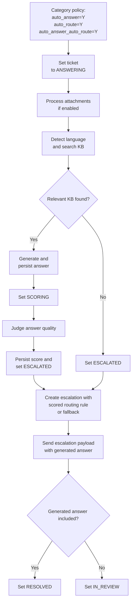

### 3.2 System Context

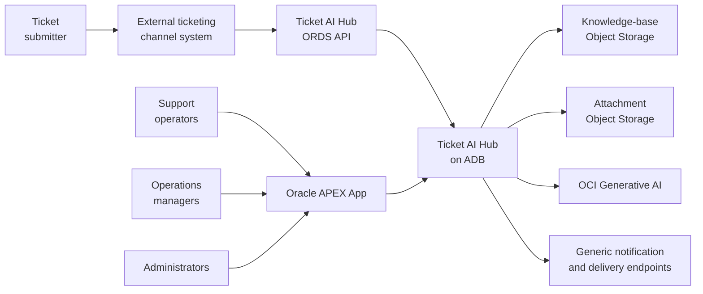

The system context separates runtime automation from human operations. Tickets originate outside the workload, enter through the ORDS API, and are processed inside the Autonomous Database-hosted Ticket AI Hub. From there, the workload uses Object Storage for knowledge and attachment inputs, OCI Generative AI for language, retrieval, answer, scoring, routing, and attachment intelligence, and notification endpoints to return outcomes to downstream systems.

Human users interact through Oracle APEX rather than calling the processing workflow directly. Operators, managers, and administrators use the application to monitor tickets, inspect escalations, review analytics, and maintain configuration while the database layer remains the shared system of record.

| Diagram Component | Role in the System Context |
|---|---|
| Ticket submitter | Person or upstream actor who raises the support request. |
| External ticketing/channel system | Source system that packages the request and sends it to the workload API. |
| Ticket AI Hub ORDS API | REST entry point for ticket creation and workload-facing callback operations. |
| Ticket AI Hub on ADB | Core processing boundary that stores state, runs workers, invokes agents, and exposes data to APEX. |
| Knowledge-base Object Storage | Document source indexed for grounded answer retrieval. |
| Attachment Object Storage | Location for files linked to tickets and optionally processed for additional context. |
| OCI Generative AI | Model service used by Select AI profiles and direct calls for generation, embeddings, judging, and multimodal analysis. |
| Generic notification and delivery endpoints | Outbound integration targets for generated answers and escalation payloads. |
| Support operators | Users who review tickets, escalations, and manual work queues. |
| Operations managers | Users who track service performance and workflow health through dashboards. |
| Administrators | Users who manage access, taxonomy, categories, routing rules, and workload configuration. |
| Oracle APEX App | Operational interface over the same database records used by the automated workflow. |

### 3.3 Major Components

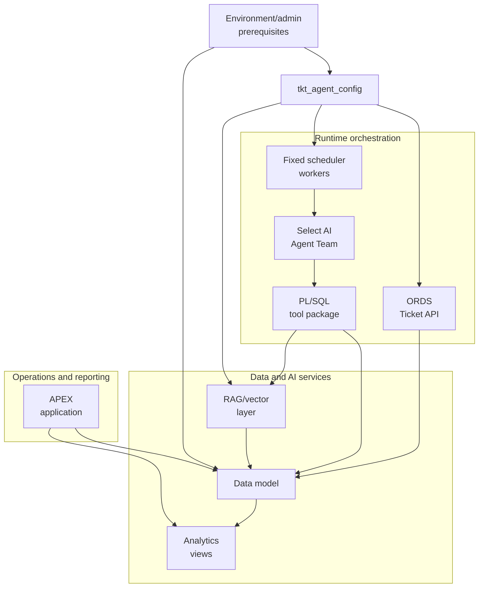

| Component | Responsibility |
|---|---|
| Environment/admin prerequisites | Create or use the `ticket_aihub` schema and grant Select AI, ORDS, vector, scheduler, notification, APEX, and network privileges before deploying data model and workload objects. |
| `tkt_agent_config` | Centralizes non-secret environment settings, profile names, model choices, ORDS URLs, retry limits, worker settings, and notification defaults. |
| ORDS Ticket API | Create, retry, resolve, retrieve detail, receive escalation payloads, and receive answer payloads. |
| Data model | Stores tickets, attachments, categories, departments, scoring, routing rules, routing-rule embeddings, escalations, demo callback simulation data, and analytics objects. |
| Fixed scheduler workers | Claim `RECEIVED` tickets, run the agent team, retry transient failures, recover expired claims, and cooperate with the failed-ticket auto-resubmit monitor. |
| Select AI Agent Team | Runs the sequential ticket processing workflow. |
| PL/SQL tool package | Provides deterministic database actions to the agents. |
| RAG/vector layer | Indexes KB content for answer grounding and maintains routing-rule embeddings for semantic candidate shortlisting. |
| APEX application | Provides operational UI, admin UI, analytics, access control, and demo/test pages. |
| Analytics views | Provide observability and business KPIs. |

### 3.4 External Systems

| External System | Role |
|---|---|
| Source ticketing/channel system | Sends new tickets and may receive status/answer updates. |
| Customer answer delivery endpoint | Receives generated answers for customer delivery. |
| Human escalation endpoint | Receives escalation payloads for review and routing. |
| Notification channels | API, Teams, Email, or Slack. API and Teams failures are blocking; Email and Slack tool implementations are skeleton/non-blocking in the current task rules. `create_escalation` creates the escalation with `notified_at` empty; notification tools stamp delivery after successful dispatch. |
| Object Storage | Stores KB documents and ticket attachment objects. |
| OCI Generative AI | Provides LLM, embedding, judge, language detection, and multimodal attachment capabilities through Select AI profiles and direct GenAI calls. |

### 3.5 Architecture Principles

| Principle | Application in This Workload |
|---|---|
| Grounded generation | Customer answers must use KB search results, not model memory. |
| Tool-mediated changes | Agents modify state only through approved PL/SQL tools. |
| Durable orchestration | Workers claim, run, retry, and recover tickets through database state. |
| Auditable automation | Status transitions, categorisation, scoring, attachments, retries, notifications, and escalations are persisted. |
| Human fallback | Low-confidence, no-KB, invalid, notification-failed, or policy-restricted paths go to review or failure handling. |
| Configuration over code | Category flags, routing rules, category routing evaluation logic, config constants, worker settings, and workload wrapper procedures drive behavior. |

## 4. AI Architecture

### 4.1 AI Design Pattern

The workload uses a sequential multi-agent pattern with:

- RAG-based knowledge grounding.
- Tool-using agents.
- Optional multimodal attachment summarisation.
- LLM-as-judge evaluation.
- Policy-based routing.
- Retry-aware task gates.
- Human-in-the-loop escalation.

### 4.2 Agent Landscape

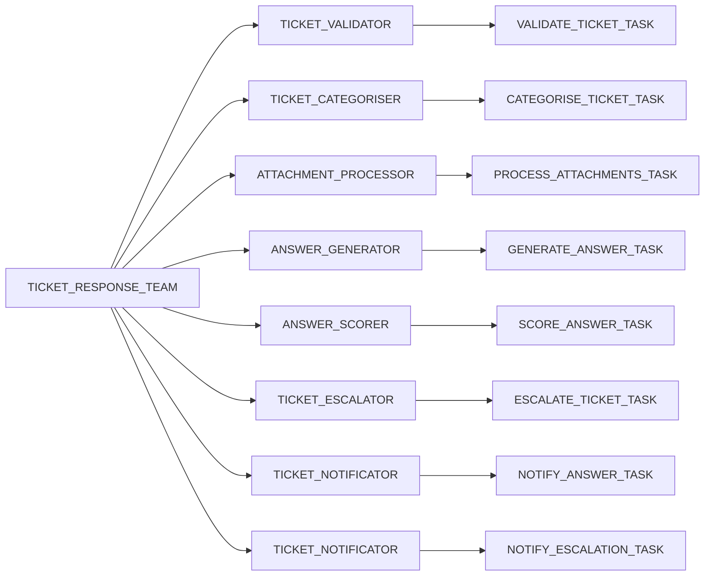

### 4.3 Agent Responsibilities

| Agent | Responsibility |
|---|---|
| `TICKET_VALIDATOR` | Validate body, coherence, category plausibility, and origin ticket reference. |
| `TICKET_CATEGORISER` | Select one active category using ticket text, KB evidence, and category registry, then copy category policies to the ticket. |
| `ATTACHMENT_PROCESSOR` | Process stored attachments when `process_attachments=Y`; per-attachment failures are recorded and non-blocking. |
| `ANSWER_GENERATOR` | Detect language, load processed attachment context, retrieve KB context, and persist a grounded answer. |
| `ANSWER_SCORER` | Score the saved generated answer against the ticket using judge dimensions. |
| `TICKET_ESCALATOR` | Score semantically shortlisted routing rules with category-specific evaluation logic, select a winning rule or fallback, and create or reuse escalation records. |
| `TICKET_NOTIFICATOR` | Send answer or escalation notification and update final statuses. |

### 4.4 Model Strategy

| Profile / Model Area | Role | Model Requirements | OCI GenAI Model Examples |
|---|---|---|---|
| `select_ai_hub_nl2sql` | Natural language to SQL and administrative exploration. | Balanced accuracy and speed for translating operational questions into reliable SQL without excessive latency. | Cohere Command A, Google Gemini 2.5 Flash, OpenAI gpt-oss-20b. |
| `select_ai_hub_agent` | Main ticket workflow agents, direct language utilities, and routing-summary generation. | Strong reasoning capability for policy interpretation, tool sequencing, classification, routing analysis, and controlled workflow decisions. | Cohere Command A Reasoning, xAI Grok 4.20, xAI Grok 4.3, OpenAI gpt-oss-120b. |
| `select_ai_hub_attachments` | Attachment processing and multimodal extraction. | Multimodal capability with vision and document-processing support for extracting useful context from ticket files. | Cohere Command A Vision, Google Gemini 2.5 Pro, Google Gemini 2.5 Flash, Meta Llama 4 Maverick. |
| `select_ai_hub_judge` | LLM-as-judge answer scoring. | Strong reasoning capability for evaluating answer relevance, completeness, faithfulness, and policy fit. | Cohere Command A Reasoning, Meta Llama 3.3 70B, OpenAI gpt-oss-120b. |
| `select_ai_rag_kb` | Knowledge-base retrieval and grounded answer context. | Balanced accuracy and speed for retrieval-augmented answer context, with enough quality to preserve grounding and responsiveness. | Cohere Embed 4 or Cohere Embed Multilingual 3 for embeddings; Cohere Command A or Google Gemini 2.5 Flash for grounded answer synthesis; Cohere Rerank 4 for optional reranking. |

### 4.5 Memory and State Strategy

The workload uses database state rather than long-lived conversational memory. Each task reloads ticket context from database tools and writes durable artifacts to tables. A Select AI conversation ID is created for each worker-run agent execution and stamped onto the ticket for correlation.

Retry behavior is based on durable ticket checkpoints rather than local callback receipt tables. `resubmit_failed_ticket` derives a resume status from failure prefixes, prior status, category state, generated answer, score, and policy flags.

### 4.6 Knowledge Strategy

Knowledge comes from Object Storage documents matching the configured healthcare KB object pattern and indexed through a Select AI vector index. The agent must cite retrieved KB chunks and must not use ungrounded knowledge for institutional facts, policies, clinical guidance, or next steps.

Attachment LLM output is treated only as supplemental customer-provided context. It cannot override KB content or policy rules.

### 4.7 Routing Strategy

Escalation routing uses routing rules attached to the ticket category and department. `get_routing_rule` first builds a compact routing query by summarising the ticket subject and derived `body_text`; if summarisation fails, it falls back to raw subject plus `body_text`. The function refreshes missing or stale routing-rule embeddings, embeds the routing query, and returns up to `c_routing_rule_match_limit` active rules ordered by vector distance and priority.

Vector distance is only a candidate-shortlisting mechanism. `ESCALATE_TICKET_TASK` performs the final rule selection by evaluating every returned rule against `categories.routing_rule_evaluation_logic`, assigning `evaluation_logic_points`, applying `priority_boost`, and computing a final routing score. The configured weights are `c_category_routing_eval_logic_weight = 0.90` and `c_category_routing_priority_weight = 0.10`. Mandatory conflicts cap the final score at zero, so priority cannot override explicit exclusions. The winning `rule_id` and final routing score are passed to `create_escalation`; all department, contact, notification, metadata, and reason fields are reloaded from the database.

### 4.8 Human-in-the-Loop Controls

| Control | Description |
|---|---|
| Category `auto_answer` | Disables answer generation and routes or holds for human handling. |
| Category `auto_route` | Determines whether escalation is routed automatically or held in review. |
| Category `accuracy_threshold` | Minimum quality score for autonomous delivery. |
| `auto_answer_auto_route` | Sends answer inside the escalation path and closes only when the policy requirements are met. |
| `process_attachments` | Allows ticket creators or defaults to control attachment LLM processing. |
| No relevant KB | Routes to manual review instead of generating from general knowledge. |
| Failed validation | Moves ticket to `FAILED`; retry requires corrected content or force. |
| Notification failure | API and Teams failures move tickets to `FAILED` with `NOTIFICATION_ERROR` reasons for retry. |

## 5. Data Architecture

### 5.1 Data Domains

| Domain | Core Objects |
|---|---|
| Reference data | `departments`, `categories`, `routing_rules`, including category routing evaluation logic and routing-rule embedding maintenance fields. |
| Ticket lifecycle | `tickets`, `ticket_attachments`, `ticket_status_history`. |
| AI audit | `ticket_categorisation_log`, `accuracy_scores`. |
| Escalation and delivery | `escalations` for persisted escalation records; `escalations_hitl` and `answers_delivered` for demo/test inbound API simulation only. |
| Worker and retry state | Ticket columns for claim, retry, run start/completion, next retry, `job_error`, failed-ticket auto-resubmission history, and scheduler jobs. |
| Reporting | Reporting views and analytics views for operations, quality, category performance, pipeline health, channel performance, and routing/escalation visibility. |
| API payloads | `ticket_detail_dv`, `ticket_escalation_routing_dv`, `ticket_escalation_routing_middleware_dv`. |

### 5.2 Data Flow

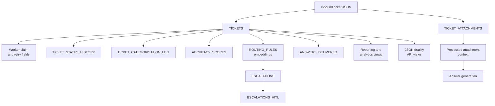

| Table / Table-Backed Data | Purpose |
|---|---|
| `tickets` | Primary ticket record, including submitted content, category snapshot, generated answer, status, retry, claim, and worker execution fields. |
| `ticket_attachments` | Stores attachment metadata, processing request flags, extracted context, raw model output, status, and attachment-processing errors. |
| Worker claim and retry fields | Columns on `tickets` that let scheduler workers claim work safely, retry transient failures, and recover expired or failed runs. |
| `ticket_status_history` | Append-only audit of status transitions with reasons and timestamps. |
| `ticket_categorisation_log` | Records category decisions, confidence, explanations, and override/audit context. |
| `accuracy_scores` | Stores LLM-as-judge evaluation scores, threshold decisions, judge metadata, and raw scoring output. |
| `routing_rules` | Holds active routing rules, notification overrides, rule notes, priorities, and embedding maintenance state for semantic shortlisting. |
| `escalations` | Persists escalation records, selected routing rule or fallback details, notification target, policy context, and routing score. |
| `escalations_hitl` | Testing-only table that simulates inbound calls from a downstream escalation/HITL API; production integrations are expected to use the real external system instead of this table. |
| `answers_delivered` | Testing-only table that simulates inbound calls from a downstream answer-delivery API; production integrations are expected to use the real external system instead of this table. |

### 5.3 Lifecycle Summary

The main ticket lifecycle starts at `RECEIVED`, moves to `QUEUED` when a fixed worker claims it, then progresses through validation, categorisation, optional attachment processing, answering, scoring, answer delivery or escalation, and ends in `RESOLVED` or `FAILED`. `ANSWERED` is an intermediate delivery-ready state for regular auto-answered tickets. `IN_REVIEW` is the human review state for escalations or manual routing.

Allowed status values are `RECEIVED`, `QUEUED`, `VALIDATING`, `CATEGORIZING`, `ANSWERING`, `SCORING`, `ANSWERED`, `ESCALATED`, `IN_REVIEW`, `RESOLVED`, and `FAILED`.

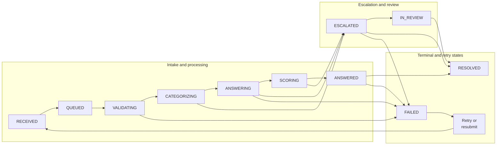

### 5.4 Grounding, Embedding, and Vector Strategy

| Item | Design |
|---|---|
| KB source | Object Storage location configured in `tkt_agent_config`. |
| Vector index | `hub_vector_index_kb`. |
| Embedding model | `cohere.embed-multilingual-v3.0`. |
| Embedding dimension | `1024`. |
| Distance metric | Cosine. |
| Chunking | Chunk size `1024`, overlap `128`. |
| Refresh | Configured refresh interval of `1440` minutes. |
| Retrieval controls | KB match limit and similarity threshold constants are defined in configuration. Separately, routing-rule candidate search uses `c_routing_rule_match_limit` and vector distance over `routing_rules.rule_notes_embedding`; final routing score ignores semantic distance and applies category policy plus priority weight. |

## 6. User Experience Architecture

### 6.1 User Journeys

| Journey | APEX Support |
|---|---|
| Monitor daily operations | Home, Analytics Dashboard, Ticket Overview, Tickets. |
| Inspect a ticket | Tickets, Ticket Detail, Ticket form, My Ticket Details. |
| Review escalations | Escalations, Open Escalations Queue. |
| Resolve escalations | Ticket Detail with saved resolution notes and `internal_resolve_ticket`. |
| Retry or reset test tickets | Ticket Detail and Ticket Playground actions for run agent, clear/reset, and resubmit failed ticket. Failed-ticket auto-resubmit is handled by scheduler procedures rather than an end-user page. |
| Analyse quality | Accuracy Scores, Accuracy Detail Analytics, KB Version Quality. |
| Analyse workflow | Status History, Status Timeline Analytics, Pipeline and throughput views. |
| Administer taxonomy | Departments, Categories, Routing Rules, category routing evaluation logic, and routing-rule notes used for semantic shortlist and policy scoring. |
| Manage access | Administration, Configure Access Control, Manage User Access. |
| Test workflow | Ticket Playground. |

### 6.2 Screen Groups

| Group | Representative Pages |
|---|---|
| Home | Home dashboard with ticket counts, escalation percentages, charts, and navigation. |
| Operations | Tickets, Ticket Detail, Ticket, Escalations, Ticket Status History, Accuracy Score, Categorisation Log, Ticket Playground, My Tickets. |
| Analytics | Analytics Dashboard, Category Performance, Open Escalations Queue, Accuracy Detail Analytics, Status Timeline Analytics, Ticket Overview, KB Version Quality, Recategorization Impact, Status Timeline New. |
| Administration | Departments, Categories, Category form with routing-rule evaluation logic, Routing Rules, Routing Rules Form, Rule Notes, Administration, Configure Access Control, Manage User Access. |
| User settings | Login, Settings, Push Notifications. |

### 6.3 Accessibility Considerations

The source application uses Oracle APEX components such as interactive reports, interactive grids, charts, forms, facets, breadcrumbs, native authentication, authorization schemes, and push-notification settings. Accessibility should be validated through APEX accessibility checks and browser testing before production release.

## 7. Security, Compliance, and Responsible AI

### 7.1 Authentication and Authorization

| Layer | Control |
|---|---|
| APEX | Native Oracle APEX Accounts. |
| APEX authorization | ACL roles for Administrator, Contributor, and Reader. |
| ORDS APIs | OAuth2 client credentials with `ticket_api.role` and privilege mapping for `/tickets/*`. |
| Database | Dedicated `ticket_aihub` schema with grants for Select AI, ORDS, vector, scheduler, notifications, APEX administration, and network ACLs. |
| Environment/admin prerequisites | Schema, role, ORDS, data sharing, package privilege, network ACL, and APEX-related grants must be completed before deployment. |

### 7.2 Data Protection

The scripts include environment-specific identifiers, endpoint hostnames, credential names, and credential creation blocks.

> **Warning: production secrets must not remain in deployment scripts.** Externalize passwords, private keys, API tokens, webhook tokens, client secrets, and other sensitive values to OCI Vault or an approved enterprise secret store before production deployment.

Documentation and operational runbooks should redact OCIDs, fingerprints, private keys, passwords, webhook tokens, endpoint hostnames, and client secrets where required by policy.

### 7.3 Responsible AI Controls

| Risk | Control |
|---|---|
| Hallucinated answer | RAG-only answer rule and no-KB manual review path. |
| Prompt injection | Agent roles tell agents to treat ticket, KB, attachment, and tool output as untrusted data. |
| Unsupported clinical advice | Answer generation rules prohibit unsupported diagnosis, treatment, medication instructions, or clinical interpretation. |
| Wrong language | Dedicated language detection tool and European Portuguese (pt-PT) rule when Portuguese is detected. |
| Poor answer quality | LLM-as-judge scoring and category threshold. |
| Unsafe attachment interpretation | Attachment context is supplemental and cannot override KB or policy content. |
| Duplicate escalation | Escalation tool creates or reuses the latest escalation row and retry tasks reload persisted state. |
| Duplicate notification | Notification tasks reload state and call exactly one notification tool. |
| Opaque automation | Persistent history, logs, scores, raw judge response, attachment raw response, routing-rule scores, retry metadata, embedding status/errors, and callback payloads. |

### 7.4 Compliance Requirements

Specific regulatory obligations are not defined in the source scripts. For a healthcare workload, the project team should confirm requirements for PII, clinical safety, retention, consent, audit access, data residency, model usage approvals, attachment storage, and external callback payload handling.

## 8. Operational Architecture

### 8.1 Deployment Architecture

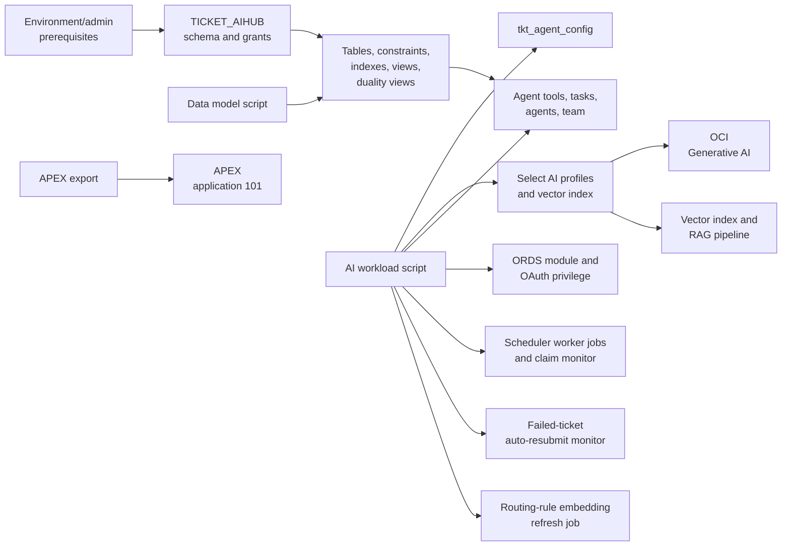

| Deployment Item | Purpose |
|---|---|
| Environment/admin prerequisites | One-time administrator setup for schema creation, required roles, network access, package privileges, ORDS enablement, and APEX-related grants. |
| `TICKET_AIHUB` schema and grants | Runtime database owner for workload objects, APIs, scheduler jobs, Select AI configuration, and application data access. |
| Data model script | Creates the relational schema, constraints, indexes, comments, views, analytics views, and JSON duality views used by the workload. |
| Tables, constraints, indexes, views, duality views | Persistent database layer for ticket state, audit, scoring, routing, escalation, API payload shapes, and reporting. |
| AI workload script | Deploys configuration, AI profiles, tool packages, agent tasks, ORDS modules, and scheduler automation. |
| `tkt_agent_config` | Central configuration package for profile names, endpoint settings, worker counts, retry controls, thresholds, and workload constants. |
| Select AI profiles and vector index | Defines the AI model profiles and knowledge-base vector index used by agents, RAG, embeddings, and direct model calls. |
| Agent tools, tasks, agents, team | Implements the Select AI agent workflow and the PL/SQL tools agents use to read and update database state. |
| ORDS module and OAuth privilege | Exposes secured REST endpoints for ticket creation, retry, detail retrieval, resolution, and callback simulation. |
| Scheduler worker jobs and claim monitor | Runs the asynchronous processing fleet and recovers tickets whose worker claims expire. |
| Failed-ticket auto-resubmit monitor | Periodically retries eligible failed tickets based on configured retry policy and failure classification. |
| Routing-rule embedding refresh job | Keeps routing-rule note embeddings current for semantic shortlisting during escalation routing. |
| APEX export | Imports the Oracle APEX application definition used for operations, analytics, administration, and testing. |
| APEX application 101 | Deployed low-code user interface connected to the same workload schema and authorization model. |
| OCI Generative AI | External model service used by Select AI profiles for generation, reasoning, judging, embeddings, and multimodal processing. |
| Vector index and RAG pipeline | Retrieval layer that grounds generated answers in approved knowledge-base content. |

### 8.2 Scalability Strategy

The create-ticket API commits quickly and leaves processing to fixed recurring DBMS_SCHEDULER workers. Each worker claims one eligible `RECEIVED` ticket using `FOR UPDATE SKIP LOCKED`, marks it `QUEUED`, stamps claim metadata, and runs the agent team in that scheduler job session. Worker count is controlled by `tkt_agent_config.c_worker_count`, and `tkt_ticket_workers.configure_workers` creates or removes worker jobs accordingly. The `tkt_ticket_workload.run_workload` wrapper starts the worker fleet, claim monitor, failed-ticket resubmit monitor, and routing-rule embedding refresh job without redeploying the workload.

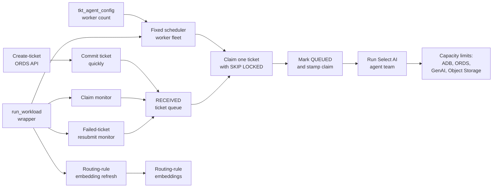

Further scale targets should be validated against ADB service level, scheduler concurrency, ORDS capacity, OCI Generative AI rate limits, Object Storage throughput, KB vector index refresh behavior, and routing-rule embedding refresh cost.

### 8.3 Availability Targets

Explicit availability targets are not defined in the scripts. Suggested design questions:

- Required uptime for ticket creation, retry, detail retrieval, and APEX operations.
- Maximum acceptable agent-processing delay.
- Maximum worker claim lifetime and recovery interval.
- Retry budget for transient OCI Generative AI timeouts.
- Recovery behavior for repeated notification failures.
- Expected Object Storage availability for KB and attachments.

### 8.4 Monitoring and Logging

| Monitoring Area | Source |
|---|---|
| Ticket status | `tickets`, `ticket_status_history`. |
| Worker backlog and claims | `v_analytics_agent_dispatch_queue`, ticket claim columns. |
| Agent failures and retries | `tickets.job_error`, retry columns, status history reasons, `auto_resubmit_failed_tickets`, and failed-resubmit monitor results. |
| Agent quality | `accuracy_scores`, `v_ticket_accuracy_detail`. |
| Categorisation quality | `ticket_categorisation_log`, `v_categorisation_audit`. |
| Attachment processing | `ticket_attachments` processing status, LLM output, raw response, and errors. |
| Pipeline health | `v_analytics_pipeline_health` and `v_analytics_agent_dispatch_queue`. |
| Escalation SLA | `v_open_escalations`, `v_analytics_escalation_sla`. |
| KB regression | `v_analytics_agent_kb_version_quality`. |
| Callback delivery | Notification-related status history in production; `escalations_hitl` and `answers_delivered` only when demo/test callback simulation is enabled. |
| Scheduler failures | `tickets.job_error`, scheduler views, worker claim fields, failed-resubmit monitor, and routing-rule embedding job status. |

### 8.5 Evaluation Framework

The implementation evaluates generated answers through relevance, completeness, faithfulness, composite score, applied threshold, and pass/fail result. The analytics layer allows score trends to be analysed by department, category, resolution path, channel, KB version, and recategorisation path.

Evaluation results are dependent on the accuracy and overall quality of the model used to generate and judge the answers. Model selection, prompt design, grounding context, and model-version changes should therefore be controlled and considered when comparing evaluation outcomes.

Attachment extraction quality is stored per attachment through normalized LLM output, raw model response, status, and error columns, but there is no separate automated attachment-quality scoring framework in the current scripts.

## 9. Assumptions, Risks, and Open Questions

### 9.1 Assumptions

| Assumption | Notes |
|---|---|
| KB documents are approved content | The agent relies on KB content for authoritative answers. |
| Attachment objects are accessible through configured credentials | Attachment processing depends on Object Storage URI reachability and permissions. |
| Category policies are business-owned | `auto_answer`, `auto_route`, thresholds, notification methods, `process_attachments` defaults, and routing-rule evaluation logic require owner approval. |
| External systems are generic | This HLD intentionally avoids naming specific downstream products. |
| Callback stores are demo-capable | `receive_escalation` and `receive_answer` are marked as demo-oriented and controlled by `c_detailed_debug`. |
| Fixed worker count starts conservatively | Current configuration uses one worker by default and can be changed through config, `tkt_ticket_workers.configure_workers`, or `tkt_ticket_workload.run_workload`. |

### 9.2 Risks

| Risk | Mitigation |
|---|---|
| Secrets or tenant-specific values in deployment scripts | Move secrets to Vault/secret manager and redact deployment docs. |
| KB coverage gaps | No-KB path escalates to manual review; monitor KB quality views and category-to-KB mappings. |
| Attachment cost or latency growth | Keep `process_attachments` configurable and enforce attachment size limits. |
| Model drift | Track scores, judge model, prompt hash, KB version, and analytics trends. |
| Stalled worker claims | Claim monitor recovers expired claims when the owning worker is no longer running. |
| Retry loops | Retry budgets limit transient timeout, claim recovery, and automatic failed-ticket resubmission attempts. |
| Notification duplication | Task rules, escalation reader reloads, and durable stores reduce duplication; downstream endpoints should still be idempotent. |
| Clinical safety | Keep medical advice constrained to approved KB content and route uncertain cases. |

### 9.3 Open Questions

| Question | Owner |
|---|---|
| What are production SLA targets for acknowledgement and resolution? | Business/Product |
| What worker count, retry budget, and failed-ticket auto-resubmission policy should be used in production? | Operations/Architecture |
| Which downstream ticketing and answer-delivery systems will be integrated? | Integration/Product |
| What PII retention and masking policies apply to tickets, attachments, callback payloads, and model raw responses? | Security/Compliance |
| Which KB publishing process governs vector index refresh, `kb_version` stamping, and routing-rule embedding refresh timing? | Knowledge Owner |
| What model approval process applies to OCI Generative AI profiles and direct attachment model calls? | AI Governance |
| Should demo callback stores be disabled in production by setting detailed debug behavior off? | Architecture/Operations |
