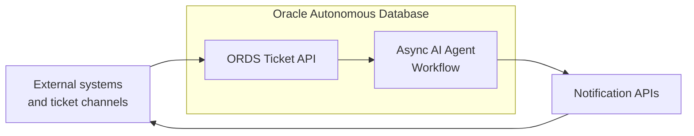
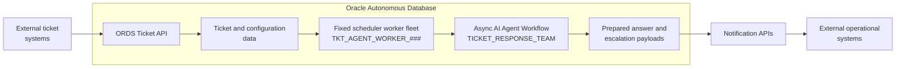
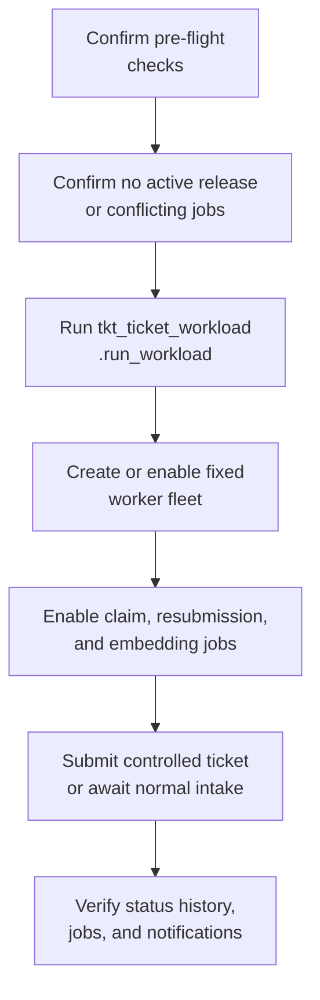
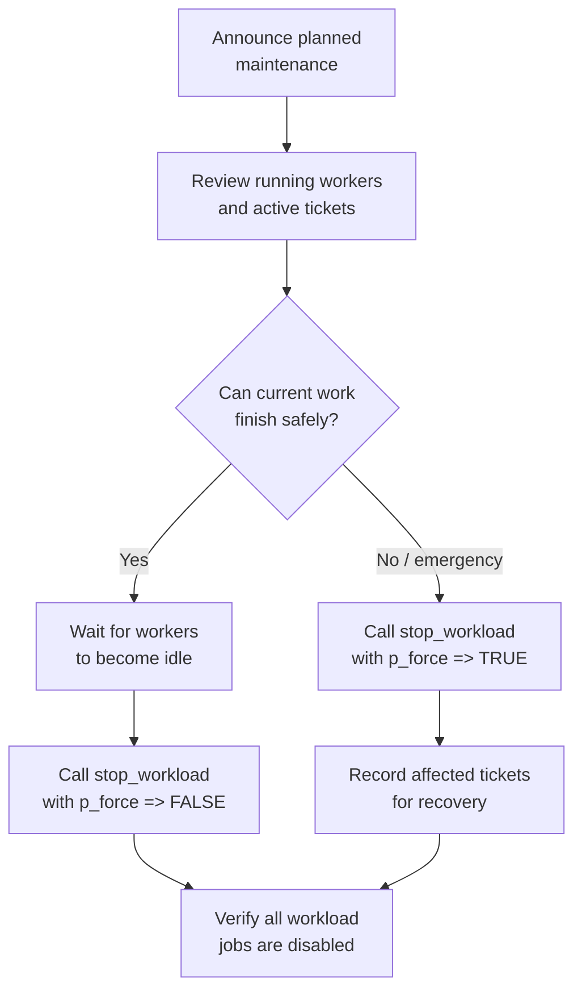
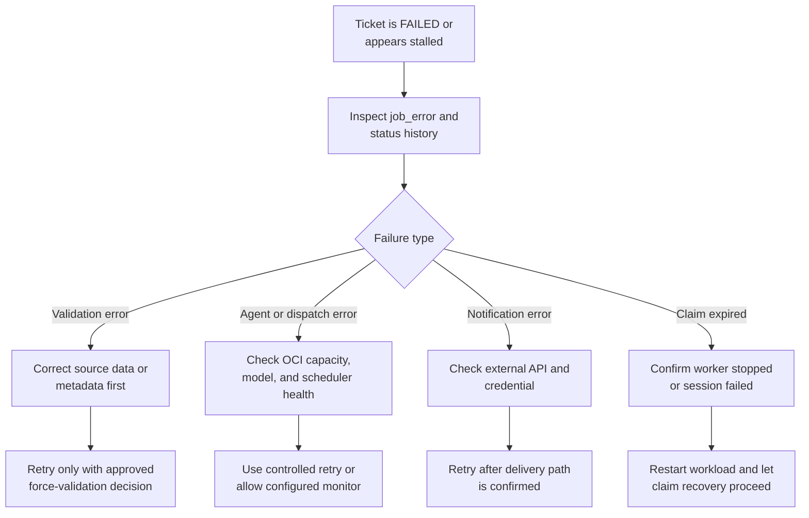
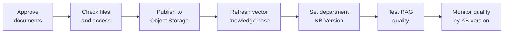

# Ticket AI Hub - Technical Operations Manual

**Author:** José Cruz  
**Version:** 0.02  
**Date:** 2026-07-21  
**Audience:** Service owners, database administrators, application administrators, release managers, and support teams.

## 1. Purpose and Scope

This manual describes how to operate the Ticket AI Hub workload after deployment: start and stop its asynchronous processing, verify its health, respond to common failures, and apply code, metadata, and knowledge-base releases. It is intentionally operational and detailed. For the solution architecture, component rationale, and integration design, refer to the High-Level Design (HLD). For implementation-level object and API detail, refer to the Low-Level Design (LLD).



The workload runs in Oracle Autonomous Database. ORDS receives tickets and operational API requests; `DBMS_SCHEDULER` workers process tickets through the `TICKET_RESPONSE_TEAM`; the database sends prepared answer and escalation payloads to the configured external notification APIs.

### 1.1 Operational Architecture



### 1.2 Operating Principles

| Principle | Operational meaning |
|---|---|
| Preserve auditability | Use supported procedures and APEX administration pages. Do not directly update ticket statuses or workflow checkpoint columns. |
| Drain before change | For planned releases, stop the workload or wait for running workers before applying code, database, metadata or knowledge base changes that affect workflow objects. |
| Separate release types | Code, metadata, and knowledge-base releases have different validation and rollback actions. Treat them independently. |
| Protect credentials | Keep OCI, Object Storage, and external API secrets in OCI Vault or an approved enterprise secret store. Never place them in SQL scripts, source control, or this manual. |
| Test production paths | The `receive_escalation` and `receive_answer` endpoints and their tables are demonstration/test facilities. Production delivery must use external-system APIs. |

## 2. Roles and Access

| Role | Responsibilities | Required access |
|---|---|---|
| Database administrator | Run prerequisite, data-model, and workload deployments; manage scheduler jobs and database security. | Autonomous Database schema owner or approved privileged deployment access. |
| Workload operator | Start and stop the workload, inspect job health, review failures, and coordinate recovery. | Execute access to workload packages; read access to scheduler and operational views. |
| Application administrator | Maintain departments, categories, routing rules, and knowledge-base version metadata in APEX. | APEX administration workspace and authorised application role. |
| Knowledge owner | Approve source documents, release KB content, and assess answer quality. | Approved Object Storage content workflow and APEX metadata access. |
| Integration owner | Own external ticket and notification APIs, credentials, and end-to-end contract tests. | Access to integration monitoring and secret-management process. |

## 3. Prerequisites and Pre-flight Checks

Before starting or restarting the workload, confirm the following.

| Check | How to verify | Expected result |
|---|---|---|
| Deployment order | Confirm the admin prerequisite script, data-model script, workload script, and APEX export were applied in that order. | Required database objects and privileges exist. |
| Compilation | Review compilation errors after a code release. | No invalid packages, functions, or procedures used by the workload. |
| ORDS | Call an authenticated non-destructive endpoint or inspect ORDS module metadata. | The ticket API is reachable and authorised. |
| AI and Vector AI | Validate configured OCI credential, region, selected models, and Vector AI profile/index. | The database can invoke OCI Generative AI and access the configured vector store. |
| Notification API | Run an approved non-production or controlled contract test. | Required outbound endpoint and credential are valid. |
| Metadata | Review enabled departments, categories, routing rules, teams, and thresholds. | Active configuration is complete and internally consistent. |
| Scheduler capacity | Inspect `USER_SCHEDULER_JOBS` and `USER_SCHEDULER_RUNNING_JOBS`. | No conflicting old worker or monitor jobs remain. |

Use this query to inspect Ticket AI Hub jobs before an operational change:

```sql
SELECT job_name,
       enabled,
       state,
       repeat_interval,
       last_start_date,
       next_run_date
FROM   user_scheduler_jobs
WHERE  job_name LIKE 'TKT_AGENT_WORKER_%'
OR     job_name IN (
           'TKT_AGENT_WORKER_CLAIM_MONITOR',
           'TKT_AGENT_FAILED_RESUBMIT_MONITOR',
           'REFRESH_ROUTING_RULE_EMBEDDINGS_JOB'
       )
ORDER BY job_name;
```

> **Warning:** Do not use `sp_reset_ticket` in production. It is a testing utility that clears ticket processing state and must only be used in controlled test environments.

## 4. Starting the Workload

`tkt_ticket_workload.run_workload` is the supported start operation. It reconciles the fixed worker fleet, ensures the claim monitor and failed-ticket resubmission monitor exist and are enabled, and enables the routing-rule embedding refresh job.

The configured workers claim eligible `RECEIVED` tickets using `FOR UPDATE SKIP LOCKED`; each worker runs one `TICKET_RESPONSE_TEAM` execution in its own scheduler session. Workers recur every five minutes by default.

> **Planned changes:** Before changing workload configuration, metadata that affects live processing, integrations, or deployed code, stop the workload gracefully:
>
> ```sql
> BEGIN
>     tkt_ticket_workload.stop_workload(p_force => FALSE);
> END;
> /
> ```
>
> `p_force => FALSE` means that running scheduler jobs are not forcibly stopped. This lets in-flight ticket processing finish before the workload is disabled, avoiding interrupted workflow executions and the data inconsistencies they can create. After the running jobs have drained, apply the approved change and start the workload again using the procedure in this section.



### 4.1 Standard Start Procedure

1. Complete the pre-flight checks in section 3.
2. Choose a worker count that matches approved database and OCI Generative AI capacity. Start conservatively after a new deployment.
3. Run the workload procedure as the application schema owner or an authorised operator.
4. Verify the expected jobs are enabled and that a controlled ticket reaches its expected terminal status.

Example start invocation used by the current deployment:

```sql
BEGIN
    tkt_ticket_workload.run_workload(
        p_worker_count             => 10,
        p_retry_cases              => 'AGENT_ERROR,RETRY_DISPATCH_ERROR,WORKER_CLAIM_EXPIRED',
        p_force_validation         => 'N',
        p_max_tickets              => 10,
        p_max_failed_resubmits     => 3,
        p_resubmit_repeat_interval => 'FREQ=MINUTELY;INTERVAL=15',
        p_resubmit_enabled         => 'Y',
        p_run_embedding_refresh    => 'N'
    );
END;
/
```

### 4.2 Start Parameters

| Parameter | Purpose | Operational guidance |
|---|---|---|
| `p_worker_count` | Number of fixed `TKT_AGENT_WORKER_###` jobs to maintain. | Increase only after validating OCI model quotas, database capacity, and notification API throughput. Reducing the number removes excess worker jobs when safe to reconcile. |
| `p_retry_cases` | Failure prefixes eligible for automatic failed-ticket resubmission. | Keep the implementation default unless a reviewed incident requires a temporary exception. Do not automatically retry business validation failures. |
| `p_force_validation` | Allows validation failures to be retried when `Y`. | Keep `N` in production normal operations; use `Y` only after correcting the source data and approving the retry. |
| `p_max_tickets` | Maximum failed tickets considered by one resubmission monitor execution. | Use a small value during recovery to avoid a sudden retry surge. The deployment example uses `10`. |
| `p_max_failed_resubmits` | Maximum automatic `FAILED` to `RECEIVED` resubmissions per ticket. | The configured default is `3`. Raising it can hide persistent faults and increase cost. |
| `p_resubmit_repeat_interval` | Frequency of the failed-ticket resubmission monitor. | Default/example is every 15 minutes. Use a slower rate while investigating a widespread integration failure. |
| `p_resubmit_enabled` | Required switch for the complete workload start. | Must be `Y`; `run_workload` rejects `N`. |
| `p_run_embedding_refresh` | Requests a one-off routing-rule embedding refresh when no refresh job is running. | Normally `N`; use a controlled refresh after routing-rule changes. |

### 4.3 Post-start Validation

Verify all of the following before declaring the service available:

1. The worker jobs match the approved worker count and are enabled.
2. `TKT_AGENT_WORKER_CLAIM_MONITOR`, `TKT_AGENT_FAILED_RESUBMIT_MONITOR`, and `REFRESH_ROUTING_RULE_EMBEDDINGS_JOB` are enabled.
3. A newly accepted ticket is recorded as `RECEIVED`, claimed as `QUEUED`, and progresses through the agent workflow.
4. The ticket has current `ticket_status_history` entries and no unexpected `job_error`.
5. A valid answer is delivered or a valid escalation is sent to the configured external notification API.

Use the following query to validate that all expected jobs are enabled and to see whether any are executing at the time of the check. A recurring worker can be healthy while `RUNNING_NOW` is `N`, because it is idle between scheduled runs.

```sql
SELECT j.job_name,
       j.enabled,
       j.state,
       j.last_start_date,
       j.next_run_date,
       CASE
           WHEN r.job_name IS NOT NULL THEN 'Y'
           ELSE 'N'
       END AS running_now
FROM   user_scheduler_jobs j
       LEFT JOIN user_scheduler_running_jobs r
           ON r.job_name = j.job_name
WHERE  j.job_name LIKE 'TKT_AGENT_WORKER_%'
OR     j.job_name IN (
           'TKT_AGENT_WORKER_CLAIM_MONITOR',
           'TKT_AGENT_FAILED_RESUBMIT_MONITOR',
           'REFRESH_ROUTING_RULE_EMBEDDINGS_JOB'
       )
ORDER BY j.job_name;
```

## 5. Stopping the Workload

Use `tkt_ticket_workload.stop_workload` for a planned operational stop. It discovers all fixed worker jobs and stops and disables the worker fleet, claim monitor, failed-ticket resubmission monitor, and routing-rule embedding refresh job.



### 5.1 Planned Stop

1. Notify integration owners that the ticket API can continue accepting tickets, but newly created tickets remain in `RECEIVED` until the workload is started again.
2. Inspect `USER_SCHEDULER_RUNNING_JOBS` and tickets in active states (`QUEUED`, `VALIDATING`, `CATEGORIZING`, `ANSWERING`, `SCORING`, `ANSWERED`, `ESCALATED`).
3. Allow active executions to finish whenever the maintenance window permits.
4. Stop the workload gracefully:

```sql
BEGIN
    tkt_ticket_workload.stop_workload(p_force => FALSE);
END;
/
```

5. Confirm that all jobs listed in section 3 are disabled and that no Ticket AI Hub job remains in `USER_SCHEDULER_RUNNING_JOBS`.

### 5.2 Emergency Stop

Use a forced stop only for security incidents, harmful outbound behaviour, database protection, or an approved emergency change.

```sql
BEGIN
    tkt_ticket_workload.stop_workload(p_force => TRUE);
END;
/
```

Forced interruption can leave a ticket with an expired worker claim. The claim monitor is designed to recover eligible active tickets after restart; document the affected ticket IDs and validate them after the workload returns.

## 6. Daily Operations and Monitoring

### 6.1 What to Monitor

| Signal | What it indicates | Action when abnormal |
|---|---|---|
| Scheduler job state and failure count | Whether the worker fleet and monitors are running as intended. | Investigate failed or disabled jobs before increasing worker count or retrying tickets. |
| `RECEIVED` backlog age | Whether workers are keeping up with ticket intake. | Check worker availability, OCI service capacity, and external dependencies; scale only with approval. |
| Active tickets near claim expiry | Potential stuck or interrupted executions. | Inspect the claiming worker and `job_error`; allow claim recovery or perform a controlled retry. |
| `FAILED` tickets by failure prefix | Recurring validation, agent, dispatch, or notification faults. | Triage the root cause before enabling broad resubmission. |
| Answer and escalation delivery outcome | Whether the notification integration is completing. | Check external API health, credentials, and payload contract. |
| Accuracy scores and KB-version quality | Answer quality and possible KB regression. | Review source documents, version metadata, model selection, and routing logic. |

### 6.2 Daily Review Queries

```sql
SELECT status, COUNT(*) AS ticket_count
FROM   tickets
GROUP  BY status
ORDER  BY status;

SELECT ticket_id,
       status,
       agent_claimed_by,
       agent_claim_expires_at,
       agent_retry_count,
       job_error
FROM   tickets
WHERE  status = 'FAILED'
OR     agent_claim_expires_at <= SYSTIMESTAMP
ORDER  BY timestamp_updated DESC;
```

Review the latest `ticket_status_history` and relevant escalation or score records before taking corrective action. Direct data corrections bypass the workflow audit trail and are not an operational remedy.

### 6.3 Ticket Recovery Decision Flow



### 6.4 Recovery Guardrails

- `VALIDATION_ERROR` tickets are not normal candidates for automatic retry. Correct the data or governing metadata first.
- The default automatic retry classes are `AGENT_ERROR`, `RETRY_DISPATCH_ERROR`, and `WORKER_CLAIM_EXPIRED`.
- Transient worker/agent timeouts have a retry budget of five attempts and a five-minute delay before pickup. Exhausted retries result in `FAILED`.
- Worker claims last 360 minutes in the current implementation. The claim monitor only recovers an expired claim when its claiming worker is no longer running.
- Use the supported retry procedure or ORDS retry endpoint. Do not manually set a `FAILED` ticket back to `RECEIVED`.

## 7. Code Release and Rollback

A code release includes changes to the prerequisite/admin script, the data model, the AI-agent workload script, ORDS definitions, or the APEX application export.

```mermaid
flowchart LR
    A["Approve release<br/>and rollback plan"] --> B["Back up metadata and<br/>record deployed version"]
    B --> C["Drain and stop<br/>workload"]
    C --> D["Apply admin prerequisites"]
    D --> E["Apply data model"]
    E --> F["Apply AI agent and<br/>ORDS workload code"]
    F --> G["Import APEX application<br/>when applicable"]
    G --> H["Compile and smoke test"]
    H --> I["Start workload and<br/>validate end to end"]
```



### 7.1 Standard Code Release Procedure

1. Approve the release, maintenance window, test evidence, backout plan, and owner for each dependency.
2. Record current package, data-model, ORDS, APEX, and knowledge-base versions. Export or otherwise preserve mutable APEX metadata according to the environment change process.
3. Drain and stop the workload using section 5.
4. Apply scripts in this order: administrator prerequisites, data model, workload/agent code and ORDS configuration, then APEX application export.
5. Review `SHOW ERRORS` output and query for invalid objects.
6. Recreate JSON duality views if their underlying schema or tables changed; then validate the middleware views and ORDS response payloads.
7. Execute a controlled end-to-end test covering ticket creation, one valid route, answer or escalation delivery, and detail retrieval.
8. Start the workload with a conservative worker count, monitor it, then restore the approved concurrency.

> **Warning:** JSON duality views must be recreated whenever their underlying tables or schema change. A successful table deployment does not guarantee that `ticket_detail_dv` or `ticket_escalation_routing_dv` still exposes the required JSON contract.

### 7.2 Rollback Principles

Use the approved, versioned rollback artifact. Do not attempt rollback by manually deleting packages, tables, scheduler jobs, or ORDS modules. If the release fails after a schema change, keep the workload stopped, assess data compatibility, restore the known-good release according to the deployment plan, recreate dependent views and API definitions, and run smoke tests before restart.

## 8. Metadata Release Operations

Metadata is managed through the administration capability in APEX and includes departments, categories, routing rules, team assignments, automation flags, thresholds, prompts, and evaluation logic.

### 8.1 Change Sequence

1. Define the business purpose, owner, effective date, and rollback action.
2. Update the smallest coherent set of metadata records in APEX.
3. Validate category automation combinations and team/routing relationships.
4. Test representative tickets, including a boundary case and a no-match case.
5. Refresh routing-rule embeddings when routing rule names or notes have changed.
6. Monitor routing outcomes and accuracy scores after release.

### 8.2 Category Automation Guardrails

| Automation combination | Supported operational behaviour |
|---|---|
| `auto_answer=Y`, `auto_route=Y`, `auto_answer_auto_route=N` | Generate and score an answer. Deliver it when it passes the threshold; otherwise create an escalation. |
| `auto_answer=N`, `auto_route=Y`, `auto_answer_auto_route=N` | Route and escalate without generating an answer. |
| `auto_answer=Y`, `auto_route=Y`, `auto_answer_auto_route=Y` | Generate an answer and always route it in the escalation payload; separate answer delivery is skipped. |

Do not activate configurations where `auto_route=N`; the workload is designed for the supported route-based flows above.

### 8.3 Routing Rule Changes

Routing rules determine the target team for a classified ticket. Their `rule_name` and `rule_notes` should state concrete location, specialty/service, and clinician criteria when applicable. The semantic embedding helps shortlist candidate rules; the category evaluation logic makes the final contextual choice. `priority_boost` is a bounded tie-influence value from `0` to `10`; it must not be used to override a location or service contradiction.

When a rule name or notes change, refresh routing-rule embeddings after the metadata release. Do not perform a broad model, prompt, and routing-rule change as one unmeasured production change; this makes routing regressions difficult to diagnose.

## 9. Knowledge-Base Release Operations

The knowledge base is sourced from the configured Object Storage location and indexed through the configured Oracle Vector AI profile. A KB release includes additions, changes, or removals of source documents, not merely a file upload.



### 9.1 KB Release Procedure

1. Approve the document inventory, content owner, classification, and rollback set.
2. Add, update, or remove files in the approved Object Storage source location.
3. Confirm the Vector AI profile, vector index, credential, embedding model, dimension, chunking, and refresh settings are appropriate for the workload.
4. Allow or trigger the approved vector refresh process and validate retrieval with representative questions.
5. Update the relevant department `KB Version` whenever the knowledge base changes. Use a clear release identifier such as `KB-2026-07` or `KB-2026-07-21` when day-level traceability is required.
6. Test expected-answer, no-answer, and recently changed-document scenarios before approving the release.
7. Monitor the analytics that compare answer quality by KB version.

### 9.2 KB Configuration Baseline

The current code uses `hub_vector_index_kb`, the OCI credential named `OCI`, Oracle region `eu-frankfurt-1`, embedding model `cohere.embed-multilingual-v3.0`, vector dimension `1024`, cosine distance, chunk size `1024`, overlap `128`, a 1,440-minute refresh rate, match limit `12`, and similarity threshold `0`. These are a deployment baseline, not universal values.

RAG and vector parameters must be defined and tested against the specific workload, purpose, language, documents, and expected question set. Changes in document type, volume, or retrieval quality may require retuning and a controlled comparison with the previous KB release.

## 10. Runtime Configuration That Influences Behaviour

### 10.1 Configuration Areas

| Area | Examples | Where the change is made | Operational effect | Change control |
|---|---|---|---|---|
| Worker and recovery | Worker count, retry classes, retry interval, resubmission limit | The `tkt_ticket_workload.run_workload` parameters; default values are defined in the deployed `tkt_agent_config` package. | Controls throughput, recovery rate, database load, and OCI model demand. | Change through the approved workload start/reconfiguration procedure and monitor closely. |
| AI models | Agent, judge, attachment, RAG, and NL2SQL model selection | Approved database AI profile and deployed workload configuration, including `tkt_agent_config` for RAG. A code/configuration release is required when these are not exposed as APEX metadata. | Changes quality, latency, modality support, and cost. | Require evaluation evidence and a controlled test set. |
| Prompts and evaluation logic | Category prompts, routing evaluation logic, response guidance | APEX Administration pages for categories and routing rules. | Changes classification, routing, and decision behaviour. | Version, test representative cases, and retain rollback text. |
| Routing rules and priority | Rule name/notes, target team, `priority_boost` | APEX Administration pages for routing rules and their related category/team metadata. | Changes escalation destination and selection between compatible rules. | Refresh rule embeddings after semantic text changes. |
| Answer thresholds | Category accuracy threshold | APEX Administration page for the applicable category. | Determines whether an answer is delivered or escalated. | Assess customer-risk and false-confidence trade-offs. |
| Knowledge base | Source documents, KB version, Vector AI settings | Documents: approved Object Storage source path. KB Version: APEX Administration page for the relevant department. Vector AI settings: deployed `tkt_agent_config`/AI profile configuration. | Changes retrieved evidence and answer quality. | Follow section 9 and update KB version metadata. |
| Integrations | Notification API endpoint, authentication, payload contract | Integration configuration and the database credential/secret-management process; endpoint or payload-mapping changes may require a workload code release. | Determines answer/escalation delivery success. | Test contract and rotate credentials through secure secret management. |

### 10.2 Model Selection Guidelines

| Profile | Requirement | Profile and model configuration variables | Where the selection is configured | Operational consideration |
|---|---|---|---|---|
| Agent | Strong reasoning and instruction following. | Profile: `c_profile_agent_name` = `select_ai_hub_agent`. Model: `c_profile_agent_model`. Region: `c_profile_agent_region`. | `tkt_agent_config` in the deployed workload script; update the constants and recreate the Select AI profile through the controlled code/configuration release. Category prompts remain APEX metadata. | Evaluate factuality, Portuguese performance, latency, and cost with real ticket samples. |
| Judge | Strong reasoning and instruction following. | Profile: `c_profile_judge_name` = `select_ai_hub_judge`. Model: `c_profile_judge_model`. Region: `c_profile_judge_region`. | `tkt_agent_config` in the deployed workload script; recreate the Select AI profile through the controlled code/configuration release. | Test scoring stability, correlation with human evaluation, latency, and cost. |
| Attachments | Multimodal model with vision and document-processing capability. | Profile: `c_profile_attachments_name` = `select_ai_hub_attachments`. Model: `c_profile_attachments_model`. Region: `c_profile_attachments_region`. | `tkt_agent_config` in the deployed workload script; recreate the Select AI profile through the controlled code/configuration release. | Validate each file type, OCR quality, confidentiality handling, and page/image limits. |
| RAG | Balance of accuracy and speed. | Profile: `c_profile_rag_kb_name` = `select_ai_rag_kb`. Generation model: `c_rag_model`. Embedding model: `c_rag_embedding_model`. Region: `c_rag_region`. | `tkt_agent_config` and the Oracle Vector AI profile/index created by the workload deployment. A model or embedding change requires a controlled KB/index rebuild and validation. | Test retrieval-grounded answers, retrieval quality, and index compatibility separately. |
| NL2SQL | Balance of accuracy and speed. | Profile: `c_profile_nl2sql_name` = `select_ai_hub_nl2sql`. Model: `c_profile_nl2sql_model`. Region: `c_profile_nl2sql_region`. | `tkt_agent_config` in the deployed workload script; recreate the Select AI profile through the controlled code/configuration release. | Test SQL correctness, permissions, and safe handling of ambiguous requests. |

Model availability is region- and tenancy-dependent. Confirm the OCI Generative AI catalog and approved service limits before changing production configuration.

## 11. Security, Secrets, and Data Protection

> **Warning: secrets and credentials**  
> Use OCI Vault or an approved enterprise secret manager for OCI, Object Storage, ORDS, and external notification API credentials. Do not place tokens, passwords, signed URLs, or private keys in APEX fields, SQL scripts, logs, screenshots, source control, or documentation.

| Control | How it is used | Why it matters |
|---|---|---|
| Least-privilege database roles | Separate deployment, operation, APEX administration, and read-only monitoring responsibilities. | Limits accidental or unauthorised workflow and data changes. |
| OCI credential management | Use the approved database credential and rotate its backing secret through the enterprise process. | Protects access to OCI Generative AI and Object Storage. |
| ORDS OAuth2 and API security | Protect exposed ticket endpoints and restrict callers to approved clients. | Prevents unauthorised ticket creation, retry, resolution, and data retrieval. |
| Log review and redaction | Restrict access to `job_error`, payloads, prompts, and attachments; avoid copying personal data into incident records. | Limits exposure of patient and customer information. |
| External API allow-listing | Use approved endpoints and validate TLS/certificates according to organisational policy. | Reduces delivery to unintended systems. |

## 12. Maintenance Calendar and Checklists

### 12.1 Daily

- Review scheduler status, backlog age, failures, notification outcomes, and active claims near expiry.
- Triage recurring failure prefixes before the automatic retry monitor compounds a fault.
- Review service and integration alerts with the responsible owners.

### 12.2 Weekly

- Review routing outcomes, accuracy trends, threshold performance, and KB-version quality.
- Review disabled or unexpectedly recreated scheduler jobs.
- Check that test/demo callback tables are not being treated as production delivery evidence.

### 12.3 Monthly or Per Release

- Reconfirm secret rotation, OCI quotas, model availability, and Object Storage access.
- Exercise a controlled recovery and rollback scenario in a non-production environment.
- Review the document inventory and KB release history.
- Revalidate API contracts after external-system changes.

## 13. Quick Reference

### 13.1 Key Scheduler Jobs

| Job | Purpose |
|---|---|
| `TKT_AGENT_WORKER_001` ... `TKT_AGENT_WORKER_###` | Fixed recurring workers that claim `RECEIVED` tickets and run the AI agent workflow. |
| `TKT_AGENT_WORKER_CLAIM_MONITOR` | Recovers expired claims only when the claiming worker is no longer running. |
| `TKT_AGENT_FAILED_RESUBMIT_MONITOR` | Resubmits eligible failed tickets within the configured retry bounds. |
| `REFRESH_ROUTING_RULE_EMBEDDINGS_JOB` | Maintains embeddings used to shortlist routing rules. |

### 13.2 Supported Operational Procedures

| Procedure | Use |
|---|---|
| `tkt_ticket_workload.run_workload` | Start or reconcile the worker fleet and associated monitors/jobs. |
| `tkt_ticket_workload.stop_workload` | Stop and disable the complete workload in a planned or emergency manner. |
| `tkt_ticket_workers.configure_workers` | Configure the fixed worker count; normally invoked through `run_workload`. |
| `configure_failed_resubmit_monitor` | Configure the failed-ticket monitor; normally invoked through `run_workload`. |
| `auto_resubmit_failed_tickets` | Controlled preview or execution of failed-ticket resubmission. |
| `resubmit_failed_ticket` | Supported retry for an individual failed ticket after root-cause review. |
| `refresh_routing_rule_embeddings` | Refresh semantic routing-rule embeddings after approved rule changes. |

### 13.3 Production Exclusions

The following are not production delivery mechanisms:

- `receive_escalation` and `receive_answer` are demo/test ORDS callback endpoints.
- `ESCALATIONS_HITL` and `ANSWERS_DELIVERED` simulate inbound API calls for testing and are not intended for a production deployment.
- Teams, Slack, and email delivery are integration skeletons for future development; the current workload delivers through the configured external notification APIs.
- `sp_reset_ticket` is strictly for testing and must never be used in production.
