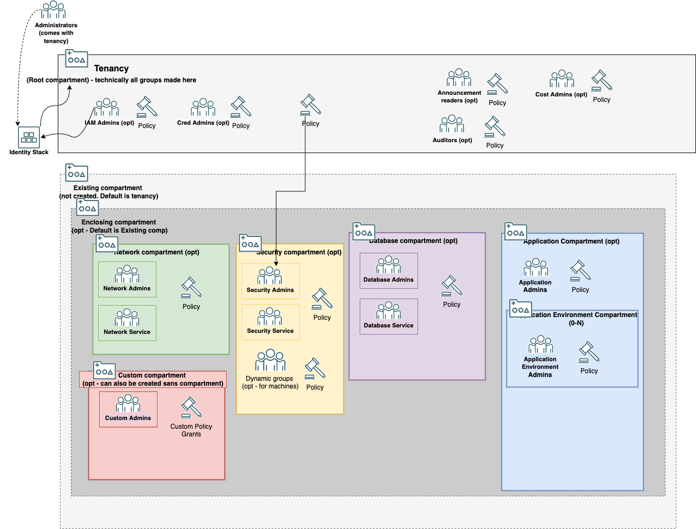

# Oracle Cloud Foundation Terraform Module - Identity - quickly create common identity resources with sensible defaults


## Table of Contents
1. [Overview](#overview)
1. [Deliverables](#deliverables)
1. [Architecture](#Architecture-Diagram)
1. [Executing Instructions](#instructions)
1. [Documentation](#documentation)
1. [The Team](#team)
1. [Feedback](#feedback)
1. [Known Issues](#known-issues)


## <a name="overview"></a>Overview
This module allows you to quickly create common identity resources like compartments, groups, dynamic groups, and policies. Most of these resources are predefined with sensible defaults. What you need to decide is which sets of resources you want and where you want to put them.


## <a name="deliverables"></a>Deliverables
This folder contains several deliverables:
- a Terraform child module that creates the identity resources
- several example parent modules that use the child module to create an identity structure
    - empty - this shows how the module creates nothing by default and only requires the tenancy ocid
    - basic - this shows how a company might create a basic identity structure for a single department and application
    - complex - this shows how a company might create a more complex identity structure for multiple deparments deploying multiple isolated applications

## <a name="architecture"></a>Architecture-Diagram
This diagram below shows the basic architecture pattern and services this module creates. Note this pattern is very modular, so you can create these common compartments anywhere you need them in your compartment structure.


## <a name="instructions"></a>Executing Instructions

## Prerequisites
The executor of this stack will need permissions and quotas to create several types of identity resources. It is recommended that an account in the administrator group initially runs this stack and then hands off management to the iam group, who can update it and create additional stacks using this child module.

## Deployment
This module is a child module and can't be run directly. It needs a parent module to call this module to run. See the examples folder for example parent modules that call this submodule
### source type
github url with path and git tag is recommended for production code. local path is used for sub-module development and customization
- github url - make sure to update the version tag to latest stable git tag version for initial deployment. If already deployed and you want to update the version, you need to validate that the new child module version works with your codebase and doesn't create dangerous resource changes, deletions, or creations
```
    source = "github.com/oracle-devrel/terraform-oci-oracle-cloud-foundation//cloud-foundation/modules/cloud-foundation-library/identity/module?ref=<input latest git tag>"
```
- local path - this should be used if you are customizing the module. The actual path will need to be updated to where your child module resides relative to your parent module.
```
    source = "../../module"
```

## Resources Created

The "tenancy_ocid" variable is always required, but doesn't create any resources itself.

### Tenancy-Wide Resource Sets
These Resources can only be deployed once in a tenancy.

#### IAM and Cred Admins
the "create_identity_persona" variable will create two groups with a policy for each group to manage identity resources.
- IAM group will have manage access to most identity resources excluding managing users, Administrator group,cred group, and linking external identity provider
- Cred group will have access to create, update, and delete various Authentication methods for users including API keys and Auth tokens
- Administrator group (comes default in tenancy) will still need to be used to create and delete users. You can also federate users from an external identity provider

#### Cost Admins
The "create_cost_persona" variable will create one group with a policy to manage access to cost resources and usage-reports across the tenancy

#### Audtiors
The "create_auditor_persona" variable will create one group with a policy to inspect all resources and read specific resource types across the tenancy including compute, networking, storage, iam, and security resources

#### Announcement Readers
The "create_announcement_personaa" variable will create one group with a policy to read announcements across the tenancy

### Compartment-scoped Resource Sets
These Resources can be deployed multiple times in your compartment structure, but will need unique prefixes/names across your tenancy. The "prefix" variable will be appended to the beginning of the name of all resources under the compartment scope. The "allow_compartment_deletion" variable is used across all created compartments. Default behavior is false, which means compartments will not be deleted when running a destroy job and will not be created if there already is an existing compartment with the same name.

#### Enclosing Compartment
You can use the "existing_compartment" variable to determine a compartment to branch from. By default, this will use the root(tenancy) compartment. You can optionally create an enclosing compartment within that existing compartment using the "enclosing_compartment_name" variable. If left blank, other compartments will be created directly in the existing compartment.

#### Network
The "create_network_persona" creates a compartment, two groups, and a policy for network resources. The "network_name" variable can be used to customize the name of these resources. 
- Network Admin group will have manage access to network resources and some common resources in this compartment
- Network Service group will have use access to specific network resources needed to create instances within the vcns the Network Admin group defines.

#### Security
The "create_security_persona" variable creates a compartment, two groups, and two policies for security resources. The "security_name" variable can be used to customize the name of these resources.
- Security Admin group will have manage access to security resources and some common resources in this compartment. Additionally they will also have a tenancy level policy to manage certain tenancy-level security resources and monitor activity across the tenancy
- Security Service group will use access access to specific security resources that the Security Admin groups defines.

##### certificates
The "enable_ca" variable will create a dynamic group and policy that is required to use Certificate Authorities in the Certificate Service. This is scoped to the security compartment.

There are more services that have required dynamic groups and policies to use that we plan on including in future releases. Please let us know in an issue if there is one you want included in the next release

#### Database
The "create_database_persona" variable creates a compartment, two groups, and a policy for database resources. The "database_name" variable can be used to customize the name of these resources.
- Database Admin group will have manage access to database resources and some common resources in this compartment.
- Database Service group will use access access to specific database resources that the Database Admin groups defines.

#### Application
The "create_application_persona" variable creates a number of compartments, groups, and policies for application resources. The "application_name" variable can be used to customize the name of these resources. The "application_type" variable is used to determine what policies this application needs. 

By default, a single, top level compartment is created.The "application_environments" variable allows you to determine how many isolated environments your application needs.  For each name listed in "application_environments", a sub compartment will be created under the top level application compartment. Each compartment created will come with a group and a policy scoped to just that compartment. The Application Admin group will have manage access to application resources and some common resources in this compartment.


#### Custom
The "create_custom_persona" variable can be used to create a custom set of identity resources. The "custom_persona_name" variable should be used to name these resources according to their purpose. By default, a new compartment will be created. You can also set the "create_custom_compartment" variable to false to create your group and policy in the enclosing or existing compartment instead. 

The "custom_policy_permissions" variable should be used to list the policy permissions (verb + resource) you want to give this group. Create a list of the verb + resource required for your policy statements. The rest of the statements will be generated for you. ex. ["read all-resources"]


## <a name="documentation"></a>Documentation

[Identity Overview](https://docs.oracle.com/en-us/iaas/Content/Identity/Concepts/overview.htm)

## <a name="team"></a>The Team
- **Owners**: [JB Anderson](https://github.com/JBAnderson5)

## <a name="feedback"></a>Feedback
We welcome your feedback. To post feedback, submit feature ideas or report bugs, please use the Issues section on this repository.	

## <a name="known-issues"></a>Known Issues
**At the moment, there are no known issues**