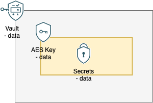

# Oracle Cloud Foundation Terraform Module - secret-data - quickly read the contents of secrets that already exist


## Table of Contents
1. [Overview](#overview)
1. [Deliverables](#deliverables)
1. [Architecture](#Architecture-Diagram)
1. [Executing Instructions](#instructions)
1. [Documentation](#documentation)
1. [The Team](#team)
1. [Feedback](#feedback)
1. [Known Issues](#known-issues)


## <a name="overview"></a>Overview
This module allows you to quickly read OCI secrets that already exists in your tenancy. It will handle the data decoding and give you back the contents in a key-value map.


## <a name="deliverables"></a>Deliverables
This folder contains several deliverables:
- A terraform child module that gets the contents from existing secrets
- an example parent module that uses the child module to retrieve a single secret


## <a name="architecture"></a>Architecture-Diagram
<brief introduction to arch diagram. update link to where your image lives. default is in the documentation folder>



## <a name="instructions"></a>Executing Instructions

## Prerequisites
The executor of this stack will need permissions to read secrets and secret bundles. Additionally, there will need to be at least one existing secret to read from

## Deployment
This module is a child module and can't be run directly. It needs a parent module to call this module to run. See the examples folder for example parent modules that call this submodule

### source type
github url with path and git tag is recommended for production code. local path is used for sub-module development and customization
- github url - make sure to update the version tag to latest stable git tag version for initial deployment. If already deployed and you want to update the version, you need to validate that the new child module version works with your codebase and doesn't create dangerous resource changes, deletions, or creations
```
    source = "https://github.com/oracle-devrel/terraform-oci-oracle-cloud-foundation//cloud-foundation/modules/cloud-foundation-library/secret-data/module?ref=v1.2.0"
```
- local path - this should be used if you are customizing the module. The actual path will need to be updated to where your child module resides relative to your parent module.
```
    source = "../../module"
```

## Resources Created

This module does not create any resources. It just retrieves data from existing infrastructure

### Secret Contents
The "secret_ocids" variable accepts a map of strings. The key is used for reference and will map to the key of the "contents" output variable. The string value should be the ocid of the secret you want to retrieve. The secret contents will be decoded and placed in the "contents" output variable.

### vault and key
The first secret in the map will additionally be used to return the vault and key used to encrypt it. This allows you to quickly turn around and create your own secret to share information about your stack to others.


## <a name="documentation"></a>Documentation

<link to official oci documentation for the resources you create>

[Vault Overview](https://docs.oracle.com/en-us/iaas/Content/KeyManagement/Concepts/keyoverview.htm)

## <a name="team"></a>The Team
- **Owners**: [JB Anderson](https://github.com/JBAnderson5)

## <a name="feedback"></a>Feedback
We welcome your feedback. To post feedback, submit feature ideas or report bugs, please use the Issues section on this repository.	

## <a name="known-issues"></a>Known Issues
**At the moment, there are no known issues**