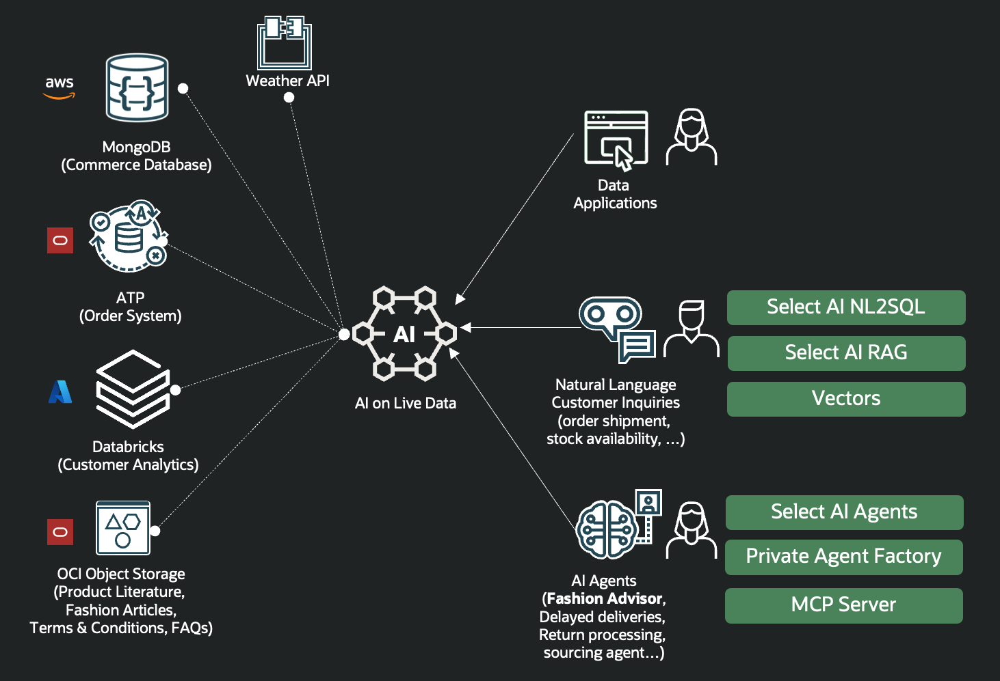
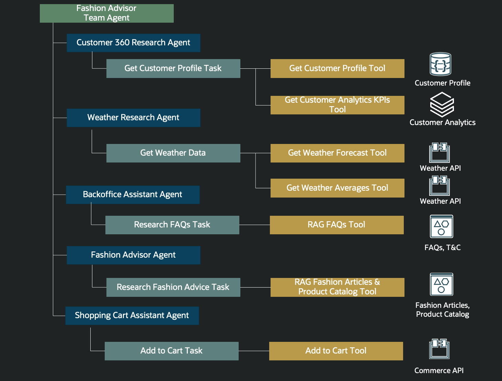
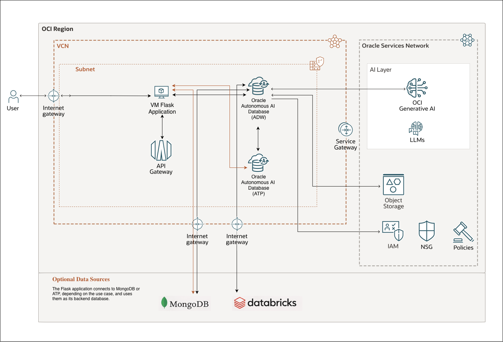

# Oracle Cloud Foundation Terraform Solution - Deploy AI Live Hub Fashion Retail demo


## Table of Contents
1. [Overview](#overview)
1. [Deliverables](#deliverables)
1. [Architecture](#architecture)
1. [Executing Instructions](#executing-instructions)
    1. [Deploy Using Oracle Resource Manager](#deploy-using-oracle-resource-manager)
    2. [Deploy Using the Terraform CLI](#deploy-using-the-terraform-cli)
        1. [Repository files](#repository-files)
        2. [Autonomous Data Warehouse](#autonomous-data-warehouse)
            1. [ADW Autonomous Database Parameters](#adw-autonomous-database-parameters)
            2. [ATP Autonomous Database Parameters](#atp-autonomous-database-parameters)
        3. [LLM settings](#llm-settings)
        4. [MongoDB](#mongodb)
        5. [Project Settings](#project-settings)
        6. [Oracle API Gateway](#oracle-api-gateway)
            1. [Module: `cart_api_gateway`](#module-cart_api_gateway)
        7. [Object Storage](#object-storage)
            1. [Files Bucket Parameters](#files-bucket-parameters)
            2. [ATP Credentials Bucket Parameters](#atp-credentials-bucket-parameters)
        8. [KeyGen](#keygen)
        9. [Compute VM Configuration](#compute-vm-configuration)
        10. [Provisioner](#provisioner)
        11. [Network](#network)
        12. [Optional - Databricks](#optional---databricks)
            1. [Analytics design](#analytics-design)
        13. [Running the code](#running-the-code)
        14. [What to do after the deployment](#what-to-do-after-the-deployment)
1. [Documentation](#documentation)
1. [The Team](#team)
1. [Feedback](#feedback)
1. [Known Issues](#known-issues)
1. [Contribute](./CONTRIBUTING.md)


## <a name="overview"></a>Overview

Deploy AI Live Hub Fashion Retail demo showcases how a fashion retailer can evolve into an AI-driven business by connecting live enterprise data across multiple platforms and turning it into personalized, customer-facing experiences. The solution brings together operational, analytical, and external data to power intelligent conversations, better recommendations, and more effective digital engagement.

At the core of the solution is a live data hub that connects key business systems, including MongoDB Atlas for customer profiles, Databricks for customer analytics such as lifetime value and churn, and Oracle Autonomous Transaction Processing for customer and order data. Because the information is retrieved on demand, the business can act on current, trusted data rather than relying only on static integrations or delayed reporting.

This foundation enables the retailer to interact with enterprise data in natural language and unlock value across both structured and unstructured information. Business users and applications can query data across multiple systems through a single AI-powered interface, while retrieval-augmented generation expands the experience to include product knowledge, policies, and advisory content.

A key business outcome of the demo is the creation of a Fashion Advisor Agent that can be embedded directly into customer-facing channels such as the retailer's website. The agent delivers highly personalized recommendations by combining customer preferences, profile data, analytics insights, order history, and even external context such as local weather conditions. This allows the retailer to offer more relevant product suggestions, create a richer shopping experience, and increase the likelihood of conversion.

The solution is designed as a set of specialized AI agents working together, allowing the retailer to scale personalization across channels while maintaining relevance and accuracy. By orchestrating access to enterprise systems, documents, policies, and external APIs, the platform helps the business improve customer satisfaction, strengthen loyalty, and drive sales through smarter digital interactions.

From a business perspective, Deploy AI Live Hub Fashion Retail demo demonstrates how organizations can move beyond AI experimentation and toward production-ready AI adoption. With Autonomous AI Database as the foundation, the solution combines accuracy, security, performance, scalability, observability, and business continuity — making it suitable for enterprise-grade retail innovation.

This solution deploys an **Agentic AI Fashion Retail Demo** on Oracle Cloud Infrastructure using **Terraform**.

The deployment provisions and configures:

- **Oracle Autonomous Data Warehouse (ADW)** for AI orchestration and semantic access to enterprise data
- **Oracle Autonomous Transaction Processing (ATP)** for relational commerce data and, by default, Oracle Mongo API document storage
- a **Compute VM** hosting the Flask application
- **Object Storage buckets** for AI files and ATP credential artifacts
- an **API Gateway** used by the cart integration
- **Oracle AI profiles, tools, tasks, agents, and team orchestration** inside ADW

The application exposes a fashion retail assistant that can:

- authenticate users
- use customer profile and customer analytics data
- recommend fashion products
- enrich recommendations with weather context
- answer FAQ / backoffice questions
- manage shopping cart operations

By default, the solution uses:

- `mongo_mode = "oracle_api"`

which means:

- the application uses **ATP Mongo API** as the document backend
- ADW consumes synchronized customer profiles from relational tables
- ATP also simulates an external analytics source used by ADW through a database link

If you set:

- `mongo_mode = "atlas"`

then the application uses **MongoDB Atlas** as the document backend instead of Oracle Database API for MongoDB.

In this mode:

- customer profile and application document data are populated into **MongoDB Atlas**
- you must have an active **MongoDB Atlas** account
- the code will create a new Atlas cluster in your accont
- you must provide the MongoDB-related Terraform variables with the values from your Atlas environment

Before deploying with `mongo_mode = "atlas"`, make sure the Atlas cluster is accessible from the deployed application and that all MongoDB connection variables are correctly populated.


## <a name="deliverables"></a>Deliverables
 This repository encloses one deliverable:

- A reference implementation written in Terraform HCL (Hashicorp Language) that provisions fully functional resources in an OCI tenancy.
- SQL automation for:
  - ADW schema and AI setup
  - ATP commerce schema
  - ATP Mongo API setup
  - customer analytics simulation
- VM provisioning automation for:
  - Flask application deployment
  - Python environment setup
  - Mongo document seeding
  - Mongo-to-ADW synchronization
- A working **AI Live Hub Fashion Retail demo**


## <a name="architecture"></a>Architecture-Diagram

The following diagram shows a mapping of the architecture above to services provided on Oracle Cloud Infrastructure using security best practices and at the end of the deployment you will have in your tenancy the related services.









## <a name="instructions"></a>Executing Instructions

## Prerequisites

- Permission to `manage` the following types of resources in your Oracle Cloud Infrastructure tenancy: `vcns`, `nat-gateways`, `route-tables`, `subnets`, `service-gateways`, `security-lists`, `autonomous databases`, `API Gateway`, `object storage` and `compute instances`.
- Quota to create the following resources: 2 Autonomous databases (one ADW and one ATP), 1 instance, 1 API Gateway, 2 object storges and 1 VM instance
If you don't have the required permissions and quota, contact your tenancy administrator. See [Policy Reference](https://docs.cloud.oracle.com/en-us/iaas/Content/Identity/Reference/policyreference.htm), [Service Limits](https://docs.cloud.oracle.com/en-us/iaas/Content/General/Concepts/servicelimits.htm), [Compartment Quotas](https://docs.cloud.oracle.com/iaas/Content/General/Concepts/resourcequotas.htm).

## Important

You can deploy this solution in any OCI region. However, the `rag_region` variable **must** be set to an OCI region where the OCI Generative AI models used by this solution are available.

This project uses the following OCI Generative AI models through `DBMS_CLOUD_AI` by default:

- `xai.grok-4-1-fast-reasoning`
- `xai.grok-4-fast-non-reasoning`
- `meta.llama-4-maverick-17b-128e-instruct-fp8`
- `cohere.embed-english-v3.0`

These default models are configured in the root `variables.tf` file through the following variables:

- `rag_region`
- `select_ai_model_nl2sql`
- `select_ai_model_agent`
- `select_ai_model_rag`
- `select_ai_embedding_model`

If you want to use other OCI Generative AI models, modify these variables in `variables.tf` with the model names available in OCI for your selected `rag_region`.

According to Oracle’s **Generative AI Models by Region** documentation, the corresponding xAI model families (**xAI Grok 4.1 Fast** and **xAI Grok 4 Fast**) are currently available only in these OCI commercial regions: **US East (Ashburn)**, **US Midwest (Chicago)**, and **US West (Phoenix)**. Oracle marks these xAI models as **on-demand only** in those regions.

Set `rag_region` to one of the following values only when you use those Grok models:

| Region Name         | Location | Region Identifier |
|---------------------|----------|-------------------|
| US East (Ashburn)   | Ashburn  | `us-ashburn-1`    |
| US Midwest (Chicago)| Chicago  | `us-chicago-1`    |
| US West (Phoenix)   | Phoenix  | `us-phoenix-1`    |

If you set `rag_region` to any other region, the solution will not work with these Grok models, because Oracle’s regional availability matrix shows them as unavailable outside those three US regions.

If your tenancy is not subscribed to one of these regions, subscribe to one before deploying the solution. Also note that **not all LLMs are available in all OCI regions**, so always verify model availability in Oracle’s official documentation before changing the model or region. Oracle’s region matrix explicitly notes that model availability varies by region.

Reference:
- Oracle documentation: *Generative AI Models by Region* :(https://docs.oracle.com/en-us/iaas/Content/generative-ai/model-endpoint-regions.htm#top)

Example variables:

```hcl
# LLM settings:

variable "rag_region" {
  type    = string
  default = "us-ashburn-1"
}

variable "select_ai_model_nl2sql" {
  type        = string
  default     = "xai.grok-4-1-fast-reasoning"
  description = "Model used by the Select AI NL2SQL profile (select_ai_hub_nl2sql). This profile converts user questions into SQL over the business views and metadata. Change this when you want to improve SQL generation quality, reasoning depth, or latency for database querying."
}

variable "select_ai_model_agent" {
  type        = string
  default     = "xai.grok-4-fast-non-reasoning"
  description = "Model used by the main Select AI agent profile (select_ai_hub). This profile is consumed by the operational agents and tasks such as customer360, fashion advisor, weather assistant, backoffice assistant, and shopping cart assistant. Change this when you want to tune general agent behavior, tool usage, speed, or cost."
}

variable "select_ai_model_rag" {
  type        = string
  default     = "meta.llama-4-maverick-17b-128e-instruct-fp8"
  description = "Model used by the RAG response profiles (select_ai_rag and select_ai_rag_faqs). These profiles generate answers from the indexed fashion articles and FAQ knowledge bases. Change this when you want to tune knowledge-base answer quality, response style, cost, or latency."
}

variable "select_ai_embedding_model" {
  type        = string
  default     = "cohere.embed-english-v3.0"
  description = "Embedding model used to build and query the vector indexes for RAG content. This affects how documents are vectorized for similarity search. Change this only when you intentionally want a different embedding strategy and are prepared to recreate or refresh the vector indexes."
}
```

# <a name="Deploy-Using-Oracle-Resource-Manager"></a>Deploy Using Oracle Resource Manager

1. Click [](https://cloud.oracle.com/resourcemanager/stacks/create?region=home&zipUrl=https://github.com/oracle-devrel/terraform-oci-oracle-cloud-foundation/releases/download/v1.0.0/AI-Live-Hub-Fashion-Retail-Demo-RM.zip)


If you aren't already signed in, when prompted, enter the tenancy and user credentials.

2. Review and accept the terms and conditions.
3. Select the region where you want to deploy the stack.
4. Follow the on-screen prompts and instructions to create the stack.
5. After creating the stack, click **Terraform Actions**, and select **Plan**.
6. Wait for the job to be completed, and review the plan.
    To make any changes, return to the Stack Details page, click **Edit Stack**, and make the required changes. Then, run the **Plan** action again.
7. If no further changes are necessary, return to the Stack Details page, click **Terraform Actions**, and select **Apply**.
8. **Connect to the Application**
After the deployment completes, open a browser and access the application using the Compute VM public IP on port `5000`:

`http://<VM_PUBLIC_IP>:5000`

Log in with one of the demo users populated from the database.

Example:
- username: `tammy.bryant@internalmail`
- password: `user`

- if needed, inspect the VM logs, log on the VM with the private key generated in the root folder and use:

```bash
tail -n 200 /home/opc/fashion-retail-app/fashion-retail-app/app.log
```


# <a name="Deploy-Using-the-Terraform-CLI"></a>Deploy Using the Terraform CLI

## Clone the Module
Now, you'll want a local copy of this repo. You can make that with the commands:

    git clone https://github.com/oracle-devrel/terraform-oci-oracle-cloud-foundation.git
    cd terraform-oci-oracle-cloud-foundation/cloud-foundation/solutions/AI-Live-Hub-Fashion-Retail-Demo
    ls

## Deployment

- Follow the instructions from Prerequisites links in order to install terraform.
- Download the terraform version suitable for your operating system.
- Unzip the archive.
- Add the executable to the PATH.
- You will have to generate an API signing key (public/private keys) and the public key should be uploaded in the OCI console, for the iam user that will be used to create the resources. Also, you should make sure that this user has enough permissions to create resources in OCI. In order to generate the API Signing key, follow the steps from: https://docs.us-phoenix-1.oraclecloud.com/Content/API/Concepts/apisigningkey.htm#How
  The API signing key will generate a fingerprint in the OCI console, and that fingerprint will be used in a terraform file described below.
- You will also need to generate an OpenSSH public key pair. Please store those keys in a place accessible like your user home .ssh directory.

## Prerequisites

- Install Terraform v0.13 or greater: https://www.terraform.io/downloads.html
- Install Python 3.6: https://www.digitalocean.com/community/tutorials/how-to-install-python-3-and-set-up-a-local-programming-environment-on-centos-7
- Generate an OCI API Key
- Create your config under \$home*directory/.oci/config (run \_oci setup config* and follow the steps)
- Gather Tenancy related variables (tenancy_id, user_id, local path to the oci_api_key private key, fingerprint of the oci_api_key_public key, region)
- Install SQLcl and make sure the sql command is available in your PATH: https://www.oracle.com/database/sqldeveloper/technologies/sqlcl/
- Install OpenSSL and make sure the openssl command is available in your PATH: https://www.openssl.org/
- Install an SSH client and make sure SSH key-based access to the target host is working before running Terraform

### Installing Terraform

Go to [terraform.io](https://www.terraform.io/downloads.html) and download the proper package for your operating system and architecture. Terraform is distributed as a single binary.
Install Terraform by unzipping it and moving it to a directory included in your system's PATH. You will need the latest version available.

### Prepare Terraform Provider Values

**variables.tf** is located in the root directory. This file is used in order to be able to make API calls in OCI, hence it will be needed by all terraform automations.

In order to populate the **variables.tf** file, you will need the following:

- Tenancy OCID
- User OCID
- Local Path to your private oci api key
- Fingerprint of your public oci api key
- Region
- OCI private key PEM content (used mainly by Resource Manager deployments)

#### **Getting the Tenancy and User OCIDs**

You will have to login to the [console](https://console.us-ashburn-1.oraclecloud.com) using your credentials (tenancy name, user name and password). If you do not know those, you will have to contact a tenancy administrator.

In order to obtain the tenancy ocid, after logging in, from the menu, select Administration -> Tenancy Details. The tenancy OCID, will be found under Tenancy information and it will be similar to **ocid1.tenancy.oc1..aaa…**

In order to get the user ocid, after logging in, from the menu, select Identity -> Users. Find your user and click on it (you will need to have this page open for uploading the oci_api_public_key). From this page, you can get the user OCID which will be similar to **ocid1.user.oc1..aaaa…**

#### **Creating the OCI API Key Pair and Upload it to your user page**

Create an oci_api_key pair in order to authenticate to oci as specified in the [documentation](https://docs.cloud.oracle.com/en-us/iaas/Content/API/Concepts/apisigningkey.htm#How):

Create the .oci directory in the home of the current user

`$ mkdir ~/.oci`

Generate the oci api private key

`$ openssl genrsa -out ~/.oci/oci_api_key.pem 2048`

Make sure only the current user can access this key

`$ chmod go-rwx ~/.oci/oci_api_key.pem`

Generate the oci api public key from the private key

`$ openssl rsa -pubout -in ~/.oci/oci_api_key.pem -out ~/.oci/oci_api_key_public.pem`

You will have to upload the public key to the oci console for your user (go to your user page -> API Keys -> Add Public Key and paste the contents in there) in order to be able to do make API calls.

After uploading the public key, you can see its fingerprint into the console. You will need that fingerprint for your variables.tf file.
You can also get the fingerprint from running the following command on your local workstation by using your newly generated oci api private key.

`$ openssl rsa -pubout -outform DER -in ~/.oci/oci_api_key.pem | openssl md5 -c`

#### **Generating an SSH Key Pair on UNIX or UNIX-Like Systems Using ssh-keygen**

- Run the ssh-keygen command.

`ssh-keygen -b 2048 -t rsa`

- The command prompts you to enter the path to the file in which you want to save the key. A default path and file name are suggested in parentheses. For example: /home/user_name/.ssh/id_rsa. To accept the default path and file name, press Enter. Otherwise, enter the required path and file name, and then press Enter.
- The command prompts you for a passphrase. Enter a passphrase, or press ENTER if you don't want to havea passphrase.
  Note that the passphrase isn't displayed when you type it in. Remember the passphrase. If you forget the passphrase, you can't recover it. When prompted, enter the passphrase again to confirm it.
- The command generates an SSH key pair consisting of a public key and a private key, and saves them in the specified path. The file name of the public key is created automatically by appending .pub to the name of the private key file. For example, if the file name of the SSH private key is id_rsa, then the file name of the public key would be id_rsa.pub.
  Make a note of the path where you've saved the SSH key pair.
  When you create instances, you must provide the SSH public key. When you log in to an instance, you must specify the corresponding SSH private key and enter the passphrase when prompted.

#### **Getting the Region**

Even though, you may know your region name, you will needs its identifier for the variables.tf file (for example, US East Ashburn has us-ashburn-1 as its identifier).
In order to obtain your region identifier, you will need to Navigate in the OCI Console to Administration -> Region Management
Select the region you are interested in, and save the region identifier.

#### **Prepare the variables.tf file**

You will have to modify the **variables.tf** file to reflect the values that you’ve captured.

```
variable "tenancy_ocid" {
  type = string
  default = "" (tenancy ocid, obtained from OCI console - Profile -> Tenancy)
}

variable "region" {
    type = string
    default = "" (the region used for deploying the infrastructure - ex: eu-frankfurt-1)
}

variable "compartment_id" {
  type = string
  default = "" (the compartment OCID used for deploying the solution - ex: ocid1.compartment.oc1..aaaaaa...)
}

variable "user_ocid" {
    type = string
    default = "" (user ocid, obtained from OCI console - Profile -> User Settings)
}

variable "fingerprint" {
    type = string
    default = "" (fingerprint obtained after setting up the API public key in OCI console - Profile -> User Settings -> API Keys -> Add Public Key)
}

variable "private_key_path" {
    type = string
    default = ""  (the path of your local oci api key - ex: /root/.ssh/oci_api_key.pem)
}

variable "oci_private_key_pem" {
    type = string
    default = "" (OCI API private key content, used mainly by Resource Manager. Leave empty when using private_key_path with Terraform CLI)
}

```
You can also configure the OCI Generative AI models used by the solution in the **variables.tf** file through the **LLM settings** section:

```hcl
# LLM settings:

variable "rag_region" {
  type    = string
  default = "us-ashburn-1"
}

variable "select_ai_model_nl2sql" {
  type        = string
  default     = "xai.grok-4-1-fast-reasoning"
  description = "Model used by the Select AI NL2SQL profile (select_ai_hub_nl2sql). This profile converts user questions into SQL over the business views and metadata. Change this when you want to improve SQL generation quality, reasoning depth, or latency for database querying."
}

variable "select_ai_model_agent" {
  type        = string
  default     = "xai.grok-4-fast-non-reasoning"
  description = "Model used by the main Select AI agent profile (select_ai_hub). This profile is consumed by the operational agents and tasks such as customer360, fashion advisor, weather assistant, backoffice assistant, and shopping cart assistant. Change this when you want to tune general agent behavior, tool usage, speed, or cost."
}

variable "genai_embedding_region" {
  type        = string
  default     = "us-chicago-1"
  description = "OCI Generative AI inference region used for embedding and RAG operations executed through DBMS_CLOUD_AI. Example: us-chicago-1."
}

variable "select_ai_model_rag" {
  type        = string
  default     = "meta.llama-4-maverick-17b-128e-instruct-fp8"
  description = "Model used by the RAG response profiles (select_ai_rag and select_ai_rag_faqs). These profiles generate answers from the indexed fashion articles and FAQ knowledge bases. Change this when you want to tune knowledge-base answer quality, response style, cost, or latency."
}

variable "select_ai_embedding_model" {
  type        = string
  default     = "cohere.embed-english-v3.0"
  description = "Embedding model used to build and query the vector indexes for RAG content. This affects how documents are vectorized for similarity search. Change this only when you intentionally want a different embedding strategy and are prepared to recreate or refresh the vector indexes."
}
```

If you want to use other OCI Generative AI models, modify these variables with model names available in OCI for your selected `rag_region`. Always verify model availability here:

- [OCI Generative AI Models by Region](https://docs.oracle.com/en-us/iaas/Content/generative-ai/model-endpoint-regions.htm#top)


## Repository Files

* **images/** - Contains the images and architecture diagrams referenced in `README.md`.

* **modules/** - Contains the Terraform submodules and provisioning assets used by the solution.

* **modules/provisioner/** - Contains the post-provisioning files used to configure ADW, ATP, the compute VM, the Flask application, and the data synchronization flow.

### Files inside `modules/provisioner/`

#### SQL templates and SQL scripts

* **adw_ai_profiles_oracle.sql.tftpl** - Terraform SQL template that creates and configures the ADW AI profiles used by the solution. It defines the AI profile setup required for SQL generation, orchestration, and AI interactions inside ADW.

* **adw_analytics_oracle_api.sql.tftpl** - Terraform SQL template that configures the ADW-side analytics integration for the default Oracle-based deployment flow. It is used so ADW can access and expose analytics data consumed by the AI layer.

* **adw_customer_profile_function_oracle.sql** - SQL script that creates the ADW customer profile function used to retrieve customer profile information from the relational store in a format that can be consumed by the AI logic and application workflows.

* **adw_verify_customer_profile_oracle.sql** - SQL verification script used to validate that customer profile data has been correctly synchronized and is accessible in ADW after setup.

* **adw-co-hub-v0.01-admin-user.sql.tftpl** - Terraform SQL template that configures the ADW admin-level setup. It is used for administrative objects, privileges, and setup steps required before the application schema is fully configured.

* **adw-co-hub-v0.01-cohub-user.sql.tftpl** - Main ADW SQL template for the application schema. It creates and configures the core ADW objects used by the demo, including schema objects, views, AI profiles, AI tools, AI tasks, AI agents, and team orchestration.

* **atp_customer_analytics_kpi.sql** - SQL script that creates or populates the ATP customer analytics KPI dataset. It is used to simulate an external analytics source that ADW later consumes through a database link.

* **atp-co-mongo-setup.sql.tftpl** - Main ATP SQL template that configures the ATP-side relational schema and Oracle Mongo API setup. It prepares the commerce data model, document collections, and related database objects required by the application.

* **co_create.sql** - SQL script used to create the main application schema objects. It prepares the core structures required by the `CO` schema before installation and population steps are executed.

* **co_install.sql** - SQL installation script that executes the main database installation sequence for the application schema. It is used to install the objects and logic needed by the demo.

* **co_populate.sql** - SQL population script used to insert and load demo data into the application schema. It is required so the application and AI flows have sample business data available after deployment.

* **cohub-create_tables_ddl.sql** - DDL script used to create the main `cohub` tables required by the application. It defines the relational structures used by the solution.

* **cohub-product_catalog.sql** - SQL script used to create, populate, or expose the product catalog data used by the fashion retail application and recommendation flows.

* **databricks-customer_analytics_kpi.sql** - Optional SQL script related to the Databricks-style analytics design. In the current solution, the Databricks concept is simulated with ATP, so this script represents the optional or future path for a separate analytics integration rather than the default deployment flow.

#### Seed data

* **co-customer_profile.csv** - CSV seed file containing customer profile data used to populate the document backend and support synchronization into ADW.

#### Application artifact

* **fashion-retail-app-2026-02-10-11-53.zip** - Packaged application artifact containing the deployable files for the Flask-based fashion retail application.

#### Shell scripts

* **file_envs.sh** - Shell helper script used to prepare and export environment variables required during provisioning and application startup.

* **read_wallet_and_cert.sh** - Shell helper script used to read the database wallet and certificate files required for secure ADW and ATP connectivity.

#### Python scripts

* **sync_mongo_atp_to_adw.py** - Python synchronization script that copies customer profile data from the active document backend into ADW relational storage so the AI layer can query it reliably.

#### Terraform files inside `modules/provisioner/`

* **variables.tf** - Declares the input variables required by the provisioner module.

* **outputs.tf** - Declares the outputs exposed by the provisioner module.

* **provisioner.tf** - Defines the internal provisioning resources and execution logic used by the provisioner module.

### Main repository files

* **CONTRIBUTING.md** - Contains the contribution guidelines for users who want to suggest improvements, report bugs, or contribute changes to the repository.

* **LICENSE** - Contains the license terms for the repository.

* **locals.tf** - Defines reusable local Terraform values and derived expressions used throughout the deployment.

* **main.tf** - Main Terraform orchestration file that wires together the OCI resources, modules, and integration logic used by the solution.

* **outputs.tf** - Defines the Terraform outputs produced after a successful deployment.

* **provider.tf** - Defines the Oracle Cloud Infrastructure Terraform provider configuration.

* **README.md** - Main project documentation file.

* **cleanup_buckets.sh** - Shell helper script placed in the root directory of the solution. It reads the Object Storage bucket names from `variables.tf`, detects the OCI Object Storage namespace automatically, deletes all object versions, and deletes all remaining objects from the buckets before running `terraform destroy`.

* **schema.yaml** - Defines the OCI Resource Manager schema used to improve the stack deployment experience in the OCI Console.

* **variables.tf** - Contains the global Terraform input variables used by the project.

* **provisioner.tf** - Defines the top-level provisioning logic that connects to the compute VM and runs the provisioner module after the infrastructure is created.

* **app.py** - Main Flask application entry point for the fashion retail demo. It handles the application routes, login flow, customer interactions, chat experience, and shopping cart integration.


### Autonomous Data Warehouse

The ADW subsystem / module is able to create ADW/ATP databases.

#### ADW Autonomous Database Parameters

* Parameters:
    * __adw_db_name__ - The database name. The name must begin with an alphabetic character and can contain a maximum of 14 alphanumeric characters. Special characters are not permitted. The database name must be unique in the tenancy.
    * __adw_db_password__ - The password must be between 12 and 30 characters long, and must contain at least 1 uppercase, 1 lowercase, and 1 numeric character. It cannot contain the double quote symbol (") or the username "admin", regardless of casing. The password is mandatory if source value is "BACKUP_FROM_ID", "BACKUP_FROM_TIMESTAMP", "DATABASE" or "NONE".
    * __adw_db_compute_model__ - The compute model of the Autonomous Database. This is required if using the computeCount parameter. If using cpuCoreCount then it is an error to specify computeModel to a non-null value.
    * __adw_db_compute_count__ - The compute amount available to the database. Minimum and maximum values depend on the compute model and whether the database is on Shared or Dedicated infrastructure. For an Autonomous Database on Shared infrastructure, the 'ECPU' compute model requires values in multiples of two. Required when using the computeModel parameter. When using cpuCoreCount parameter, it is an error to specify computeCount to a non-null value.
    * __adw_db_size_in_tbs__ - The size, in gigabytes, of the data volume that will be created and attached to the database. This storage can later be scaled up if needed. The maximum storage value is determined by the infrastructure shape. See Characteristics of Infrastructure Shapes for shape details.
    * __adw_db_workload__ - The Autonomous Database workload type. The following values are valid:
        - OLTP - indicates an Autonomous Transaction Processing database
        - DW - indicates an Autonomous Data Warehouse database
        - AJD - indicates an Autonomous JSON Database
        - APEX - indicates an Autonomous Database with the Oracle APEX Application Development workload type. *Note: db_workload can only be updated from AJD to OLTP or from a free OLTP to AJD.
    * __adw_db_version__ - A valid Oracle Database version for Autonomous Database. db_workload AJD and APEX are only supported for db_version 19c and above.
    * __adw_db_enable_auto_scaling__ - Indicates if auto scaling is enabled for the Autonomous Database OCPU core count. The default value is FALSE.
    * __adw_db_is_free_tier__ - Indicates if this is an Always Free resource. The default value is false. Note that Always Free Autonomous Databases have 1 CPU and 20GB of memory. For Always Free databases, memory and CPU cannot be scaled. When adw_db_workload is AJD or APEX it cannot be true.
    * __adw_db_license_model__ - The Oracle license model that applies to the Oracle Autonomous Database. Bring your own license (BYOL) allows you to apply your current on-premises Oracle software licenses to equivalent, highly automated Oracle PaaS and IaaS services in the cloud. License Included allows you to subscribe to new Oracle Database software licenses and the Database service. Note that when provisioning an Autonomous Database on dedicated Exadata infrastructure, this attribute must be null because the attribute is already set at the Autonomous Exadata Infrastructure level. When using shared Exadata infrastructure, if a value is not specified, the system will supply the value of BRING_YOUR_OWN_LICENSE. It is a required field when adw_db_workload is AJD and needs to be set to LICENSE_INCLUDED as AJD does not support default license_model value BRING_YOUR_OWN_LICENSE.
    * __adw_db_data_safe_status__ - (Updatable) Status of the Data Safe registration for this Autonomous Database. Could be REGISTERED or NOT_REGISTERED.
    * __adw_db_operations_insights_status__ - (Updatable) Status of Operations Insights for this Autonomous Database. Values supported are ENABLED and NOT_ENABLED.
    * __adw_db_database_management_status__ - Status of Database Management for this Autonomous Database. Values supported are ENABLED and NOT_ENABLED.

Below is an example:

```hcl
# ADW Autonomous Database Configuration Variables

variable "adw_db_name" {
  type    = string
  default = "AgenticAiADW"
}

variable "adw_db_password" {
  type    = string
  default = "V2xzQXRwRGIxMjM0Iw=="
}

variable "adw_db_compute_model" {
  type    = string
  default = "ECPU"
}

variable "adw_db_compute_count" {
  type    = number
  default = 4
}

variable "adw_db_size_in_tbs" {
  type    = number
  default = 1
}

variable "adw_db_workload" {
  type    = string
  default = "DW"
}

variable "adw_db_version" {
  type    = string
  default = "23ai"
}

variable "adw_db_enable_auto_scaling" {
  type    = bool
  default = true
}

variable "adw_db_is_free_tier" {
  type    = bool
  default = false
}

variable "adw_db_license_model" {
  type    = string
  default = "BRING_YOUR_OWN_LICENSE"
}

variable "adw_db_data_safe_status" {
  type    = string
  default = "NOT_REGISTERED"
  # default = "REGISTERED"
}

variable "adw_db_operations_insights_status" {
  type    = string
  default = "NOT_ENABLED"
  # default = "ENABLED"
}

variable "adw_db_database_management_status" {
  type = string
  # default = "NOT_ENABLED"
  # default = "ENABLED"
  default = "ENABLED"
}

```

#### ATP Autonomous Database Parameters

* Parameters:
    * __atp_db_name__ - The database name. The name must begin with an alphabetic character and can contain a maximum of 14 alphanumeric characters. Special characters are not permitted. The database name must be unique in the tenancy.
    * __atp_db_password__ - The password must be between 12 and 30 characters long, and must contain at least 1 uppercase, 1 lowercase, and 1 numeric character. It cannot contain the double quote symbol (") or the username "admin", regardless of casing. The password is mandatory if source value is "BACKUP_FROM_ID", "BACKUP_FROM_TIMESTAMP", "DATABASE" or "NONE".
    * __atp_db_compute_model__ - The compute model of the Autonomous Database. This is required if using the computeCount parameter. If using cpuCoreCount then it is an error to specify computeModel to a non-null value.
    * __atp_db_compute_count__ - The compute amount available to the database. Minimum and maximum values depend on the compute model and whether the database is on Shared or Dedicated infrastructure. For an Autonomous Database on Shared infrastructure, the 'ECPU' compute model requires values in multiples of two. Required when using the computeModel parameter. When using cpuCoreCount parameter, it is an error to specify computeCount to a non-null value.
    * __atp_db_size_in_tbs__ - The size, in gigabytes, of the data volume that will be created and attached to the database. This storage can later be scaled up if needed. The maximum storage value is determined by the infrastructure shape. See Characteristics of Infrastructure Shapes for shape details.
    * __atp_db_workload__ - The Autonomous Database workload type. The following values are valid:
        - OLTP - indicates an Autonomous Transaction Processing database
        - DW - indicates an Autonomous Data Warehouse database
        - AJD - indicates an Autonomous JSON Database
        - APEX - indicates an Autonomous Database with the Oracle APEX Application Development workload type. *Note: db_workload can only be updated from AJD to OLTP or from a free OLTP to AJD.
    * __atp_db_version__ - A valid Oracle Database version for Autonomous Database. db_workload AJD and APEX are only supported for db_version 19c and above.
    * __atp_db_enable_auto_scaling__ - Indicates if auto scaling is enabled for the Autonomous Database OCPU core count. The default value is FALSE.
    * __atp_db_is_free_tier__ - Indicates if this is an Always Free resource. The default value is false. Note that Always Free Autonomous Databases have 1 CPU and 20GB of memory. For Always Free databases, memory and CPU cannot be scaled. When atp_db_workload is AJD or APEX it cannot be true.
    * __atp_db_license_model__ - The Oracle license model that applies to the Oracle Autonomous Database. Bring your own license (BYOL) allows you to apply your current on-premises Oracle software licenses to equivalent, highly automated Oracle PaaS and IaaS services in the cloud. License Included allows you to subscribe to new Oracle Database software licenses and the Database service. Note that when provisioning an Autonomous Database on dedicated Exadata infrastructure, this attribute must be null because the attribute is already set at the Autonomous Exadata Infrastructure level. When using shared Exadata infrastructure, if a value is not specified, the system will supply the value of BRING_YOUR_OWN_LICENSE. It is a required field when atp_db_workload is AJD and needs to be set to LICENSE_INCLUDED as AJD does not support default license_model value BRING_YOUR_OWN_LICENSE.
    * __atp_db_data_safe_status__ - (Updatable) Status of the Data Safe registration for this Autonomous Database. Could be REGISTERED or NOT_REGISTERED.
    * __atp_db_operations_insights_status__ - (Updatable) Status of Operations Insights for this Autonomous Database. Values supported are ENABLED and NOT_ENABLED.
    * __atp_db_database_management_status__ - Status of Database Management for this Autonomous Database. Values supported are ENABLED and NOT_ENABLED.


Below is an example:

```
# ATP Autonomous Database Configuration Variables

variable "atp_db_name" {
  type    = string
  default = "AgenticAiATP"
}

variable "atp_db_password" {
  type    = string
  default = "V2xzQXRwRGIxMjM0Iw=="
}

variable "atp_db_compute_model" {
  type    = string
  default = "ECPU"
}

variable "atp_db_compute_count" {
  type    = number
  default = 4
}

variable "atp_db_size_in_tbs" {
  type    = number
  default = 1
}

variable "atp_db_workload" {
  type    = string
  default = "OLTP"
}

variable "atp_db_version" {
  type    = string
  default = "23ai"
}

variable "atp_db_enable_auto_scaling" {
  type    = bool
  default = true
}

variable "atp_db_is_free_tier" {
  type    = bool
  default = false
}

variable "atp_db_license_model" {
  type    = string
  default = "BRING_YOUR_OWN_LICENSE"
}

variable "atp_db_data_safe_status" {
  type    = string
  default = "NOT_REGISTERED"
  # default = "REGISTERED"
}

variable "atp_db_operations_insights_status" {
  type    = string
  default = "NOT_ENABLED"
  # default = "ENABLED"
}

variable "atp_db_database_management_status" {
  type = string
  # default = "NOT_ENABLED"
  # default = "ENABLED"
  default = "ENABLED"
}
```

# LLM settings

You can deploy this solution in any OCI region. However, the `rag_region` variable **must** be set to an OCI region where the OCI Generative AI models used by this solution are available. Oracle’s *Generative AI Models by Region* documentation provides the official regional availability matrix for OCI Generative AI models. (https://docs.oracle.com/en-us/iaas/Content/generative-ai/model-endpoint-regions.htm#top)

This project uses the following OCI Generative AI models through `DBMS_CLOUD_AI` by default:

- `xai.grok-4-1-fast-reasoning`
- `xai.grok-4-fast-non-reasoning`
- `meta.llama-4-maverick-17b-128e-instruct-fp8`
- `cohere.embed-english-v3.0`

These default models are configured in the root `variables.tf` file through the following variables:

- `rag_region`
- `select_ai_model_nl2sql`
- `select_ai_model_agent`
- `genai_embedding_region`
- `select_ai_model_rag`
- `select_ai_embedding_model`

* Parameters:
    * __rag_region__ - The OCI region used for the LLM / RAG configuration. This region must support the selected OCI Generative AI models.
    * __select_ai_model_nl2sql__ - Model used by the Select AI NL2SQL profile (`select_ai_hub_nl2sql`). This profile translates natural language questions into SQL over the business views and metadata in ADW.
    * __select_ai_model_agent__ - Model used by the main Select AI agent profile (`select_ai_hub`). This profile is used by the operational agents and tasks created by the solution, including customer360, fashion advisor, weather assistant, backoffice assistant, and shopping cart assistant.
    * __genai_embedding_region__ - OCI Generative AI inference region used for embedding and RAG operations executed through `DBMS_CLOUD_AI`.
    * __select_ai_model_rag__ - Model used by the RAG response profiles (`select_ai_rag` and `select_ai_rag_faqs`). This model generates answers from the indexed fashion articles and FAQ knowledge bases.
    * __select_ai_embedding_model__ - Embedding model used to build and query the vector indexes for the RAG knowledge base. This variable affects how documents are converted into vectors for semantic search.

If you want to use other OCI Generative AI models, modify these variables in `variables.tf` with the model names available in OCI for your selected `rag_region`.

According to Oracle’s **Generative AI Models by Region** documentation, model availability varies by region, and each region is marked as available, on-demand only, dedicated only, or unavailable depending on the model. Oracle’s matrix currently shows the relevant xAI Grok model families as available only in a limited set of OCI commercial regions.

Set `rag_region` to one of the supported OCI regions for the selected model family. Example supported values include:

| Region Name         | Location | Region Identifier |
|---------------------|----------|-------------------|
| US East (Ashburn)   | Ashburn  | `us-ashburn-1`    |
| US Midwest (Chicago)| Chicago  | `us-chicago-1`    |
| US West (Phoenix)   | Phoenix  | `us-phoenix-1`    |

If you set `rag_region` to a region where the required OCI Generative AI model is unavailable, the solution will not work with that model. Oracle explicitly notes that model availability varies by region, so always verify the selected model and region in Oracle’s official documentation before changing either one.

If your tenancy is not subscribed to a required region, subscribe to that region before deploying the solution. Also note that **not all LLMs are available in all OCI regions**, so always verify model availability in Oracle’s official documentation before changing the model or region. Oracle’s region matrix explicitly notes that model availability varies by region.

Reference:
- Oracle documentation: *Generative AI Models by Region*

Below is an example:

```hcl
# LLM settings:

variable "rag_region" {
  type    = string
  default = "us-ashburn-1"
}

variable "select_ai_model_nl2sql" {
  type        = string
  default     = "xai.grok-4-1-fast-reasoning"
  description = "Model used by the Select AI NL2SQL profile (select_ai_hub_nl2sql). This profile converts user questions into SQL over the business views and metadata. Change this when you want to improve SQL generation quality, reasoning depth, or latency for database querying."
}

variable "select_ai_model_agent" {
  type        = string
  default     = "xai.grok-4-fast-non-reasoning"
  description = "Model used by the main Select AI agent profile (select_ai_hub). This profile is consumed by the operational agents and tasks such as customer360, fashion advisor, weather assistant, backoffice assistant, and shopping cart assistant. Change this when you want to tune general agent behavior, tool usage, speed, or cost."
}

variable "genai_embedding_region" {
  type        = string
  default     = "us-chicago-1"
  description = "OCI Generative AI inference region used for embedding and RAG operations executed through DBMS_CLOUD_AI. Example: us-chicago-1."
}

variable "select_ai_model_rag" {
  type        = string
  default     = "meta.llama-4-maverick-17b-128e-instruct-fp8"
  description = "Model used by the RAG response profiles (select_ai_rag and select_ai_rag_faqs). These profiles generate answers from the indexed fashion articles and FAQ knowledge bases. Change this when you want to tune knowledge-base answer quality, response style, cost, or latency."
}

variable "select_ai_embedding_model" {
  type        = string
  default     = "cohere.embed-english-v3.0"
  description = "Embedding model used to build and query the vector indexes for RAG content. This affects how documents are vectorized for similarity search. Change this only when you intentionally want a different embedding strategy and are prepared to recreate or refresh the vector indexes."
}
```

# MongoDB

These variables are used to configure the MongoDB Atlas project, cluster, and database user required by this solution.

The user must obtain the MongoDB Atlas configuration values from their own MongoDB Atlas account and replace them accordingly.

* Parameters:
    * __mongodb_atlas_public_key__ - The MongoDB Atlas API public key associated with your MongoDB Atlas organization. This value must be taken from your MongoDB Atlas account.
    * __mongodb_atlas_private_key__ - The MongoDB Atlas API private key associated with your MongoDB Atlas organization. This value must be taken from your MongoDB Atlas account.
    * __mongodb_atlas_org_id__ - The MongoDB Atlas organization ID where the project will be created or managed. This value must be taken from your MongoDB Atlas account.
    * __mongodb_atlas_project_name__ - The name of the MongoDB Atlas project to be used for this solution. This value should be defined by the user in MongoDB Atlas.
    * __mongodb_atlas_cluster_name__ - The name of the MongoDB Atlas cluster to be used for this solution. This value should match the cluster created or managed in MongoDB Atlas.
    * __mongodb_atlas_region__ - The MongoDB Atlas region where the cluster will be deployed. This value must match a valid MongoDB Atlas region supported by the selected cloud provider and cluster tier.
    * __mongodb_db_username__ - The MongoDB database username that will be used by the application to connect to the database. This value should be defined by the user in MongoDB Atlas.
    * __mongodb_db_password__ - The MongoDB database user password that will be used by the application to connect to the database. This value should be defined by the user in MongoDB Atlas.
    * __mongodb_database_name__ - The MongoDB database name used by the application. This value should remain as configured.

Below is an example:

```hcl
# MongoDB

variable "mongodb_atlas_public_key" {
  type    = string
  default = "ab12tcd34test"
}

variable "mongodb_atlas_private_key" {
  type    = string
  default = "f3a91c84-de13-2c8a7d5f4b90"
}

variable "mongodb_atlas_org_id" {
  type    = string
  default = "7f4a323b4e56a1c2d789"
}

variable "mongodb_atlas_project_name" {
  type    = string
  default = "agentic-ai-project"
}

variable "mongodb_atlas_cluster_name" {
  type    = string
  default = "agentic-ai-free"
}

variable "mongodb_atlas_region" {
  type    = string
  default = "EU_WEST_1"
}

variable "mongodb_db_username" {
  type    = string
  default = "username"
}

variable "mongodb_db_password" {
  type    = string
  default = "somepassword"
}

variable "mongodb_database_name" {
  type    = string
  default = "co"
}
```

# Project Settings

These variables define the project-level behavior for the document backend and Oracle Mongo API integration.

The user must not modify these variables, except for `mongo_mode`, which can be set depending on the backend that should be used by the solution.

* Parameters:
    * __mongo_mode__ - Controls which document backend is used by the solution. The supported values are:
        - `oracle_api` - the application uses **ATP Mongo API** as the document backend. In this mode, ADW consumes synchronized customer profiles from relational tables, and ATP also simulates an external analytics source used by ADW through a database link.
        - `atlas` - the application uses **MongoDB Atlas** as the document backend instead of Oracle Database API for MongoDB. In this mode, customer profile and application document data are populated into **MongoDB Atlas**, you must have an active **MongoDB Atlas** account, the code will create a new Atlas cluster in your account, and you must provide the MongoDB-related Terraform variables with the values from your Atlas environment. Before deploying with `mongo_mode = "atlas"`, make sure the Atlas cluster is accessible from the deployed application and that all MongoDB connection variables are correctly populated.
    * __atp_private_endpoint_subnet_id__ - The subnet OCID used for the ATP private endpoint configuration. This value must not be modified.
    * __atp_private_endpoint_nsg_ids__ - The list of Network Security Group OCIDs associated with the ATP private endpoint. This value must not be modified.
    * __oracle_mongo_username__ - The Oracle Mongo API username used by the solution when Oracle Database API for MongoDB is enabled. This value must not be modified.
    * __oracle_mongo_password__ - The Oracle Mongo API password used by the solution when Oracle Database API for MongoDB is enabled. This value must not be modified.
    * __oracle_mongo_schema__ - The Oracle Mongo API schema used by the solution when Oracle Database API for MongoDB is enabled. This value must not be modified.

By default, the solution uses:

- `mongo_mode = "oracle_api"`

which means:

- the application uses **ATP Mongo API** as the document backend
- ADW consumes synchronized customer profiles from relational tables
- ATP also simulates an external analytics source used by ADW through a database link

If you set:

- `mongo_mode = "atlas"`

then the application uses **MongoDB Atlas** as the document backend instead of Oracle Database API for MongoDB.

In this mode:

- customer profile and application document data are populated into **MongoDB Atlas**
- you must have an active **MongoDB Atlas** account
- the code will create a new Atlas cluster in your account
- you must provide the MongoDB-related Terraform variables with the values from your Atlas environment

Below is an example:

```hcl
# Project Settings 

variable "mongo_mode" {
  type    = string
  # default = "oracle_api"
  default = "atlas"
}

variable "atp_private_endpoint_subnet_id" {
  type    = string
  default = null
}

variable "atp_private_endpoint_nsg_ids" {
  type    = list(string)
  default = []
}

variable "oracle_mongo_username" {
  type    = string
  default = "CO"
}

variable "oracle_mongo_password" {
  type    = string
  default = "AaBbCcDdEe123#"
}

variable "oracle_mongo_schema" {
  type    = string
  default = "CO"
}
```

# Oracle API Gateway

Oracle Cloud Infrastructure API Gateway is a fully managed service for publishing APIs through private or public endpoints. Oracle documents that API Gateway can expose APIs with public IP addresses, route traffic to backend services such as Compute instances, load balancers, and Functions, and support features such as authentication, authorization, CORS, request/response transformation, request validation, and request limiting. 

In OCI API Gateway, a route is the mapping between a path, one or more HTTP methods, and a backend service. Oracle also defines the deployment path prefix as the base path on which all routes in the deployment are exposed, with examples such as `/v1` and `/v2`. 

This configuration is defined in the `main.tf` file and must not be modified.

## Module: `cart_api_gateway`

This module provisions an OCI API Gateway deployment for the cart service and exposes cart-related endpoints through a public gateway.

### Parameters used in `main.tf`

* **source** - The local Terraform module path used to provision the API Gateway resources: `./modules/oci-api-gateway-cart`.
* **compartment_id** - The OCI compartment OCID where the API Gateway resources are created.
* **subnet_id** - The subnet OCID where the gateway is attached. In this case, it uses the `public-subnet` output from the `network-subnets` module.
* **gateway_display_name** - The display name of the API Gateway resource: `jc-iad-apigw-hub`.
* **deployment_display_name** - The display name of the API deployment created on the gateway: `fashion-store-cart-api`.
* **endpoint_type** - The gateway frontend type. Here it is set to `PUBLIC`, which aligns with Oracle’s public frontend model that exposes APIs through a public IP address.
* **path_prefix** - The base path for all deployed routes: `/v1`. Oracle describes the path prefix as the path on which all routes in the deployment are exposed.
* **execution_log_level** - The execution logging level for API Gateway processing. Here it is set to `INFO`. Oracle documents execution log levels for recording processing details inside the gateway.
* **enable_access_log** - Controls whether API deployment access logs are enabled. Here it is set to `false`. Oracle states that access logs record a summary of every request and response that goes through the API gateway and matches a route.
* **defined_tags** - A map of OCI defined tags applied to the provisioned resources. Here it is an empty map: `{}`.
* **http_routes** - A list of API Gateway routes that proxy requests to an HTTP backend service. In this configuration, the backend target is the cart service running on the public IP of `module.web-instance` on port `5000`. Oracle describes routes as the mapping between a path, methods, and a backend.
* **stock_routes** - A list of static or mock-style routes returned directly by the gateway/module configuration, each with explicit path, methods, status, body, and response headers.

## `http_routes` structure

Each object in `http_routes` defines one proxied backend route.

* **path** - The request path exposed by the gateway.
* **methods** - The allowed HTTP methods for that route.
* **url** - The backend HTTP endpoint to which the gateway forwards the request.
* **connect_timeout** - Timeout in seconds for establishing the connection to the backend.
* **read_timeout** - Timeout in seconds for reading the backend response.
* **send_timeout** - Timeout in seconds for sending the request to the backend.
* **is_ssl_verify_disabled** - Controls whether SSL certificate verification is disabled for the backend connection.

### Configured `http_routes`

* **`/api/v1/cart/items`**
  * **methods**: `POST`
  * **backend url**: `http://${module.web-instance.InstancePublicIPs[0]}:5000/api/v1/cart/items`
  * **connect_timeout**: `60`
  * **read_timeout**: `10`
  * **send_timeout**: `10`
  * **is_ssl_verify_disabled**: `false`

## `stock_routes` structure

Each object in `stock_routes` defines a route handled directly by the gateway/module logic, with a predefined response.

* **path** - The route path exposed by the gateway.
* **methods** - The allowed HTTP methods for that route.
* **status** - The HTTP status code returned by the route.
* **body** - The static response body returned by the route.
* **headers** - The HTTP headers returned by the route.
  * **name** - Header name.
  * **value** - Header value.

## Configured `stock_routes`

* **`/cart`**
  * **methods**: `GET`
  * **status**: `200`
  * **body**: empty
  * **headers**:
    * `Content-Type: text/html`

* **`/api/cart/update`**
  * **methods**: `POST`
  * **status**: `200`
  * **body**: empty
  * **headers**:
    * `Content-Type: application/json`

* **`/api/cart/remove`**
  * **methods**: `POST`
  * **status**: `200`
  * **body**: empty
  * **headers**:
    * `Content-Type: application/json`

* **`/api/v1/cart`**
  * **methods**: `GET`
  * **status**: `200`
  * **body**: empty
  * **headers**:
    * `Content-Type: application/json`

* **`/api/v1/cart`**
  * **methods**: `POST`
  * **status**: `200`
  * **body**: empty
  * **headers**:
    * `Content-Type: application/json`

* **`/api/v1/cart/items/{product_id}`**
  * **methods**: `DELETE`
  * **status**: `200`
  * **body**: empty
  * **headers**:
    * `Content-Type: application/json`

* **`/api/v1/cart/items/{product_id}`**
  * **methods**: `PATCH`
  * **status**: `200`
  * **body**: empty
  * **headers**:
    * `Content-Type: application/json`

* **`/api/v1/cart/clear`**
  * **methods**: `POST`
  * **status**: `200`
  * **body**: empty
  * **headers**:
    * `Content-Type: application/json`

* **`/api/v1/cart/shipping-address`**
  * **methods**: `PUT`
  * **status**: `200`
  * **body**: empty
  * **headers**:
    * `Content-Type: application/json`

* **`/api/v1/cart/coupons`**
  * **methods**: `POST`
  * **status**: `200`
  * **body**: empty
  * **headers**:
    * `Content-Type: application/json`

* **`/api/v1/cart/coupons/{coupon_code}`**
  * **methods**: `DELETE`
  * **status**: `200`
  * **body**: empty
  * **headers**:
    * `Content-Type: application/json`

* **`/api/v1/cart/summary`**
  * **methods**: `GET`
  * **status**: `200`
  * **body**: empty
  * **headers**:
    * `Content-Type: application/json`

## Notes

* The gateway is configured as a **public** OCI API Gateway endpoint.
* The deployment uses the **`/v1` path prefix**, so routes are exposed under that deployment base path. Oracle documents `/v1` as a valid deployment path prefix example.
* Execution logging is enabled at **`INFO`** level, while access logging is disabled in this configuration. Oracle distinguishes between execution logs for internal gateway processing and access logs for request/response summaries.
* This Terraform block is part of **`main.tf`** and should remain unchanged.


# Object Storage

This resource provides the Bucket resource in Oracle Cloud Infrastructure Object Storage service.
Creates a bucket in the given namespace with a bucket name and optional user-defined metadata. Avoid entering confidential information in bucket names.

## Files Bucket Parameters

* Parameters:
    * __files_bucket_name__ - The name of the bucket. Valid characters are uppercase or lowercase letters, numbers, hyphens, underscores, and periods. Bucket names must be unique within an Object Storage namespace. Avoid entering confidential information. Example: my-new-bucket1
    * __files_bucket_access_type__ - The type of public access enabled on this bucket. A bucket is set to NoPublicAccess by default, which only allows an authenticated caller to access the bucket and its contents. When ObjectRead is enabled on the bucket, public access is allowed for the GetObject, HeadObject, and ListObjects operations. When ObjectReadWithoutList is enabled on the bucket, public access is allowed for the GetObject and HeadObject operations.
    * __files_bucket_storage_tier__ - The type of storage tier of this bucket. A bucket is set to 'Standard' tier by default, which means the bucket will be put in the standard storage tier. When 'Archive' tier type is set explicitly, the bucket is put in the Archive Storage tier. The 'storageTier' property is immutable after bucket is created.
    * __files_bucket_events_enabled__ - Whether or not events are emitted for object state changes in this bucket. By default, objectEventsEnabled is set to false. Set objectEventsEnabled to true to emit events for object state changes. For more information about events, see Overview of Events.

## ATP Credentials Bucket Parameters

* Parameters:
    * __atp_creds_bucket_name__ - The name of the bucket. Valid characters are uppercase or lowercase letters, numbers, hyphens, underscores, and periods. Bucket names must be unique within an Object Storage namespace. Avoid entering confidential information. Example: my-new-bucket1
    * __atp_creds_bucket_access_type__ - The type of public access enabled on this bucket. A bucket is set to NoPublicAccess by default, which only allows an authenticated caller to access the bucket and its contents. When ObjectRead is enabled on the bucket, public access is allowed for the GetObject, HeadObject, and ListObjects operations. When ObjectReadWithoutList is enabled on the bucket, public access is allowed for the GetObject and HeadObject operations.
    * __atp_creds_bucket_storage_tier__ - The type of storage tier of this bucket. A bucket is set to 'Standard' tier by default, which means the bucket will be put in the standard storage tier. When 'Archive' tier type is set explicitly, the bucket is put in the Archive Storage tier. The 'storageTier' property is immutable after bucket is created.
    * __atp_creds_bucket_events_enabled__ - Whether or not events are emitted for object state changes in this bucket. By default, objectEventsEnabled is set to false. Set objectEventsEnabled to true to emit events for object state changes. For more information about events, see Overview of Events.

Below is an example:

```hcl
# Object Storage Variables:

variable "files_bucket_name" {
  type    = string
  default = "AgenticAiFiles"
}

variable "files_bucket_access_type" {
  type    = string
  default = "ObjectRead"
}

variable "files_bucket_storage_tier" {
  type    = string
  default = "Standard"
}

variable "files_bucket_events_enabled" {
  type    = bool
  default = false
}
```

# ATP Credentials Bucket Parameters

```
variable "atp_creds_bucket_name" {
  type    = string
  default = "AgenticATPCreds"
}

variable "atp_creds_bucket_access_type" {
  type    = string
  default = "ObjectRead"
}

variable "atp_creds_bucket_storage_tier" {
  type    = string
  default = "Standard"
}

variable "atp_creds_bucket_events_enabled" {
  type    = bool
  default = false
}
```


# KeyGen
Generates a secure private key and encodes it as PEM. This resource is primarily intended for easily bootstrapping throwaway development environments.

In the main.tf file we are calling the keygen module that will create one public and one private key. 
This keys are neccesary, as the public key will be generated and injected in all the instances, and the private key will be generated.
Both can be found in the solution folder if you want to use them after the deployment it's done.
For Resource Manager, the keys can be found in the dashboard under the resource section.

Below is an example:
```
module "keygen" {
  source = "../../../cloud-foundation/modules/cloud-foundation-library/keygen"
  display_name = "keygen"
  subnet_domain_name = "keygen"
}
```

# Compute VM Configuration

The compute VM hosts the Flask application and executes provisioning logic.

For this VM, the configuration uses the **Oracle-Linux-Cloud-Developer-8.5-2022.05.22-0** image, as it comes with the necessary software preinstalled.

The image OCIDs are provided per OCI region through a map variable, so the correct image can be selected based on the deployment region.

More information about this image and the OCIDs required for each region can be found here:

https://docs.oracle.com/en-us/iaas/images/image/2e439f8e-e98f-489b-82a3-338360b46b82/

More information regarding compute shapes can be found here:

https://docs.oracle.com/en-us/iaas/Content/Compute/References/computeshapes.htm

* Parameters for the Compute VM Configuration
    * __bastion_instance_image_ocid__ - A map of OCI region identifiers to the corresponding Oracle Linux Cloud Developer image OCIDs. This variable is used to select the correct image for the VM depending on the target OCI region.
    * __bastion_instance_display_name__ - The display name of the compute instance.
    * __bastion_instance_shape__ - The shape of the compute instance. The shape determines the number of CPUs, amount of memory, and other resources allocated to the instance.

Below is an example:

```hcl
# Bastion Instance Variables:
# More information on what Image OCIDs you need to use based on the region can be found here:
# https://docs.oracle.com/en-us/iaas/images/image/2e439f8e-e98f-489b-82a3-338360b46b82/
# Oracle-Linux-Cloud-Developer-8.5-2022.05.22-0 image  

variable "bastion_instance_image_ocid" {
  type = map(string)
  default = {
    eu-amsterdam-1    = "ocid1.image.oc1.eu-amsterdam-1.aaaaaaaabcomraotpw6apg7xvmc3xxu2avkkqpx4yj7cbdx7ebcm4d52halq"
    eu-stockholm-1    = "ocid1.image.oc1.eu-stockholm-1.aaaaaaaa52kiqhwcoprmwfiuwureucv7nehqjfofoicwptpixdphzvon2mua"
    me-abudhabi-1     = "ocid1.image.oc1.me-abudhabi-1.aaaaaaaa7nqsxvp4vp25gvzcrvld6xaiyxaxmzepkb5gz6us5sfkgeeez2zq"
    ap-mumbai-1       = "ocid1.image.oc1.ap-mumbai-1.aaaaaaaaham2gnbrst3s46jrwchlnl3uqo7yxij7f3pqdzwx7zybu657347q"
    eu-paris-1        = "ocid1.image.oc1.eu-paris-1.aaaaaaaaab5yi4bbnabymexkvwcdjlcjiue26kf3vz6dvzm6dvpttqcpaj5q"
    uk-cardiff-1      = "ocid1.image.oc1.uk-cardiff-1.aaaaaaaagvgnze6oq5il7b26onoq4daeaqrghp5hx4yp3q3rvtfpnbzq4zhq"
    me-dubai-1        = "ocid1.image.oc1.me-dubai-1.aaaaaaaaid5v36623wk7lyoivnqwygyaxppqfbzyo35wifxs7hkqo5caxhqa"
    eu-frankfurt-1    = "ocid1.image.oc1.eu-frankfurt-1.aaaaaaaa3mdtxzi5rx2ids2tb74wmm77zvsqdaxbjlgvjpr4ytzc5njtksjq"
    sa-saopaulo-1     = "ocid1.image.oc1.sa-saopaulo-1.aaaaaaaa22wjczcl7udl7w7e347zkwig7mh5p3zfbcemzs46jiaeom5lznyq"
    ap-hyderabad-1    = "ocid1.image.oc1.ap-hyderabad-1.aaaaaaaaaq6ggb4u6p4fgsdcj7o2p4akt5t7gmyjnvootiytrqc5joe5pmfq"
    us-ashburn-1      = "ocid1.image.oc1.iad.aaaaaaaas4cu36z32iraul5otar4gl3uy4s5jkupcc4m5shfqlatjiwaoftq"
    ap-seoul-1        = "ocid1.image.oc1.ap-seoul-1.aaaaaaaakrtvc67c6thtmhrwphecd66omeytl7jmv3zd2bci74j56r4xodwq"
    me-jeddah-1       = "ocid1.image.oc1.me-jeddah-1.aaaaaaaaghsie5mvgzb6fbfzujidzrg7jnrraqkh6qkyh2vw7rl6cdnbpe6a"
    af-johannesburg-1 = "ocid1.image.oc1.af-johannesburg-1.aaaaaaaa2sj43nffpmyqlubrj4cikfgoij7qyqhymlnhw3bj7t26lh46euia"
    ap-osaka-1        = "ocid1.image.oc1.ap-osaka-1.aaaaaaaao3swjyengmcc5rz3ynp2euqskvcscqwgouzs3smaarxofxbwstcq"
    uk-london-1       = "ocid1.image.oc1.uk-london-1.aaaaaaaaetscnayepwj2lto7mpgiwtom4jwkqafr3axumt3pt32cgwczkexq"
    eu-milan-1        = "ocid1.image.oc1.eu-milan-1.aaaaaaaavht3nwv7qsue7ljexbqqgofogwvrlgybvtrxylm52eg6b6xrgniq"
    ap-melbourne-1    = "ocid1.image.oc1.ap-melbourne-1.aaaaaaaafavk2azn6cizxnugwi7izvxsumhiuzthw6g7k2o4vuhg4l3phi3a"
    eu-marseille-1    = "ocid1.image.oc1.eu-marseille-1.aaaaaaaakpex24z6rmmyvdeop72nomfui5t54lztix7t5mblqii4l7v4iecq"
    il-jerusalem-1    = "ocid1.image.oc1.il-jerusalem-1.aaaaaaaafgok5gj36cnrsqo6a3p72wqpg45s3q32oxkt45fq573obioliiga"
    ap-tokyo-1        = "ocid1.image.oc1.ap-tokyo-1.aaaaaaaappsxkscys22g5tha37tksf6rlec3tm776dnq7dcquaofeqqb6rna"
    us-phoenix-1      = "ocid1.image.oc1.phx.aaaaaaaawmvmgfvthguywgry23pugqqv2plprni37sdr2jrtzq6i6tmwdjwa"
    sa-santiago-1     = "ocid1.image.oc1.sa-santiago-1.aaaaaaaatqcxvjriek3gdndhk43fdss6hmmd47fw2vmuq7ldedr5f555vx5q"
    ap-singapore-1    = "ocid1.image.oc1.ap-singapore-1.aaaaaaaaouprplh2bubqudrghr46tofi3bukvtrdgiuvckylpk4kvmxyhzda"
    us-sanjose-1      = "ocid1.image.oc1.us-sanjose-1.aaaaaaaaqudryedi3l4danxy5kxbwqkz3nonewp3jwb5l3tdcikhftthmtga"
    ap-sydney-1       = "ocid1.image.oc1.ap-sydney-1.aaaaaaaaogu4pvw4zw2p7kjabyynczopoqipecr2gozdaolh5kem2mkdrloa"
    sa-vinhedo-1      = "ocid1.image.oc1.sa-vinhedo-1.aaaaaaaa57khlnd4ziajy6wwmud2d6k3wsqkm4yce3mlzbgxeggpbu3yqbpa"
    ap-chuncheon-1    = "ocid1.image.oc1.ap-chuncheon-1.aaaaaaaanod2kc3bw5l3myyd5okw4c46kapdpsu2fqgyswf4lka2hrordlla"
    ca-montreal-1     = "ocid1.image.oc1.ca-montreal-1.aaaaaaaaevwlof26wfzcoajtlmykpaev7q5ekqyvkpqo2sjo3gdwzygu7xta"
    ca-toronto-1      = "ocid1.image.oc1.ca-toronto-1.aaaaaaaanajb7uklrra5eq2ewx35xfi2aulyohweb2ugik7kc6bdfz6swyha"
    eu-zurich-1       = "ocid1.image.oc1.eu-zurich-1.aaaaaaaameaqzqjwp45epgv2zywkaw2cxutz6gdc6jxnrrbb4ciqpyrnkczq"
  }
}

variable "bastion_instance_display_name" {
  type    = string
  default = "AgenticAI"
}

variable "bastion_instance_shape" {
  type    = string
  default = "VM.Standard2.1"
}
```

# Provisioner

This module connects to the compute instance and executes the provisioning logic required to configure the application environment.

The provisioner module runs after the required infrastructure resources are created, including the autonomous databases, compute instance, Object Storage buckets, API Gateway, wallet uploads, file uploads, and MongoDB Atlas resources.

This configuration is defined in the `main.tf` file and must not be modified.

* Parameters:
    * __source__ - The local Terraform module path used to provision and configure the application environment on the compute instance.
    * __depends_on__ - The list of Terraform resources and modules that must be successfully created before the provisioner module runs.
    * __host__ - The public IP address of the compute instance where the provisioning logic will be executed.
    * __private_key__ - The private SSH key used to connect to the compute instance.
    * __atp_url__ - The SQL Developer Web URL exposed by the Autonomous Database module.
    * __db_password__ - The ADW database password used during provisioning.
    * __db_name__ - The ADW database name used during provisioning.
    * __atp_db_name__ - The ATP database name used during provisioning.
    * __atp_db_password__ - The ATP database password used during provisioning.
    * __conn_db__ - The high mutual TLS connection string used for the ADW database connection.
    * __conn_db_atp__ - The high mutual TLS connection string used for the ATP database connection.
    * __atp_creds_bucket_name__ - The Object Storage bucket name where ATP-related credentials are stored.
    * __compartment_id__ - The OCI compartment OCID used by the provisioner for resource-related operations.
    * __atp_wallet_zip_path__ - The local path to the ATP wallet ZIP file used during provisioning.
    * __service_selector__ - The database service selector used for the ATP connection.
    * __oci_user_ocid__ - The OCI user OCID used for authentication.
    * __oci_tenancy_ocid__ - The OCI tenancy OCID used for authentication.
    * __oci_fingerprint__ - The OCI API key fingerprint used for authentication.
    * __oci_private_key_pem__ - The OCI private key content used for authentication.
    * __objectstorage_region__ - The OCI region used for Object Storage access.
    * __api_gateway_hostname__ - The hostname of the deployed API Gateway.
    * __rag_region__ - The OCI region used for the LLM / RAG configuration.
    * __rag_compartment_id__ - The OCI compartment OCID used for the Generative AI / RAG resources.
    * __files_bucket_name__ - The Object Storage bucket name used for application files.
    * __cart_items_api_url__ - The API Gateway endpoint URL used for cart item operations.
    * __cart_summary_api_url__ - The API Gateway endpoint URL used for cart summary operations.
    * __select_ai_model_nl2sql__ - Model used by the Select AI NL2SQL profile that converts natural language questions into SQL.
    * __select_ai_model_agent__ - Model used by the main Select AI agent profile for the operational agents and tasks.
    * __genai_embedding_region__ - OCI Generative AI inference region used for embedding and RAG operations executed through DBMS_CLOUD_AI.
    * __select_ai_model_rag__ - Model used by the RAG response profiles for answers generated from indexed knowledge base content.
    * __select_ai_embedding_model__ - Embedding model used to build and query the vector indexes for the RAG knowledge base.
    * __mongo_mode__ - Controls which document backend is used by the solution.
    * __mongodb_hostname__ - The MongoDB hostname used by the application.
    * __mongodb_db_name__ - The MongoDB database name used by the application.
    * __mongodb_username__ - The MongoDB username used by the application.
    * __mongodb_password__ - The MongoDB password used by the application.
    * __oracle_mongo_url__ - The Oracle Database API for MongoDB endpoint URL, when Oracle Mongo API mode is used.
    * __mongo_uri__ - The MongoDB connection URI used by the application. If `mongo_mode = "atlas"`, the URI is taken from the MongoDB Atlas module. If `mongo_mode = "oracle_api"`, the URI is built from the Oracle Mongo API endpoint and Oracle Mongo credentials.
    * __mongo_db_name__ - The MongoDB database name used by the application depending on the selected `mongo_mode`. If `mongo_mode = "atlas"`, the database name comes from the MongoDB Atlas module. If `mongo_mode = "oracle_api"`, the schema name is used.

Below is an example:

```hcl
#Connect to instance and execute provision of web server
module "provisioner" {
  source = "./modules/provisioner"
  depends_on = [
    module.adb,
    module.keygen,
    module.web-instance,
    module.os,
    module.cart_api_gateway,
    null_resource.upload_wallet_to_object_storage,
    null_resource.upload_files_to_object_storage,
    module.mongodb_atlas
  ]

  host                  = module.web-instance.InstancePublicIPs[0]
  private_key           = module.keygen.OPCPrivateKey["private_key_pem"]
  atp_url               = module.adb.adw_sql_dev_web_urls
  db_password           = var.adw_db_password
  db_name               = var.adw_db_name
  atp_db_name           = var.atp_db_name
  atp_db_password       = var.atp_db_password
  conn_db               = module.adb.high_mutual_connection_string["adw"]
  conn_db_atp           = module.adb.high_mutual_connection_string["atp"]
  atp_creds_bucket_name = var.atp_creds_bucket_name

  compartment_id      = var.compartment_id
  atp_wallet_zip_path = "${path.root}/wallet_${var.atp_db_name}.zip"
  service_selector    = "_tp"

  oci_user_ocid        = trimspace(var.user_ocid)
  oci_tenancy_ocid     = trimspace(var.tenancy_ocid)
  oci_fingerprint      = trimspace(var.fingerprint)
  oci_private_key_pem  = local.effective_oci_private_key_pem
  objectstorage_region = var.region

  api_gateway_hostname   = module.cart_api_gateway.gateway_hostname
  rag_region             = var.rag_region
  genai_embedding_region = var.genai_embedding_region
  rag_compartment_id     = var.compartment_id
  files_bucket_name      = var.files_bucket_name
  cart_items_api_url     = "${module.cart_api_gateway.deployment_endpoint}/api/v1/cart/items"
  cart_summary_api_url   = "${module.cart_api_gateway.deployment_endpoint}/api/v1/cart/summary"

  select_ai_model_nl2sql    = var.select_ai_model_nl2sql
  select_ai_model_agent     = var.select_ai_model_agent
  select_ai_model_rag       = var.select_ai_model_rag
  select_ai_embedding_model = var.select_ai_embedding_model

  mongo_mode = var.mongo_mode

  mongodb_hostname = local.mongodb_hostname
  mongodb_db_name  = local.mongodb_db_name
  mongodb_username = local.mongodb_username
  mongodb_password = local.mongodb_password

  oracle_mongo_url = try(module.adb.mongo_db_urls["atp"], "")

  mongo_uri = (
    var.mongo_mode == "atlas" ? module.mongodb_atlas[0].mongodb_uri :
    var.mongo_mode == "oracle_api" ? replace(
      replace(
        try(module.adb.mongo_db_urls["atp"], ""),
        "[user:password@]",
        "${var.oracle_mongo_username}:${var.oracle_mongo_password}@"
      ),
      "[user]",
      var.oracle_mongo_schema
    ) :
    ""
  )

  mongo_db_name = (
    var.mongo_mode == "atlas" ? module.mongodb_atlas[0].database_name :
    var.mongo_mode == "oracle_api" ? var.oracle_mongo_schema :
    ""
  )
}
```

# Network

This resource provides the VCN resource in Oracle Cloud Infrastructure Core service and also provides the Subnet resource in Oracle Cloud Infrastructure Core service.

The solution will create 1 VCN in your compartment, 2 subnets (one public and one private), route tables for incoming and outgoing traffic, Network Security Groups for ingress and egress traffic, 1 Internet Gateway, a DHCP options configuration, a NAT Gateway, and a Service Gateway.

* Parameters
    * __vcn_cidr__ - The list of one or more IPv4 CIDR blocks for the VCN that meet the following criteria: The CIDR blocks must be valid. They must not overlap with each other or with the on-premises network CIDR block. The number of CIDR blocks must not exceed the limit of CIDR blocks allowed per VCN. It is an error to set both `cidrBlock` and `cidrBlocks`. Note: `cidr_blocks` update must be restricted to one operation at a time (either add/remove or modify one single `cidr_block`) or the operation will be declined.
    * __public_subnet_cidr__ - The CIDR IP address range of the subnet. The CIDR must maintain the following rules: a. The CIDR block is valid and correctly formatted. b. The new range is within one of the parent VCN ranges. This is the CIDR for the public subnet.
    * __private_subnet_cidr__ - The CIDR IP address range of the subnet. The CIDR must maintain the following rules: a. The CIDR block is valid and correctly formatted. b. The new range is within one of the parent VCN ranges. This is the CIDR for the private subnet.

Below is an example:

```hcl
# VCN and subnet Variables

variable "vcn_cidr" {
  default = "10.0.0.0/16"
}

variable "public_subnet_cidr" {
  default = "10.0.0.0/24"
}

variable "private_subnet_cidr" {
  default = "10.0.1.0/24"
}
```

## Optional - Databricks
### Analytics design

The Databricks concept is simulated with ATP in this solution.

This approach was chosen because using a real Databricks environment requires users to create and maintain a paid Databricks account. This solution does **not** include a free Databricks demo environment.

Final design:

- ATP produces analytics data
- ADW consumes it through a database link
- AI reads it through `customer_analytics_kpi_mv`

If you want to use a real Databricks environment instead of the ATP-based simulation, you must provision and configure your own paid Databricks account separately, then manually adapt the integration logic.

```
-------------------------------------------------------------------------
-- 6a) Get analytics data
-------------------------------------------------------------------------
-- In this solution, the Databricks concept is simulated with ATP.
-- A real Databricks environment is not provisioned by default because
-- users must create and use their own paid Databricks account.
--
-- Current design:
-- - ATP produces analytics data
-- - ADW consumes it through DB link
-- - AI reads it through customer_analytics_kpi_mv
--
-- The code below is optional and should only be used if you manually
-- configure a real Databricks environment.

  -- -- verify data
  -- select * from customer_analytics_kpi fetch first 10 rows only;

  -- -- materialize data for faster access
  -- create materialized view if not exists customer_analytics_kpi_mv
  --   refresh complete next sysdate + 1/4
  --   as select * from customer_analytics_kpi;

  -- -- refresh materialized view
  -- exec dbms_mview.refresh('cohub.customer_analytics_kpi_mv');

  -- -- verify data
  -- select * from customer_analytics_kpi_mv
  -- order by customer_id desc
  -- fetch first 10 rows only;

  -- -- local name used to represent the external Databricks share provider
  -- databricks_credential_name VARCHAR2(4000) := 'databricks_provider';

  -- -- create credential object(s)
  -- begin
  --     credential_base_name => databricks_credential_name,
  --     dbms_share.create_credentials(
  --       delta_profile => databricks_delta_profile);
  -- end;
  -- /

-------------------------------------------------------------------------
-- 6b) Add metadata to the analytics materialized view
-------------------------------------------------------------------------
-- In the default solution, AI reads the analytics dataset from
-- customer_analytics_kpi_mv, which is backed by the ATP-based simulation.
-- If you switch to a real Databricks integration, keep the same metadata
-- structure or update it as needed.

--   -- add table comment
--   comment on table customer_analytics_kpi_mv is
--   'customer analytics kpi dataset containing comprehensive metrics for customer behavior, order history, and e-commerce engagement. one record per customer with calculated kpis for analysis and reporting.';

--   -- add column comments
--   comment on column customer_analytics_kpi_mv.customer_id is 'unique identifier for each customer';
--   comment on column customer_analytics_kpi_mv.full_name is 'customer full name';
--   comment on column customer_analytics_kpi_mv.email is 'customer email address';
--   comment on column customer_analytics_kpi_mv.gender is 'customer gender (male, female, non-binary)';
--   comment on column customer_analytics_kpi_mv.date_of_birth is 'customer date of birth in yyyy-mm-dd format';
--   comment on column customer_analytics_kpi_mv.age is 'customer age in years calculated from date of birth';
--   comment on column customer_analytics_kpi_mv.phone_number is 'customer phone number with country code';
--   comment on column customer_analytics_kpi_mv.account_created_date is 'timestamp when customer account was created';
--   comment on column customer_analytics_kpi_mv.customer_tenure_days is 'number of days since account creation (customer tenure)';
--   comment on column customer_analytics_kpi_mv.loyalty_tier is 'customer loyalty program tier (Bronze, Silver, Gold)';
--   comment on column customer_analytics_kpi_mv.loyalty_points is 'current loyalty points balance';
--   comment on column customer_analytics_kpi_mv.email_verified is 'email verification status (true/false)';
--   comment on column customer_analytics_kpi_mv.sms_opt_in is 'sms marketing opt-in status (true/false)';
--   comment on column customer_analytics_kpi_mv.total_orders is 'total number of orders placed by customer';
--   comment on column customer_analytics_kpi_mv.lifetime_value is 'customer lifetime value - total revenue generated';
--   comment on column customer_analytics_kpi_mv.average_order_value is 'average order value (aov) across all customer orders';
--   comment on column customer_analytics_kpi_mv.last_order_date is 'date of most recent order in yyyy-mm-dd format';
--   comment on column customer_analytics_kpi_mv.days_since_last_order is 'number of days since last order placed';
--   comment on column customer_analytics_kpi_mv.preferred_store is 'preferred shopping channel (online, in-store)';
--   comment on column customer_analytics_kpi_mv.order_frequency is 'order frequency calculated as orders per year';
--   comment on column customer_analytics_kpi_mv.is_active_customer is 'active customer flag - ordered within last 90 days (true/false)';
--   comment on column customer_analytics_kpi_mv.customer_segment is 'customer value segment (high value, medium value, low value)';
--   comment on column customer_analytics_kpi_mv.newsletter_subscribed is 'newsletter subscription status (true/false)';
--   comment on column customer_analytics_kpi_mv.promotional_emails is 'promotional email opt-in status (true/false)';
--   comment on column customer_analytics_kpi_mv.marketing_categories_count is 'number of marketing categories customer is interested in';
--   comment on column customer_analytics_kpi_mv.preferred_style is 'customer preferred clothing style';
--   comment on column customer_analytics_kpi_mv.favorite_colors_count is 'number of favorite colors specified by customer';
--   comment on column customer_analytics_kpi_mv.favorite_brands_count is 'number of favorite brands specified by customer';
--   comment on column customer_analytics_kpi_mv.city is 'customer shipping address city';
--   comment on column customer_analytics_kpi_mv.state is 'customer shipping address state/province code';
--   comment on column customer_analytics_kpi_mv.country is 'customer shipping address country';

-------------------------------------------------------------------------
-- 7) Join data from multiple data sources
-------------------------------------------------------------------------
-- Example queries for joining data across sources used by this solution.

  -- select * from customers@atp_co_link;
  -- select * from customer_profile@mongodb_atlas_link_co fetch first 10 rows only;
  -- select * from customer_profile_mv;
  -- select count(1) from customer_profile_mv;
```


## Running the code

```
# Run init to get terraform modules
$ terraform init

# Create the infrastructure
$ terraform apply --auto-approve

# If you are done with this infrastructure, take it down
$ ./cleanup_buckets.sh && terraform destroy --auto-approve
```

## What to do after deployment: 

**Connect to the Application**
After the deployment completes, open a browser and access the application using the Compute VM public IP on port `5000`:

`http://<VM_PUBLIC_IP>:5000`

Log in with one of the demo users populated from the database.

Example:
- username: `tammy.bryant@internalmail`
- password: `user`

- if needed, inspect the VM logs, log on the VM with the private key generated in the root folder and use:

```bash
tail -n 200 /home/opc/fashion-retail-app/fashion-retail-app/app.log
```


## <a name="documentation"></a>Documentation

### Oracle Cloud Infrastructure Documentation

[Autonomous Database Overview](https://docs.oracle.com/en-us/iaas/autonomous-database/index.html)

[DBMS_CLOUD_AI Package](https://docs.oracle.com/en-us/iaas/autonomous-database-serverless/doc/dbms-cloud-ai-package.html)

[Select AI Overview](https://docs.oracle.com/en-us/iaas/autonomous-database-serverless/doc/sql-generation-ai-autonomous.html)

[Select AI Examples](https://docs.oracle.com/en-us/iaas/autonomous-database-serverless/doc/select-ai-examples.html)

[Generative AI Models by Region](https://docs.oracle.com/en-us/iaas/Content/generative-ai/model-endpoint-regions.htm#top)

[Object Storage Overview](https://docs.oracle.com/en-us/iaas/Content/Object/Concepts/objectstorageoverview.htm)

[Compute Service Overview](https://docs.oracle.com/en-us/iaas/Content/Compute/Concepts/computeoverview.htm)

[Compute Shapes](https://docs.oracle.com/en-us/iaas/Content/Compute/References/computeshapes.htm)

[OCI Image Documentation - Oracle Linux Cloud Developer 8.5](https://docs.oracle.com/en-us/iaas/images/image/2e439f8e-e98f-489b-82a3-338360b46b82/)

[Network Overview](https://docs.oracle.com/en-us/iaas/Content/Network/Concepts/overview.htm)

[API Gateway Overview](https://docs.oracle.com/en-us/iaas/Content/APIGateway/Concepts/apigatewayoverview.htm)

[API Gateway Documentation Home](https://docs.oracle.com/en-us/iaas/Content/APIGateway/home.htm)

### Terraform Registry Documentation

[Terraform Autonomous Database Resource](https://registry.terraform.io/providers/oracle/oci/latest/docs/resources/database_autonomous_database)

[Terraform Object Storage Bucket Resource](https://registry.terraform.io/providers/oracle/oci/latest/docs/resources/objectstorage_bucket)

[Terraform Compute Instance Resource](https://registry.terraform.io/providers/oracle/oci/latest/docs/resources/core_instance)

[Terraform VCN Resource](https://registry.terraform.io/providers/oracle/oci/latest/docs/resources/core_vcn)

[Terraform Subnet Resource](https://registry.terraform.io/providers/oracle/oci/latest/docs/resources/core_subnet)

[Terraform API Gateway Resource](https://registry.terraform.io/providers/oracle/oci/latest/docs/resources/apigateway_gateway)

[Terraform API Gateway Deployment Resource](https://registry.terraform.io/providers/oracle/oci/latest/docs/resources/apigateway_deployment)

### MongoDB Atlas Documentation

[MongoDB Atlas Terraform Overview](https://www.mongodb.com/docs/atlas/terraform/)

[MongoDB Atlas Terraform Provider](https://registry.terraform.io/providers/mongodb/mongodbatlas/latest)

[MongoDB Atlas Terraform Provider Configuration](https://registry.terraform.io/providers/MongoDB/mongodbatlas/latest/docs/guides/provider-configuration)

[MongoDB Atlas Project Resource](https://registry.terraform.io/providers/mongodb/mongodbatlas/latest/docs/resources/project)

[MongoDB Atlas Organizations, Projects, and Clusters Guidance](https://www.mongodb.com/docs/atlas/architecture/current/hierarchy/)

[MongoDB Atlas Administration API Reference](https://www.mongodb.com/docs/atlas/api/atlas-admin-api-ref/)

## <a name="team"></a>The Team
- **Owners**: [Panaitescu Ionel](https://github.com/ionelpanaitescu) , [José Cruz](https://github.com/josecrcruz) 

## <a name="feedback"></a>Feedback
We welcome your feedback. To post feedback, submit feature ideas or report bugs, please use the Issues section on this repository.	

## <a name="known-issues"></a>Known Issues
**At the moment, there are no known issues**
