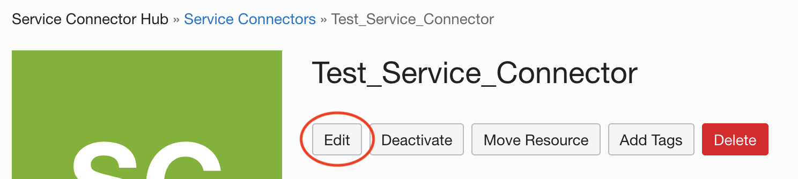
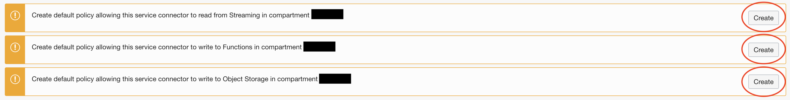

# Oracle Cloud Foundation Terraform Solution - Deploy Enterprise data warehousing - a predictive maintenance example


## Table of Contents
1. [Overview](#overview)
1. [Deliverables](#deliverables)
1. [Architecture](#Architecture-Diagram)
1. [Executing Instructions](#instructions)
    1. [Deploy Using Oracle Resource Manager](#Deploy-Using-Oracle-Resource-Manager)
    1. [Deploy Using the Terraform CLI](#Deploy-Using-the-Terraform-CLI)
1. [Documentation](#documentation)
1. [The Team](#team)
1. [Feedback](#feedback)
1. [Known Issues](#known-issues)
1. [Contribute](#CONTRIBUTING.md)


## <a name="overview"></a>Overview
This architecture uses OCI Streaming for ingesting continuous, high-volume streams of data into object storage through an integration made with Oracle's Service Connector Hub.

This data can then be leveraged with Oracle Data Science. Oracle Data Science is used to build, train, and manage machine learning (ML) models in Oracle Cloud Infrastructure.

Data Flow is used to run your Apache Spark applications.

For details of the architecture, see [_Enterprise data warehousing - a predictive maintenance example_](https://docs.oracle.com/en/solutions/oci-streaming-analysis/)

## <a name="deliverables"></a>Deliverables
 This repository encloses one deliverable:

- A reference implementation written in Terraform HCL (Hashicorp Language) that provisions fully functional resources in an OCI tenancy.

## <a name="architecture"></a>Architecture-Diagram
The following diagram illustrates this reference architecture:


## <a name="instructions"></a>Executing Instructions

## Prerequisites

- Permission to `manage` the following types of resources in your Oracle Cloud Infrastructure tenancy: `vcns`, `nat-gateways`, `route-tables`, `subnets`, `service-gateways`, `security-lists`, `stream`, `stream-pull`, `stream-push`, `stream-pools`, `serviceconnectors`, `dataflow-family`, and `functions-family`.

- Quota to create the following resources: 1 VCN, 2 subnets, 1 Internet Gateway, 1 NAT Gateway, 1 Service Gateway, 2 route rules, 2 NSGs, 1 stream/stream pool, 1 Fn App, 1 Fn Function, 2 Buckets, 1 Data Flow App, 1 Data Science Project/Notebook and 1 Service Connector Hub.

If you don't have the required permissions and quota, contact your tenancy administrator. See [Policy Reference](https://docs.cloud.oracle.com/en-us/iaas/Content/Identity/Reference/policyreference.htm), [Service Limits](https://docs.cloud.oracle.com/en-us/iaas/Content/General/Concepts/servicelimits.htm), [Compartment Quotas](https://docs.cloud.oracle.com/iaas/Content/General/Concepts/resourcequotas.htm).

# <a name="Deploy-Using-Oracle-Resource-Manager"></a>Deploy Using Oracle Resource Manager

**Note**: A set of policies and two dynamic groups are created in this Resource Manager stack allowing an administrator to deploy this solution. These are listed in "local.tf" file ( the last lines) and can be used as a reference when fitting this deployment to your specific IAM configuration.

1. Click [](https://cloud.oracle.com/resourcemanager/stacks/create?region=home&zipUrl=https://github.com/oracle-devrel/terraform-oci-oracle-cloud-foundation/releases/download/v1.0.0/Enterprise-data-warehousing-a-predictive-maintenance-example-RM.zip)


    If you aren't already signed in, when prompted, enter the tenancy and user credentials.
---- 
### __The Prerequisites before creating the stack are:__
1. __Get an Auth Token and Create a New Repository__
  
  - In the top-right corner of the Console, open the User menu (User menu), and then click User Settings.
  - On the Auth Tokens page, click Generate Token.
  - Enter Tutorial auth token as a friendly description for the auth token and click Generate Token. The new auth token is displayed.
  - Copy the auth token immediately to a secure location from where you can retrieve it later, because you won't see the auth token again in the Console.
  - Close the Generate Token dialog.
  - In the Console, open the navigation menu. Go to Developer Services and click Container Registry.
  - Choose the region in which you will be working (for example, us-ashburn-1).
  - Choose the compartment you have permission to work in.
  
  - Create a new repository: - Click Create Repository.
  - Choose the compartment in which to create the new repository (by default, the same compartment you selected previously).
  - Enter __decoder__  as the name for the new repository.
  - Select the Private option to limit access to the new repository.
  - Click Create Repository to create the new repository

2. __Check your username format__ 
 - "tenancy-namespace>/username". For example, ansh81vru1zp/jdoe@acme.com. If your tenancy is federated with Oracle Identity Cloud Service, use the format tenancy-namespace/oracleidentitycloudservice/username. 
 - As the tenancy-namespace terraform will get it automatically, just verify if your tenancy it's federated or not. 
 - If it's federated remember the oracleidentitycloudservice/username format. For example: oracleidentitycloudservice/ionel_panaitescu . This will be required for the ocir_user_name variable.
---- 
2. Review and accept the terms and conditions.
3. Select the region where you want to deploy the stack.
4. Follow the on-screen prompts and instructions to create the stack.
5. After creating the stack, click **Terraform Actions**, and select **Plan**.
6. Wait for the job to be completed, and review the plan.
    To make any changes, return to the Stack Details page, click **Edit Stack**, and make the required changes. Then, run the **Plan** action again.
7. If no further changes are necessary, return to the Stack Details page, click **Terraform Actions**, and select **Apply**. 

8. Navigate to your Service Connector Hub Instance (Analytics & AI -> Messaging -> Service Connector Hub).
   
9.  Click "Edit":
   

11. Scroll down the page and click the three create buttons for the policies required for the Service Connector Hub: 
    

# <a name="Deploy-Using-the-Terraform-CLI"></a>Deploy Using the Terraform CLI

## Clone the Module
Now, you'll want a local copy of this repo. You can make that with the commands:

    git clone https://github.com/oracle-devrel/terraform-oci-oracle-cloud-foundation.git
    cd terraform-oci-oracle-cloud-foundation/cloud-foundation/solutions/Enterprise-data-warehousing-a-predictive-maintenance-example
    ls

## Deployment

- Follow the instructions from Prerequisites links in order to install terraform.
- Download the terraform version suitable for your operating system.
- Unzip the archive.
- Add the executable to the PATH.
- You will have to generate an API signing key (public/private keys) and the public key should be uploaded in the OCI console, for the iam user that will be used to create the resources. Also, you should make sure that this user has enough permissions to create resources in OCI. In order to generate the API Signing key, follow the steps from: https://docs.us-phoenix-1.oraclecloud.com/Content/API/Concepts/apisigningkey.htm#How
  The API signing key will generate a fingerprint in the OCI console, and that fingerprint will be used in a terraform file described below.
- You will also need to generate an OpenSSH public key pair. Please store those keys in a place accessible like your user home .ssh directory.

## Prerequisites

- Install Terraform v0.13 or greater: https://www.terraform.io/downloads.html
- Install Python 3.6: https://www.digitalocean.com/community/tutorials/how-to-install-python-3-and-set-up-a-local-programming-environment-on-centos-7
- Generate an OCI API Key
- Create your config under \$home*directory/.oci/config (run \_oci setup config* and follow the steps)
- Gather Tenancy related variables (tenancy_id, user_id, local path to the oci_api_key private key, fingerprint of the oci_api_key_public key, and region)

### Installing Terraform

Go to [terraform.io](https://www.terraform.io/downloads.html) and download the proper package for your operating system and architecture. Terraform is distributed as a single binary.
Install Terraform by unzipping it and moving it to a directory included in your system's PATH. You will need the latest version available.

### Prepare Terraform Provider Values

**variables.tf** is located in the root directory. This file is used in order to be able to make API calls in OCI, hence it will be needed by all terraform automations.

In order to populate the **variables.tf** file, you will need the following:

- Tenancy OCID
- User OCID
- Local Path to your private oci api key
- Fingerprint of your public oci api key
- Region

#### **Getting the Tenancy and User OCIDs**

You will have to login to the [console](https://console.us-ashburn-1.oraclecloud.com) using your credentials (tenancy name, user name and password). If you do not know those, you will have to contact a tenancy administrator.

In order to obtain the tenancy ocid, after logging in, from the menu, select Administration -> Tenancy Details. The tenancy OCID, will be found under Tenancy information and it will be similar to **ocid1.tenancy.oc1..aaa…**

In order to get the user ocid, after logging in, from the menu, select Identity -> Users. Find your user and click on it (you will need to have this page open for uploading the oci_api_public_key). From this page, you can get the user OCID which will be similar to **ocid1.user.oc1..aaaa…**

#### **Creating the OCI API Key Pair and Upload it to your user page**

Create an oci_api_key pair in order to authenticate to oci as specified in the [documentation](https://docs.cloud.oracle.com/en-us/iaas/Content/API/Concepts/apisigningkey.htm#How):

Create the .oci directory in the home of the current user

`$ mkdir ~/.oci`

Generate the oci api private key

`$ openssl genrsa -out ~/.oci/oci_api_key.pem 2048`

Make sure only the current user can access this key

`$ chmod go-rwx ~/.oci/oci_api_key.pem`

Generate the oci api public key from the private key

`$ openssl rsa -pubout -in ~/.oci/oci_api_key.pem -out ~/.oci/oci_api_key_public.pem`

You will have to upload the public key to the oci console for your user (go to your user page -> API Keys -> Add Public Key and paste the contents in there) in order to be able to do make API calls.

After uploading the public key, you can see its fingerprint into the console. You will need that fingerprint for your variables.tf file.
You can also get the fingerprint from running the following command on your local workstation by using your newly generated oci api private key.

`$ openssl rsa -pubout -outform DER -in ~/.oci/oci_api_key.pem | openssl md5 -c`

#### **Generating an SSH Key Pair on UNIX or UNIX-Like Systems Using ssh-keygen**

- Run the ssh-keygen command.

`ssh-keygen -b 2048 -t rsa`

- The command prompts you to enter the path to the file in which you want to save the key. A default path and file name are suggested in parentheses. For example: /home/user_name/.ssh/id_rsa. To accept the default path and file name, press Enter. Otherwise, enter the required path and file name, and then press Enter.
- The command prompts you for a passphrase. Enter a passphrase, or press ENTER if you don't want to havea passphrase.
  Note that the passphrase isn't displayed when you type it in. Remember the passphrase. If you forget the passphrase, you can't recover it. When prompted, enter the passphrase again to confirm it.
- The command generates an SSH key pair consisting of a public key and a private key, and saves them in the specified path. The file name of the public key is created automatically by appending .pub to the name of the private key file. For example, if the file name of the SSH private key is id_rsa, then the file name of the public key would be id_rsa.pub.
  Make a note of the path where you've saved the SSH key pair.
  When you create instances, you must provide the SSH public key. When you log in to an instance, you must specify the corresponding SSH private key and enter the passphrase when prompted.

#### **Getting the Region**

Even though, you may know your region name, you will needs its identifier for the variables.tf file (for example, US East Ashburn has us-ashburn-1 as its identifier).
In order to obtain your region identifier, you will need to Navigate in the OCI Console to Administration -> Region Management
Select the region you are interested in, and save the region identifier.

#### **Prepare the variables.tf file**

You will have to modify the **variables.tf** file to reflect the values that you’ve captured.

```
variable "tenancy_ocid" {
  type = string
  default = "" (tenancy ocid, obtained from OCI console - Profile -> Tenancy)
}

variable "region" {
    type = string
    default = "" (the region used for deploying the infrastructure - ex: eu-frankfurt-1)
}

variable "compartment_id" {
  type = string
  default = "" (the compartment used for deploying the solution - ex: compartment1)
}

variable "user_ocid" {
    type = string
    default = "" (user ocid, obtained from OCI console - Profile -> User Settings)
}

variable "fingerprint" {
    type = string
    default = "" (fingerprint obtained after setting up the API public key in OCI console - Profile -> User Settings -> API Keys -> Add Public Key)
}

variable "private_key_path" {
    type = string
    default = ""  (the path of your local oci api key - ex: /root/.ssh/oci_api_key.pem)
}
```

## Additional Prerequisites

Additionally you'll need to do some pre-deploy setup for Docker and Fn Project inside your machine:

```
sudo su -
yum update
yum install yum-utils
yum-config-manager --enable *addons
yum install docker-engine
groupadd docker
service docker restart
usermod -a -G docker opc
chmod 666 /var/run/docker.sock
exit
curl -LSs https://raw.githubusercontent.com/fnproject/cli/master/install | sh
exit
```

### __Last additional prerequisites are:__
1. __Get an Auth Token and Create a New Repository__
  
  - In the top-right corner of the Console, open the User menu (User menu), and then click User Settings.
  - On the Auth Tokens page, click Generate Token.
  - Enter Tutorial auth token as a friendly description for the auth token and click Generate Token. The new auth token is displayed.
  - Copy the auth token immediately to a secure location from where you can retrieve it later, because you won't see the auth token again in the Console.
  - Close the Generate Token dialog.
  - In the Console, open the navigation menu. Go to Developer Services and click Container Registry.
  - Choose the region in which you will be working (for example, us-ashburn-1).
  - Choose the compartment you have permission to work in.
  
  - Create a new repository: - Click Create Repository.
  - Choose the compartment in which to create the new repository (by default, the same compartment you selected previously).
  - Enter __decoder__  as the name for the new repository.
  - Select the Private option to limit access to the new repository.
  - Click Create Repository to create the new repository

2. __Check your username format__ 
 - "tenancy-namespace>/username". For example, ansh81vru1zp/jdoe@acme.com. If your tenancy is federated with Oracle Identity Cloud Service, use the format tenancy-namespace/oracleidentitycloudservice/username. 
 - As the tenancy-namespace terraform will get it automatically, just verify if your tenancy it's federated or not. 
 - If it's federated remember the oracleidentitycloudservice/username format. For example: oracleidentitycloudservice/ionel_panaitescu . This will be required for the ocir_user_name variable.

## Repository files

* **functions(folder)** - In this folder all the neccesary files to create the Docker Image that will be pushed to the Container Registry. This Docker Image will decode all the messages from the StreamPool to the object storage.
* **images(folder)** - In this folder are 2 images neccesary for the deployment.
* **modules(folder)** - ( this folder will be pressent only for the Resource Manager zipped files) Contains folders with subsystems and modules for each section of the project: networking, autonomous database, analytics cloud, etc.
* **CONTRIBUTING.md** - Contributing guidelines, also called Contribution guidelines, the CONTRIBUTING.md file, or software contribution guidelines, is a text file which project managers include in free and open-source software packages or other open media packages for the purpose of describing how others may contribute user-generated content to the project.The file explains how anyone can engage in activities such as formatting code for submission or submitting patches
* **LICENSE** - The Universal Permissive License (UPL), Version 1.0 
* **local.tf** - Local values can be helpful to avoid repeating the same values or expressions multiple times in a configuration, but if overused they can also make a configuration hard to read by future maintainers by hiding the actual values used.Here is the place where all the resources are defined.
* **main.tf** - Main Terraform script used for instantiating the Oracle Cloud Infrastructure provider and all subsystems modules
* **outputs.tf** - Defines project's outputs that you will see after the code runs successfuly
* **provider.tf** - The terraform provider that will be used (OCI)
* **README.md** - This file
* **schema.yaml** - Schema documents are recommended for Terraform configurations when using Resource Manager. Including a schema document allows you to extend pages in the Oracle Cloud Infrastructure Console. Facilitate variable entry in the Create Stack page by surfacing SSH key controls and by naming, grouping, dynamically prepopulating values, and more. Define text in the Application Information tab of the stack detail page displayed for a created stack.
* **tags.tf** - A file that will add tags for all the resouces as ArchitectureCenterTagNamespace convention.
* **variables.tf** - Project's global variables


Secondly, populate the `terraform.tf` file with the disared configuration following the information:

# Object Storage
This resource provides the Bucket resource in Oracle Cloud Infrastructure Object Storage service.
Creates a bucket in the given namespace with a bucket name and optional user-defined metadata. Avoid entering confidential information in bucket names.

* Parameters:
    * __data_bucket_name__ - The name of the bucket. Valid characters are uppercase or lowercase letters, numbers, hyphens, underscores, and periods. Bucket names must be unique within an Object Storage namespace. Avoid entering confidential information. example: Example: my-new-bucket1
    * __data_bucket_access_type__ - The type of public access enabled on this bucket. A bucket is set to NoPublicAccess by default, which only allows an authenticated caller to access the bucket and its contents. When ObjectRead is enabled on the bucket, public access is allowed for the GetObject, HeadObject, and ListObjects operations. When ObjectReadWithoutList is enabled on the bucket, public access is allowed for the GetObject and HeadObject operations.
    * __data_bucket_storage_tier__ - The type of storage tier of this bucket. A bucket is set to 'Standard' tier by default, which means the bucket will be put in the standard storage tier. When 'Archive' tier type is set explicitly, the bucket is put in the Archive Storage tier. The 'storageTier' property is immutable after bucket is created.
    * __data_bucket_events_enabled__ - Whether or not events are emitted for object state changes in this bucket. By default, objectEventsEnabled is set to false. Set objectEventsEnabled to true to emit events for object state changes. For more information about events, see Overview of Events.
    * __dataflow_logs_bucket_name__ - The name of the bucket. Valid characters are uppercase or lowercase letters, numbers, hyphens, underscores, and periods. Bucket names must be unique within an Object Storage namespace. Avoid entering confidential information. example: Example: my-new-bucket1
    * __dataflow_logs_bucket_access_type__ - The type of public access enabled on this bucket. A bucket is set to NoPublicAccess by default, which only allows an authenticated caller to access the bucket and its contents. When ObjectRead is enabled on the bucket, public access is allowed for the GetObject, HeadObject, and ListObjects operations. When ObjectReadWithoutList is enabled on the bucket, public access is allowed for the GetObject and HeadObject operations.
    * __dataflow_logs_bucket_storage_tier__ - The type of storage tier of this bucket. A bucket is set to 'Standard' tier by default, which means the bucket will be put in the standard storage tier. When 'Archive' tier type is set explicitly, the bucket is put in the Archive Storage tier. The 'storageTier' property is immutable after bucket is created.
    * __dataflow_logs_bucket_events_enabled__ - Whether or not events are emitted for object state changes in this bucket. By default, objectEventsEnabled is set to false. Set objectEventsEnabled to true to emit events for object state changes. For more information about events, see Overview of Events.

Below is an example:

```
variable "data_bucket_name" {
    type    = string
    default = "data_bucket"
}

variable "data_bucket_access_type" {
    type    = string
    default  = "NoPublicAccess"
}

variable "data_bucket_storage_tier" {
    type    = string
    default = "Standard"
}
  
variable "data_bucket_events_enabled" {
    type    = bool
    default = false
}

variable "dataflow_logs_bucket_name" {
    type    = string
    default = "dataflow-logs"
}

variable "dataflow_logs_bucket_access_type" {
    type    = string
    default  = "NoPublicAccess"
}

variable "dataflow_logs_bucket_storage_tier" {
    type    = string
    default = "Standard"
}
  
variable "dataflow_logs_bucket_events_enabled" {
    type    = bool
    default = false
}
```

# Streaming

This resource provides the Stream Pool resource in Oracle Cloud Infrastructure Streaming service.
Also this resource provides the Service Connector resource in Oracle Cloud Infrastructure Service Connector Hub service.

Creates a new service connector in the specified compartment. A service connector is a logically defined flow for moving data from a source service to a destination service in Oracle Cloud Infrastructure. For general information about service connectors, see Service Connector Hub Overview.

* Parameters:
    * __stream_name__ - The name of the stream. Avoid entering confidential information.
    * __stream_partitions__ - The number of partitions in the stream.
    * __stream_retention_in_hours__ -  The retention period of the stream, in hours. Accepted values are between 24 and 168 (7 days). If not specified, the stream will have a retention period of 24 hours.
    * __stream_pool_name__ - The name of the stream pool. Avoid entering confidential information
    * __service_connector_display_name__ - A user-friendly name. It does not have to be unique, and it is changeable. Avoid entering confidential information.
    * __service_connector_source_kind__ - The type descriminator.
    * __service_connector_source_cursor_kind__ - The type descriminator.
    * __service_connector_target_kind__ - An object that represents the target of the flow defined by the service connector. An example target is a stream. For more information about flows defined by service connectors, see Service Connector Hub Overview.
    * __service_connector_target_bucket__ - The name of the bucket. Avoid entering confidential information.
    * __service_connector_target_object_name_prefix__ - The prefix of the objects. Avoid entering confidential information.
    * __service_connector_target_batch_rollover_size_in_mbs__ -  The batch rollover size in megabytes.
    * __service_connector_target_batch_rollover_time_in_ms__ - The batch rollover time in milliseconds.
    * __service_connector_description__ - The description of the resource. Avoid entering confidential information.
    * __service_connector_tasks_kind__ - The type descriminator.
    * __service_connector_tasks_batch_size_in_kbs__ - Size limit (kilobytes) for batch sent to invoke the function.
    * __service_connector_tasks_batch_time_in_sec__ - Time limit (seconds) for batch sent to invoke the function.    

Below is an example:

```
variable "stream_name" {
    type    = string
    default = "Test_Stream"
}

variable "stream_partitions" {
    type    = string
    default = "1"
}

variable "stream_retention_in_hours" {
    type    = string
    default = "24"
}
  
variable "stream_pool_name" {
    type    = string
    default = "Test_Stream_Pool"
}

variable "service_connector_display_name" {
  default = "Test_Service_Connector"
}

variable "service_connector_source_kind" {
  default = "streaming"
}

variable "service_connector_source_cursor_kind" {
  default = "TRIM_HORIZON"
}

variable "service_connector_target_kind" {
  default = "objectStorage"
}

variable "service_connector_target_bucket" {
  default = "data_bucket"
}

variable "service_connector_target_object_name_prefix" {
  default = "data"
}

variable "service_connector_target_batch_rollover_size_in_mbs" {
  default = 10
}

variable "service_connector_target_batch_rollover_time_in_ms" {
  default = 60000
}

variable "service_connector_description" {
  default = "Used to connect streaming to object storage"
}

variable "service_connector_tasks_kind" {
  default = "function"
}

variable "service_connector_tasks_batch_size_in_kbs" {
  default = 5120
}

variable "service_connector_tasks_batch_time_in_sec" {
  default = 60
}
```

# Functions

This data source provides the list of Functions in Oracle Cloud Infrastructure Functions service. To not break the deployment please don't modify any variables in the functions sections as it's needed to be like this to work for ocir_repo_name.

* Parameters:
    * __app_display_name__ - The display name of the function. The display name must be unique within the application containing the function. Avoid entering confidential information.
    * __ocir_repo_name__ - The repo name where you will store the image in the Container Registry.
    * __ocir_user_name__ - The username that will push the image in the Container Registry. The user should be in this format: "oracleidentitycloudservice/username"
    * __ocir_user_password__ - The auth token generated for your user.

Below is an example:

```
variable "app_display_name" {
  default = "DecoderApp"
}

variable "ocir_repo_name" {
  default = "decoder"
}

variable "ocir_user_name" {
  default = ""
}

variable "ocir_user_password" {
  default = ""
}
```

# Data Flow

This resource provides the Application resource in Oracle Cloud Infrastructure Data Flow service. Creates an application.

* Parameters:
    * __application_display_name__ - A user-friendly name. It does not have to be unique. Avoid entering confidential information.
    * __application_driver_shape__ - The VM shape for the driver. Sets the driver cores and memory.
    * __application_executor_shape__ - The VM shape for the executors. Sets the executor cores and memory.
    * __application_file_uri__ - n Oracle Cloud Infrastructure URI of the file containing the application to execute. See https://docs.cloud.oracle.com/iaas/Content/API/SDKDocs/hdfsconnector.htm#uriformat. 
    * __application_language__ - The Spark language.
    * __application_num_executors__ - The number of executor VMs requested.
    * __application_spark_version__ -  The Spark version utilized to run the application.
    * __application_class_name__ - The class for the application.
    * __application_description__ - A user-friendly description.


Below is an example:

```
variable "application_display_name" {
  default = "dataflowapp"
}

variable "application_driver_shape" {
  default = "VM.Standard2.1"
}

variable "application_executor_shape" {
  default = "VM.Standard2.1"
}

variable "application_file_uri" {
  default = "oci://oow_2019_dataflow_lab@bigdatadatasciencelarge/usercontent/oow-lab-2019-java-etl-1.0-SNAPSHOT.jar"
}

variable "application_language" {
  default = "Java"
}

variable "application_num_executors" {
  default = 1
}

variable "application_spark_version" {
  default = "2.4.4"
}

variable "application_class_name" {
  default = "convert.Convert"
}

variable "application_description" {
  default = "Test Java Application"
}
```

# Data Science with notebook 

This resource provides the Notebook Session resource in Oracle Cloud Infrastructure Data Science service.

* Parameters:
    * __project_description__ - A short description of the project.
    * __project_display_name__ - A user-friendly display name for the resource. It does not have to be unique and can be modified. Avoid entering confidential information.
    * __notebook_session_display_name__ -  A user-friendly display name for the resource. It does not have to be unique and can be modified. Avoid entering confidential information.
    * __notebook_session_notebook_session_configuration_details_shape__ - The shape used to launch the notebook session compute instance. The list of available shapes in a given compartment can be retrieved using the ListNotebookSessionShapes endpoint.
    * __notebook_session_notebook_session_configuration_details_block_storage_size_in_gbs__ - A notebook session instance is provided with a block storage volume. This specifies the size of the volume in GBs.

Below is an example:

```
variable "project_description" {
  default = "Test_Project"
}

variable "project_display_name" {
  default = "data_science_project"
}

variable "notebook_session_display_name" {
  default = "notebook_session"
}

variable "notebook_session_notebook_session_configuration_details_shape" {
  default = "VM.Standard2.1"
}

variable "notebook_session_notebook_session_configuration_details_block_storage_size_in_gbs" {
  default = 50
}

```

# Network
This resource provides the Vcn resource in Oracle Cloud Infrastructure Core service anso This resource provides the Subnet resource in Oracle Cloud Infrastructure Core service.
The solution will create 1 VCN in your compartment, 2 subnets ( one public and one private so the analytics cloud instance can be public or private ), 2 route tables for incomming and outoing traffic, 2 Network Security Groups for ingress and egress traffic, 1 internet gateway, 2 route tables for each subnet, dhcp service, NAT Gateway and a Service Gateway.

* Parameters
    * __vcn_cidr__ - The list of one or more IPv4 CIDR blocks for the VCN that meet the following criteria:
        The CIDR blocks must be valid.  
        They must not overlap with each other or with the on-premises network CIDR block.
        The number of CIDR blocks must not exceed the limit of CIDR blocks allowed per VCN. It is an error to set both cidrBlock and cidrBlocks. Note: cidr_blocks update must be restricted to one operation at a time (either add/remove or modify one single cidr_block) or the operation will be declined.
    * __public_subnet_cidr__ - The CIDR IP address range of the subnet. The CIDR must maintain the following rules - a. The CIDR block is valid and correctly formatted. b. The new range is within one of the parent VCN ranges. This is the cidr for the public subnet.
    * __private_subnet_cidr__ - The CIDR IP address range of the subnet. The CIDR must maintain the following rules - a. The CIDR block is valid and correctly formatted. b. The new range is within one of the parent VCN ranges. This is the cidr for the private subnet.


Below is an example:
```
variable "vcn_cidr" {
  default = "10.0.0.0/16"
}
variable "public_subnet_cidr" {
  default = "10.0.0.0/24"
}
variable "private_subnet_cidr" {
  default = "10.0.1.0/24"
}
```
Don't modify any other variables in the variable.tf file - it may cause that the solution will not work propertly. The use_regional_subnet variable is for the subnets to be regional, not AD specific. 


## Running the code

```
# Run init to get terraform modules
$ terraform init

# Create the infrastructure
$ terraform apply --auto-approve

# If you are done with this infrastructure, take it down
$ terraform destroy --auto-approve
```


## <a name="documentation"></a>Documentation


[Object Storage Overview](https://docs.oracle.com/en-us/iaas/Content/Object/Concepts/objectstorageoverview.htm)

[Streaming Overview](https://docs.oracle.com/en-us/iaas/Content/Streaming/Concepts/streamingoverview.htm)

[Functions Overview](https://docs.oracle.com/en-us/iaas/Content/Functions/Concepts/functionsoverview.htm)

[Pushing Images Using the Docker CLI](https://docs.oracle.com/en-us/iaas/Content/Registry/Tasks/registrypushingimagesusingthedockercli.htm)

[Data Flow Overview](https://docs.oracle.com/en-us/iaas/data-flow/using/dfs_service_overview.htm)

[Data Science Overview](https://docs.oracle.com/en-us/iaas/data-science/using/overview.htm)

[Network Overview](https://docs.cloud.oracle.com/iaas/Content/Network/Concepts/overview.htm)

[Tagging Overview](https://docs.oracle.com/en-us/iaas/Content/Tagging/Concepts/taggingoverview.htm)

[Terraform Object Storage Service Resource](https://registry.terraform.io/providers/hashicorp/oci/latest/docs/resources/objectstorage_bucket)

[Terraform Streaming Stream Pool Service Resource](https://registry.terraform.io/providers/hashicorp/oci/latest/docs/resources/streaming_stream_pool)

[Terraform Streaming Stream Service Resource](https://registry.terraform.io/providers/hashicorp/oci/latest/docs/resources/streaming_stream)

[Terraform Service Connector Resource](https://registry.terraform.io/providers/hashicorp/oci/latest/docs/resources/sch_service_connector)

[Terraform Function Resource](https://registry.terraform.io/providers/hashicorp/oci/latest/docs/resources/functions_function)

[Terraform Function Application  Resource](https://registry.terraform.io/providers/hashicorp/oci/latest/docs/resources/functions_application)

[Terraform Data Flow Service Resource](https://registry.terraform.io/providers/hashicorp/oci/latest/docs/resources/dataflow_application)

[Terraform Data Science Project Service Resource](https://registry.terraform.io/providers/hashicorp/oci/latest/docs/resources/datascience_project)

[Terraform Data Science Notebook Session Service Resource](https://registry.terraform.io/providers/hashicorp/oci/latest/docs/resources/datascience_notebook_session)

[Terraform Vcn resource in Oracle Cloud Infrastructure Core service](https://registry.terraform.io/providers/hashicorp/oci/latest/docs/resources/core_vcn)

[Terraform Subnet resource in Oracle Cloud Infrastructure Core service](https://registry.terraform.io/providers/hashicorp/oci/latest/docs/resources/core_subnet)

[Terraform Tag Service Resource](https://registry.terraform.io/providers/hashicorp/oci/latest/docs/resources/identity_tag_namespace)


## <a name="team"></a>The Team
- **Owners**: [Panaitescu Ionel](https://github.com/ionelpanaitescu), [Corina Todea](https://github.com/ctodearo)

## <a name="feedback"></a>Feedback
We welcome your feedback. To post feedback, submit feature ideas or report bugs, please use the Issues section on this repository.	

## <a name="known-issues"></a>Known Issues
**At the moment, there are no known issues**