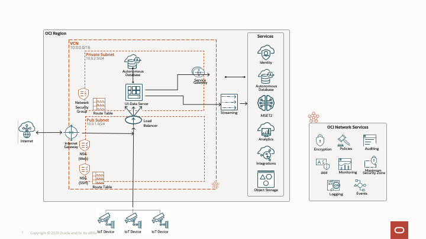

# Oracle Cloud Foundation Terraform Solution - Deploy Sam Workbench on Oracle Cloud

## Table of Contents
1. [Overview](#overview)
1. [Deliverables](#deliverables)
1. [Architecture](#Architecture-Diagram)
1. [Executing Instructions](#instructions)
    1. [Deploy Using Oracle Resource Manager](#Deploy-Using-Oracle-Resource-Manager)
    1. [Deploy Using the Terraform CLI](#Deploy-Using-the-Terraform-CLI)
1. [Documentation](#documentation)
1. [The Team](#team)
1. [Feedback](#feedback)
1. [Known Issues](#known-issues)
1. [Contribute](#CONTRIBUTING.md)


## <a name="overview"></a>Overview
Oracle Cloud Foundation Terraform Solution - Deploy Sam Workbench on Oracle Cloud

## <a name="deliverables"></a>Deliverables
 This repository encloses one deliverable:

- A reference implementation written in Terraform HCL (Hashicorp Language) that provisions fully functional resources in an OCI tenancy.


## <a name="architecture"></a>Architecture-Diagram

The following diagram shows a mapping of the architecture above to services provided on Oracle Cloud Infrastructure using security best practices and at the end of the deployment you will have in your tenancy the related services.




## <a name="instructions"></a>Executing Instructions

## Prerequisites

- Permission to `manage` the following types of resources in your Oracle Cloud Infrastructure tenancy: `vcns`, `nat-gateways`, `route-tables`, `subnets`, `service-gateways`, `security-lists`, `autonomous database`, `load balancer`, `streaming` and `compute instances`.
- Quota to create the following resources: 1 ATP database instance and 2 VM instance, 1 Load Balancer and Streaming Service.
If you don't have the required permissions and quota, contact your tenancy administrator. See [Policy Reference](https://docs.cloud.oracle.com/en-us/iaas/Content/Identity/Reference/policyreference.htm), [Service Limits](https://docs.cloud.oracle.com/en-us/iaas/Content/General/Concepts/servicelimits.htm), [Compartment Quotas](https://docs.cloud.oracle.com/iaas/Content/General/Concepts/resourcequotas.htm).

# <a name="Deploy-Using-Oracle-Resource-Manager"></a>Deploy Using Oracle Resource Manager

1. Click [](https://cloud.oracle.com/resourcemanager/stacks/create?region=home&zipUrl=https://github.com/oracle-devrel/terraform-oci-oracle-cloud-foundation/releases/download/v1.0.0/Sam-Workbench-RM.zip)


    If you aren't already signed in, when prompted, enter the tenancy and user credentials.

2. Review and accept the terms and conditions.
3. Select the region where you want to deploy the stack.
4. Follow the on-screen prompts and instructions to create the stack.
5. After creating the stack, click **Terraform Actions**, and select **Plan**.
6. Wait for the job to be completed, and review the plan.
    To make any changes, return to the Stack Details page, click **Edit Stack**, and make the required changes. Then, run the **Plan** action again.
7. If no further changes are necessary, return to the Stack Details page, click **Terraform Actions**, and select **Apply**. 


# <a name="Deploy-Using-the-Terraform-CLI"></a>Deploy Using the Terraform CLI

## Clone the Module
Now, you'll want a local copy of this repo. You can make that with the commands:

    git clone https://github.com/oracle-devrel/terraform-oci-oracle-cloud-foundation.git
    cd terraform-oci-oracle-cloud-foundation/cloud-foundation/solutions/Sam-Workbench
    ls

## Deployment

- Follow the instructions from Prerequisites links in order to install terraform.
- Download the terraform version suitable for your operating system.
- Unzip the archive.
- Add the executable to the PATH.
- You will have to generate an API signing key (public/private keys) and the public key should be uploaded in the OCI console, for the iam user that will be used to create the resources. Also, you should make sure that this user has enough permissions to create resources in OCI. In order to generate the API Signing key, follow the steps from: https://docs.us-phoenix-1.oraclecloud.com/Content/API/Concepts/apisigningkey.htm#How
  The API signing key will generate a fingerprint in the OCI console, and that fingerprint will be used in a terraform file described below.
- You will also need to generate an OpenSSH public key pair. Please store those keys in a place accessible like your user home .ssh directory.

## Prerequisites

- Install Terraform v0.13 or greater: https://www.terraform.io/downloads.html
- Install Python 3.6: https://www.digitalocean.com/community/tutorials/how-to-install-python-3-and-set-up-a-local-programming-environment-on-centos-7
- Generate an OCI API Key
- Create your config under \$home*directory/.oci/config (run \_oci setup config* and follow the steps)
- Gather Tenancy related variables (tenancy_id, user_id, local path to the oci_api_key private key, fingerprint of the oci_api_key_public key, and region)

### Installing Terraform

Go to [terraform.io](https://www.terraform.io/downloads.html) and download the proper package for your operating system and architecture. Terraform is distributed as a single binary.
Install Terraform by unzipping it and moving it to a directory included in your system's PATH. You will need the latest version available.

### Prepare Terraform Provider Values

**variables.tf** is located in the root directory. This file is used in order to be able to make API calls in OCI, hence it will be needed by all terraform automations.

In order to populate the **variables.tf** file, you will need the following:

- Tenancy OCID
- User OCID
- Local Path to your private oci api key
- Fingerprint of your public oci api key
- Region

#### **Getting the Tenancy and User OCIDs**

You will have to login to the [console](https://console.us-ashburn-1.oraclecloud.com) using your credentials (tenancy name, user name and password). If you do not know those, you will have to contact a tenancy administrator.

In order to obtain the tenancy ocid, after logging in, from the menu, select Administration -> Tenancy Details. The tenancy OCID, will be found under Tenancy information and it will be similar to **ocid1.tenancy.oc1..aaa…**

In order to get the user ocid, after logging in, from the menu, select Identity -> Users. Find your user and click on it (you will need to have this page open for uploading the oci_api_public_key). From this page, you can get the user OCID which will be similar to **ocid1.user.oc1..aaaa…**

#### **Creating the OCI API Key Pair and Upload it to your user page**

Create an oci_api_key pair in order to authenticate to oci as specified in the [documentation](https://docs.cloud.oracle.com/en-us/iaas/Content/API/Concepts/apisigningkey.htm#How):

Create the .oci directory in the home of the current user

`$ mkdir ~/.oci`

Generate the oci api private key

`$ openssl genrsa -out ~/.oci/oci_api_key.pem 2048`

Make sure only the current user can access this key

`$ chmod go-rwx ~/.oci/oci_api_key.pem`

Generate the oci api public key from the private key

`$ openssl rsa -pubout -in ~/.oci/oci_api_key.pem -out ~/.oci/oci_api_key_public.pem`

You will have to upload the public key to the oci console for your user (go to your user page -> API Keys -> Add Public Key and paste the contents in there) in order to be able to do make API calls.

After uploading the public key, you can see its fingerprint into the console. You will need that fingerprint for your variables.tf file.
You can also get the fingerprint from running the following command on your local workstation by using your newly generated oci api private key.

`$ openssl rsa -pubout -outform DER -in ~/.oci/oci_api_key.pem | openssl md5 -c`

#### **Generating an SSH Key Pair on UNIX or UNIX-Like Systems Using ssh-keygen**

- Run the ssh-keygen command.

`ssh-keygen -b 2048 -t rsa`

- The command prompts you to enter the path to the file in which you want to save the key. A default path and file name are suggested in parentheses. For example: /home/user_name/.ssh/id_rsa. To accept the default path and file name, press Enter. Otherwise, enter the required path and file name, and then press Enter.
- The command prompts you for a passphrase. Enter a passphrase, or press ENTER if you don't want to havea passphrase.
  Note that the passphrase isn't displayed when you type it in. Remember the passphrase. If you forget the passphrase, you can't recover it. When prompted, enter the passphrase again to confirm it.
- The command generates an SSH key pair consisting of a public key and a private key, and saves them in the specified path. The file name of the public key is created automatically by appending .pub to the name of the private key file. For example, if the file name of the SSH private key is id_rsa, then the file name of the public key would be id_rsa.pub.
  Make a note of the path where you've saved the SSH key pair.
  When you create instances, you must provide the SSH public key. When you log in to an instance, you must specify the corresponding SSH private key and enter the passphrase when prompted.

#### **Getting the Region**

Even though, you may know your region name, you will needs its identifier for the variables.tf file (for example, US East Ashburn has us-ashburn-1 as its identifier).
In order to obtain your region identifier, you will need to Navigate in the OCI Console to Administration -> Region Management
Select the region you are interested in, and save the region identifier.

#### **Prepare the variables.tf file**

You will have to modify the **variables.tf** file to reflect the values that you’ve captured.

```
variable "tenancy_ocid" {
  type = string
  default = "" (tenancy ocid, obtained from OCI console - Profile -> Tenancy)
}

variable "region" {
    type = string
    default = "" (the region used for deploying the infrastructure - ex: eu-frankfurt-1)
}

variable "compartment_id" {
  type = string
  default = "" (the compartment OCID used for deploying the solution - ex: ocid1.compartment.oc1..aaaaaa...)
}

variable "user_ocid" {
    type = string
    default = "" (user ocid, obtained from OCI console - Profile -> User Settings)
}

variable "fingerprint" {
    type = string
    default = "" (fingerprint obtained after setting up the API public key in OCI console - Profile -> User Settings -> API Keys -> Add Public Key)
}

variable "private_key_path" {
    type = string
    default = ""  (the path of your local oci api key - ex: /root/.ssh/oci_api_key.pem)
}
```

## Repository files
* **images(folder)** - Contains images to be used inside the README.md file
* **modules(folder)** - ( this folder will be present only for the Resource Manager zipped files) Contains folders with subsystems and modules for each section of the project: networking, autonomous database, analytics cloud, etc.
* **scripts(folder)** - this folder contains the necessary scripts that will run on the compute instances, for the bastion and also for the Secure Agent VM.
* **CONTRIBUTING.md** - Contributing guidelines, also called Contribution guidelines, the CONTRIBUTING.md file, or software contribution guidelines, is a text file which project managers include in free and open-source software packages or other open media packages for the purpose of describing how others may contribute user-generated content to the project.The file explains how anyone can engage in activities such as formatting code for submission or submitting patches
* **LICENSE** - The Universal Permissive License (UPL), Version 1.0 
* **local.tf** - Local values can be helpful to avoid repeating the same values or expressions multiple times in a configuration, but if overused they can also make a configuration hard to read by future maintainers by hiding the actual values used.Here is the place where all the resources are defined.
* **main.tf** - Main Terraform script used for instantiating the Oracle Cloud Infrastructure provider and all subsystems modules
* **outputs.tf** - Defines project's outputs that you will see after the code runs successfuly
* **provider.tf** - The terraform provider that will be used (OCI)
* **README.md** - This file
* **variables.tf** - Project's global variables


Secondly, populate the `terraform.tf` file with the disared configuration following the information:


# Autonomous Data Warehouse

The ADW subsystem / module is able to create ADW/ATP databases.

* Parameters:
    * __db_name__ - The database name. The name must begin with an alphabetic character and can contain a maximum of 14 alphanumeric characters. Special characters are not permitted. The database name must be unique in the tenancy.
    * __db_password__ - The password must be between 12 and 30 characters long, and must contain at least 1 uppercase, 1 lowercase, and 1 numeric character. It cannot contain the double quote symbol (") or the username "admin", regardless of casing. The password is mandatory if source value is "BACKUP_FROM_ID", "BACKUP_FROM_TIMESTAMP", "DATABASE" or "NONE".
    * __db_compute_model__ - The compute model of the Autonomous Database. This is required if using the computeCount parameter. If using cpuCoreCount then it is an error to specify computeModel to a non-null value.
    * __db_compute_count__ - The compute amount available to the database. Minimum and maximum values depend on the compute model and whether the database is on Shared or Dedicated infrastructure. For an Autonomous Database on Shared infrastructure, the 'ECPU' compute model requires values in multiples of two. Required when using the computeModel parameter. When using cpuCoreCount parameter, it is an error to specify computeCount to a non-null value.
    * __db_size_in_tbs__ - The size, in gigabytes, of the data volume that will be created and attached to the database. This storage can later be scaled up if needed. The maximum storage value is determined by the infrastructure shape. See Characteristics of Infrastructure Shapes for shape details.
    * __db_workload__ - The Autonomous Database workload type. The following values are valid:
        - OLTP - indicates an Autonomous Transaction Processing database
        - DW - indicates an Autonomous Data Warehouse database
        - AJD - indicates an Autonomous JSON Database
        - APEX - indicates an Autonomous Database with the Oracle APEX Application Development workload type. *Note: db_workload can only be updated from AJD to OLTP or from a free OLTP to AJD.
    * __db_version__ - A valid Oracle Database version for Autonomous Database.db_workload AJD and APEX are only supported for db_version 19c and above.
    * __db_enable_auto_scaling__ - Indicates if auto scaling is enabled for the Autonomous Database OCPU core count. The default value is FALSE.
    * __db_is_free_tier__ - Indicates if this is an Always Free resource. The default value is false. Note that Always Free Autonomous Databases have 1 CPU and 20GB of memory. For Always Free databases, memory and CPU cannot be scaled. When db_workload is AJD or APEX it cannot be true.
    * __db_license_model__ - The Oracle license model that applies to the Oracle Autonomous Database. Bring your own license (BYOL) allows you to apply your current on-premises Oracle software licenses to equivalent, highly automated Oracle PaaS and IaaS services in the cloud. License Included allows you to subscribe to new Oracle Database software licenses and the Database service. Note that when provisioning an Autonomous Database on dedicated Exadata infrastructure, this attribute must be null because the attribute is already set at the Autonomous Exadata Infrastructure level. When using shared Exadata infrastructure, if a value is not specified, the system will supply the value of BRING_YOUR_OWN_LICENSE. It is a required field when db_workload is AJD and needs to be set to LICENSE_INCLUDED as AJD does not support default license_model value BRING_YOUR_OWN_LICENSE.
    * __db_data_safe_status__ - (Updatable) Status of the Data Safe registration for this Autonomous Database. Could be REGISTERED or NOT_REGISTERED.
    * __db_operations_insights_status__ - (Updatable) Status of Operations Insights for this Autonomous Database. Values supported are ENABLED and NOT_ENABLED
    * __db_database_management_status__ - Status of Database Management for this Autonomous Database. Values supported are ENABLED and NOT_ENABLED


Below is an example:

```
variable "db_name" {
  type    = string
  default = "Samworkbench"
}

variable "db_password" {
  type = string
  default = "<enter-password-here>" # Example password: Par0laMea123
}

variable "db_compute_model" {
  type    = string
  default = "ECPU"
}

variable "db_compute_count" {
  type = number
  default = 4
}

variable "db_size_in_tbs" {
  type = number
  default = 1
}

variable "db_workload" {
  type = string
  default = "OLTP"
}

variable "db_version" {
  type = string
  default = "19c"
}

variable "db_enable_auto_scaling" {
  type = bool
  default = true
}

variable "db_is_free_tier" {
  type = bool
  default = false
}

variable "db_license_model" {
  type = string
  default = "BRING_YOUR_OWN_LICENSE"
}

variable "db_data_safe_status" {
  type = string
  default = "NOT_REGISTERED"
  # default = "REGISTERED"
}

variable "db_operations_insights_status" {
  type = string
  default = "NOT_ENABLED"
  # default = "ENABLED"
}

variable "db_database_management_status" {
  type = string
  default = "NOT_ENABLED"
  # default = "ENABLED"
}
```

# Streaming

This resource provides the Stream Pool resource in Oracle Cloud Infrastructure Streaming service.
Also this resource provides the Service Connector resource in Oracle Cloud Infrastructure Service Connector Hub service.

Creates a new service connector in the specified compartment. A service connector is a logically defined flow for moving data from a source service to a destination service in Oracle Cloud Infrastructure. For general information about service connectors, see Service Connector Hub Overview.

* Parameters:
    * __stream_name__ - The name of the stream. Avoid entering confidential information.
    * __stream_partitions__ - The number of partitions in the stream.
    * __stream_retention_in_hours__ -  The retention period of the stream, in hours. Accepted values are between 24 and 168 (7 days). If not specified, the stream will have a retention period of 24 hours.
    * __stream_pool_name__ - The name of the stream pool. Avoid entering confidential information


* Service Connector Hub (optional):
    * __service_connector_display_name__ - A user-friendly name. It does not have to be unique, and it is changeable. Avoid entering confidential information.
    * __service_connector_source_kind__ - The type descriminator.
    * __service_connector_source_cursor_kind__ - The type descriminator.
    * __service_connector_target_kind__ - An object that represents the target of the flow defined by the service connector. An example target is a stream. For more information about flows defined by service connectors, see Service Connector Hub Overview.
    * __service_connector_target_bucket__ - The name of the bucket. Avoid entering confidential information.
    * __service_connector_target_object_name_prefix__ - The prefix of the objects. Avoid entering confidential information.
    * __service_connector_target_batch_rollover_size_in_mbs__ -  The batch rollover size in megabytes.
    * __service_connector_target_batch_rollover_time_in_ms__ - The batch rollover time in milliseconds.
    * __service_connector_description__ - The description of the resource. Avoid entering confidential information.
    * __service_connector_tasks_kind__ - The type descriminator.
    * __service_connector_tasks_batch_size_in_kbs__ - Size limit (kilobytes) for batch sent to invoke the function.
    * __service_connector_tasks_batch_time_in_sec__ - Time limit (seconds) for batch sent to invoke the function.    
    * __function_id__ - Your function name or function ocid from your tenancy. 

Below is an example:

```
# Streaming

variable "stream_name" {
    type    = string
    default = "Test_Stream"
}

variable "stream_partitions" {
    type    = string
    default = "1"
}

variable "stream_retention_in_hours" {
    type    = string
    default = "24"
}
  
variable "stream_pool_name" {
    type    = string
    default = "Test_Stream_Pool"
}
```
The streaming module also has the service connector hub integrated and you can use it if you have a function already in your tenancy available. For this solution only the stream pool and 1 stream will be provisioned.

For this you need to go into the local.tf file and for the service_connector object to be replaced with the code below and also to set in the variables.tf file the rest of the variables detailed upper.
Also you need to replace the : function_id with your function name or function ocid from your tenancy. 

```
service_connector = {
    Test_Stream = {
      compartment_id          = var.compartment_id
      service_connector_display_name = var.service_connector_display_name
      service_connector_source_kind  = var.service_connector_source_kind
      service_connector_source_cursor_kind = var.service_connector_source_cursor_kind
      service_connector_target_kind = var.service_connector_target_kind
      service_connector_target_batch_rollover_size_in_mbs = var.service_connector_target_batch_rollover_size_in_mbs
      service_connector_target_batch_rollover_time_in_ms  = var.service_connector_target_batch_rollover_time_in_ms
      service_connector_target_bucket                     = var.service_connector_target_bucket
      service_connector_target_object_name_prefix         = var.service_connector_target_object_name_prefix
      service_connector_description                       = var.service_connector_description
      defined_tags =  { "${oci_identity_tag_namespace.ArchitectureCenterTagNamespace.name}.${oci_identity_tag.ArchitectureCenterTag.name}" = var.release }
      service_connector_tasks_kind                        = var.service_connector_tasks_kind
      service_connector_tasks_batch_size_in_kbs           = var.service_connector_tasks_batch_size_in_kbs
      service_connector_tasks_batch_time_in_sec           = var.service_connector_tasks_batch_time_in_sec
      function_id                                         = lookup(module.functions.functions,"Lakehouse_Function").ocid
  }
}
```

# KeyGen
Generates a secure private key and encodes it as PEM. This resource is primarily intended for easily bootstrapping throwaway development environments.

In the main.tf file we are calling the keygen module that will create one public and one private key. 
This keys are neccesary, as the public key will be generated and injected in all the instances, and the private key will be generated.
Both can be found in the solution folder if you want to use them after the deployment it's done.
For Resource Manager, the keys can be found in the dashboard under the resource section.

Below is an example:
```
module "keygen" {
  source = "../../../cloud-foundation/modules/cloud-foundation-library/keygen"
  display_name = "keygen"
  subnet_domain_name = "keygen"
}
```


# Compute Bastion VM Configuration
The compute module will create two VM's, one VM that will stand as a Bastion/Jump Host and the Secure Agent itself on another VM. 
The Bastion it's deployed in the public subnet and the Secure Agent Instance it's in the private subnet.
For the Bastion VM we are using the Oracle-Linux-Cloud-Developer-8.5-2022.05.22-0 image as it comes with all the neccesary software installed and for the Informatica Secure Anget Instance we are using the informatica Marketplace Image version August_2022.03. 

More information about this image and about the OCIDs required to be provided as a variable can be found here:

https://docs.oracle.com/en-us/iaas/images/image/2e439f8e-e98f-489b-82a3-338360b46b82/

More information regarding shapes can be found here:

https://docs.oracle.com/en-us/iaas/Content/Compute/References/computeshapes.htm

* Parameters for the VM Bastion Compute Configuration
    * __bastion_shape__ - (Required) (Updatable) The shape of an instance. The shape determines the number of CPUs, amount of memory, and other resources allocated to the instance.
    * __bastion_display_name__ - (Required) (Updatable) - Required. The hostname/dns name for the Bastion VM.


Below is an example:
```
# VM Bastion Compute Configuration

variable "bastion_display_name" {
  default = "sam-bastion"
}

variable "bastion_server_shape" {
  default = "VM.Standard2.4"
}
```

# UI Data Server VM Configuration
* Parameters for the UI Data Server VM Configuration
    * __ui_data_server_shape__ - (Required) (Updatable) The shape of an instance. The shape determines the number of CPUs, amount of memory, and other resources allocated to the instance.
    * __ui_data_server_display_name__ - (Required) (Updatable) - Required. The hostname/dns name for the UI Data Server VM.
    * __ui_data_server_ocpus__ - (Updatable) The total number of OCPUs available to the instance.
    * __ui_data_server_memory_in_gbs__ - (Updatable) The total amount of memory available to the instance, in gigabytes.


On the ui data server docker it will be available and will spean up 2 docker containers.
  - docker run --name listener-ui -d -p 8000:8000 -it docker.io/library/python:3.7-slim python3 -m http.server --bind 0.0.0.0
  - docker run --name listener-data -d -p 8088:80 docker.io/docker/welcome-to-docker:latest

```
variable "ui_data_server_shape" {
  default = "VM.Standard2.4"
}

variable "ui_data_server_ocpus" {
  type = number
  default = 6
}

variable "ui_data_server_memory_in_gbs" {
  type = number
  default = 196
}

variable "ui_data_server_display_name" {
  default = "ui_data_server"
}
```

# Network
This resource provides the Vcn resource in Oracle Cloud Infrastructure Core service anso This resource provides the Subnet resource in Oracle Cloud Infrastructure Core service.
The solution will create 1 VCN in your compartment, 2 subnets ( one public and one private so the analytics cloud instance can be public or private ), 2 route tables for incomming and outoing traffic, 2 Network Security Groups for ingress and egress traffic, 1 internet gateway, 2 route tables for each subnet, dhcp service, NAT Gateway and a Service Gateway. 

* Parameters
    * __vcn_cidr__ - The list of one or more IPv4 CIDR blocks for the VCN that meet the following criteria:
        The CIDR blocks must be valid.  
        They must not overlap with each other or with the on-premises network CIDR block.
        The number of CIDR blocks must not exceed the limit of CIDR blocks allowed per VCN. It is an error to set both cidrBlock and cidrBlocks. Note: cidr_blocks update must be restricted to one operation at a time (either add/remove or modify one single cidr_block) or the operation will be declined.
    * __public_subnet_cidr__ - The CIDR IP address range of the subnet. The CIDR must maintain the following rules - a. The CIDR block is valid and correctly formatted. b. The new range is within one of the parent VCN ranges. This is the cidr for the public subnet.
    * __private_subnet_cidr__ - The CIDR IP address range of the subnet. The CIDR must maintain the following rules - a. The CIDR block is valid and correctly formatted. b. The new range is within one of the parent VCN ranges. This is the cidr for the private subnet.


Below is an example:
```
variable "vcn_cidr" {
  default = "10.0.0.0/16"
}

variable "public_subnet_cidr" {
  default = "10.0.1.0/24"
}

variable "private_subnet_cidr" {
  default = "10.0.2.0/24"
}
```

# Load Balancer Configuration
* Parameters for Load Balancer Configuration
    * __load_balancer_shape__ - (Required) (Updatable) A template that determines the total pre-provisioned bandwidth (ingress plus egress). To get a list of available shapes, use the ListShapes operation. Example: flexible NOTE: Starting May 2023, Fixed shapes - 10Mbps, 100Mbps, 400Mbps, 8000Mbps would be deprecated and only shape allowed would be Flexible *Note: When updating shape for a load balancer, all existing connections to the load balancer will be reset during the update process. Also 10Mbps-Micro shape cannot be updated to any other shape nor can any other shape be updated to 10Mbps-Micro.
    * __load_balancer_maximum_bandwidth_in_mbps__ - (Required) (Updatable) Bandwidth in Mbps that determines the maximum bandwidth (ingress plus egress) that the load balancer can achieve. This bandwidth cannot be always guaranteed. For a guaranteed bandwidth use the minimumBandwidthInMbps parameter. The values must be between minimumBandwidthInMbps and 8000 (8Gbps). Example: 1500
    * __load_balancer_minimum_bandwidth_in_mbps__ - (Required) (Updatable) Bandwidth in Mbps that determines the total pre-provisioned bandwidth (ingress plus egress). The values must be between 10 and the maximumBandwidthInMbps. Example: 150
    * __load_balancer_display_name__ - (Required) (Updatable) A user-friendly name. It does not have to be unique, and it is changeable. Avoid entering confidential information. Example: example_load_balancer

The load balancer will create 2 listeners what will listen on port 443 and 1443 ; protocol https and using SSL. Also will create 2 backend sets what will listen on ports 8000 and 8088.

The topology is: 
listener-ui  https 443 -> (http) server:8000 
listener-data  https 1443 -> (http)server:8088


```
variable "load_balancer_shape" {
  default = "flexible"
}

variable "load_balancer_maximum_bandwidth_in_mbps" {
  type    = number 
  default = 400
}

variable "load_balancer_minimum_bandwidth_in_mbps" {
  type    = number 
  default = 10
}

variable "load_balancer_display_name" {
  default = "lbsam"
}
```

## Running the code

```
# Run init to get terraform modules
$ terraform init

# Create the infrastructure
$ terraform apply --auto-approve

# If you are done with this infrastructure, take it down
$ terraform destroy --auto-approve
```
## Validate Topology 

After the deployments has finished you will have a output like the one below. Use the public ip address of the load balancer and open a browser and connect to : https://load_balancer_public_ip:1443 and https://load_balancer_public_ip:443 , both of url's will communicate to each of the docker containers inside the VM.

Example: 
```
load_balancer_IP = [
  tolist([
    "150.136.27.197",
  ]),
]
Connect-to-listener-data-backend = "* Open a browser and connect to : `https://load_balancer_public_ip:1443"
Connect-to-listener-ui-backend = "* Open a browser and connect to : `https://load_balancer_public_ip:443"
```

## <a name="documentation"></a>Documentation

[Autonomous Databases Overview](https://docs.oracle.com/en-us/iaas/Content/Database/Concepts/adboverview.htm)

[Streaming Overview](https://docs.oracle.com/en-us/iaas/Content/Streaming/Concepts/streamingoverview.htm)

[Certificates](https://docs.oracle.com/en-us/iaas/Content/Compute/Concepts/computeoverview.htm)

[Compute service](https://docs.oracle.com/en-us/iaas/Content/Compute/Concepts/computeoverview.htm)

[Network Overview](https://docs.cloud.oracle.com/iaas/Content/Network/Concepts/overview.htm)

[Load Balancer Overview](https://docs.oracle.com/en-us/iaas/Content/Balance/Concepts/balanceoverview.htm)

[Terraform Autonomous Databases Resource](https://registry.terraform.io/providers/oracle/oci/latest/docs/resources/database_autonomous_database)

[Terraform Streaming Stream Pool Service Resource](https://registry.terraform.io/providers/oracle/oci/latest/docs/resources/streaming_stream_pool)

[Terraform Streaming Stream Service Resource](https://registry.terraform.io/providers/oracle/oci/latest/docs/resources/streaming_stream)

[Terraform Service Connector Resource](https://registry.terraform.io/providers/oracle/oci/latest/docs/resources/sch_service_connector)

[Terraform Certificates - TLS Provider](https://registry.terraform.io/providers/hashicorp/tls/latest/docs)

[Terraform Oracle Cloud Infrastructure Core Service](https://registry.terraform.io/providers/oracle/oci/latest/docs/resources/core_instance)

[Terraform Vcn resource in Oracle Cloud Infrastructure Core service](https://registry.terraform.io/providers/oracle/oci/latest/docs/resources/core_vcn)

[Terraform Subnet resource in Oracle Cloud Infrastructure Core service](https://registry.terraform.io/providers/oracle/oci/latest/docs/resources/core_subnet)

[Terraform Load Balancer resource in Oracle Cloud Infrastructure Core service](https://registry.terraform.io/providers/oracle/oci/latest/docs/resources/load_balancer_load_balancer)


## <a name="team"></a>The Team
- **Owners**: [Panaitescu Ionel](https://github.com/ionelpanaitescu) 

## <a name="feedback"></a>Feedback
We welcome your feedback. To post feedback, submit feature ideas or report bugs, please use the Issues section on this repository.	

## <a name="known-issues"></a>Known Issues
**At the moment, there are no known issues**