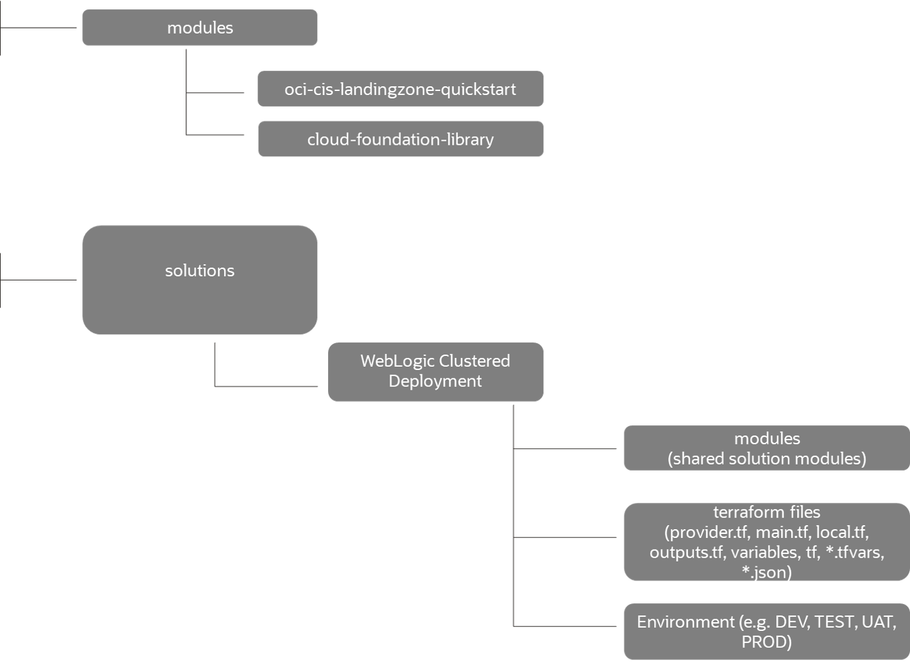

# Terraform PlayBook - WebLogic Clustered Deployment

The solution is written in Terraform, providing deployment of a cluster of WLS ( non-jrf / jrf one ) on top of OCI, with optional Cloud Database: DB on top of ExaCS ,ATP, DBCS.

## Terraform Structure

The structure followed is:

- modules - contain shared modules between different solutions.
    E.g.
       Module for creating a simple instance:
        Name of the folder - *instance* and contains 3 files:
        
    - variables.tf (entry parameters for an instance)
    - instance.tf (terraform API for OCI instance resource)
    - outputs.tf (information about created instance like instance id, instance name, etc.)

- solutions

    - modules - contain shared modules for the solution
    - locals.tf - specify explicit dependencies between resources
    - main.tf - call different modules, locals and data-sources to create all resources
    - variables.tf - declarations of variables used in main.tf
    - outputs.tf - outputs from the resources created in main.tf
    - provider.tf - infrastructure provider parameters, e.g. OCI provider
    - terraform.tfvars - hardcoded values for entry variables from variables.tf

Note: terraform.tfvars, variables.tf can be replaced by a data.json file which allows the input to be entered in JSON format.

## Terraform Coding WebLogic Clustered Deployment

1. Modules - shared between different solutions

   Description: BASIC MODULES which are creating the required OCI resources; can be reused in every terraform solution.
   Oracle offers two types of shared modules in GITHUB:
    - *oci-cis-landingzone-quickstart* - CIS benchmark landing zone modules which are reusable modules to create the OCI landing zone for secure deployment of different solutions.
    - *cloud-foundation-library* - modules that are creating basic OCI resources on top of OCI landing zone, customized using different entry parameters, e.g.: instance, volume, ATP instance, etc.

2. Solutions

  2.1 Modules

   Description: SOLUTION MODULES that combine and call different shared modules from point 1 to generate the desired solution, e.g.: call shared module instance to create a number N of WebLogic instances in a cluster.

  2.2 Terraform files (provider.tf, main.tf, locals.tf, outputs.tf, variables.tf, *.TFVARS, *.JSON)

  2.3 Environment

   Description:
           - Environment folders for specific environments, e.g.: DEV, TEST, UAT, PROD
   Contains:
           - Files (*.TFVARS. *.JSON) with hardcoded parameters values used as an entry for different environments solutions.
           - Copy or Sym Link of the following files: main.tf, provider.tf, locals.tf, outputs.tf, variables.tf

##  Re-creating WebLogic Clustered Deployment Solution

Before re-creating the solution on your side, copy the *cloud-foundation/modules* into your own shared folder for different solutions or take a note of the specific externally URL.
*cloud-fondation/modules* contain all the basic modules, reusable accross all your entire terarform OCI stack.

## Applying the solution

The entire solution is going to be found in *solutions/WebLogic Clustered Deployment* folder.
The solution will provide the landing zone if it doesn't exists and the deployment of a weblogic cluster, optionally on top of cloud database.
For landing zone, it calls / combines *cloud-foundation/modules/oci-cis-landingzone-quickstart* applying specific expected parameters for WebLogic infrastructure.

Instructions:

- Create a folder, e.g. *terraform_code*.
- *GitHub pull* the entire WebLogic Clustered Deployment solution into *terraform_code* folder.
    - git pull .
- Go to your environment folder, e.g. *terraform_code/solutions/WebLogic Clustered Deployment/dev* and copy the *solutions/WebLogic Clustered Deployment* TF files, TFVARS files / JSON files into this folder. You can also create sym links.
- In *terraform_code/solutions/WebLogic Clustered Deployment/dev* :
    - Open the *main.tf* file and verify the *source* parameter of each module to point to the correct path of the github modules (*cloud-foundation/modules* folder path or URL path and *modules* folder path or URL path).
    - Edit *.TFVARS / *.JSON files with the corresponding values for different required parameters.
    - Open a console, hit *terraform init* followed by *terraform apply -autoapprove* for creating the entire solution.
    - See the results of your terraform code in the console output.
