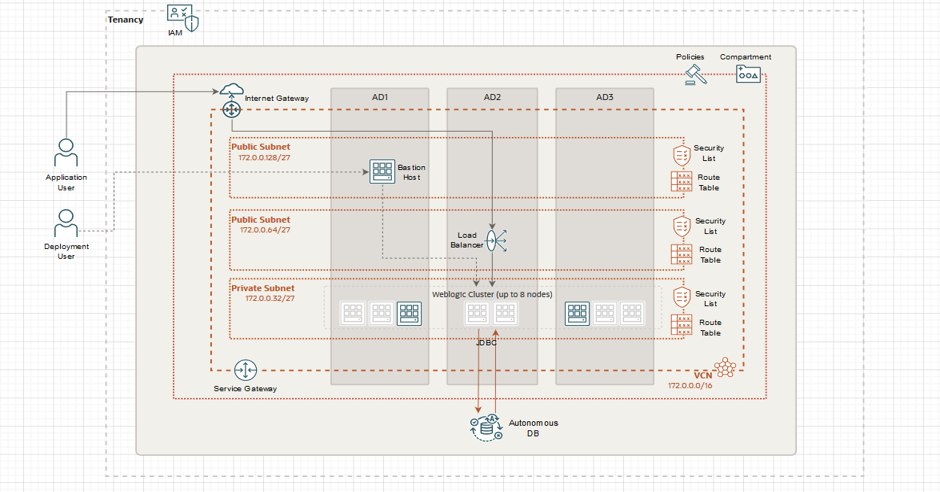

Terraform
-----------------------

OCI Terraform Provider Configuration on Linux and Windows machine -- https://mosemp.us.oracle.com/epmos/faces/DocumentDisplay?_afrLoop=101338705018173&id=2470410.1

Scope
-------

This solution creates single/multi node WLS cluster with ATP DB as INFRA DB optionally fronted by a load balancer.

Solution architecture

Tenancy Authentication Pre-requisites
--------------------

The terraform OCI provider supports API Key based authentication and Instance Principal based authentication.

User needs an OCI account in the tenancy. Here are the authentication information required
for invocation of Terraform scripts.

**Tenancy OCID** - The global identifier for your account, always shown on the bottom of the web console.

**User OCID** - The identifier of the user account you will be using for Terraform

**Fingerprint** - The fingerprint of the public key added in the above user's API Keys section of the web console.

**Private key path** - The path to the private key stored on your computer. The public key portion must be added to the user account above in the API Keys section of the web console.

How to get required keys and ocids -- https://docs.cloud.oracle.com/en-us/iaas/Content/API/Concepts/apisigningkey.htm

Pre-requisites - understanding landing zone information
--------------------------------------------------------

Use this guide to be able to understand the infrastructure (via terraform) for WebLogic Clustered Solution.

Compartments
--------------------

Best practice:

Create/Use a compartment for your project.

    Create/Use a sub-compartment for Networking resources
    Create/Use a sub-compartment for WebLogic Nodes
    Create/Use a sub-compartment to manage your database

Network Infrastructure
----------------------------------

Best practice:

# VCN

    Create/Use VCN for cluster WebLogic deployment added in Networking compartment

# Subnets

    Create/Use a private regional subnet for WebLogic cluster added in Networking compartment (optionally can be a domain level too if needed and must use DNS for hostnames.)
    Create/Use a public regional subnet for frontend balancer (must use DNS for hostnames)
    Optional - Create/Use a private regional subnet for backend balancer

# Gateways

    Create/Use an Internet Gateway
    Create/Use a Service Gateway

# Route Tables

Use the default route table created with your vcn and add/check the following route:

Default Route Table for <your_vcn_name>

Destination   |  Target Type  | Target   |  Description
--------------|---------------|----------|-------------
  0.0.0.0/0   | Internet Gateway| <your_IG_name> |   <optional_description>
  All FRA Services In Oracle Services Network | Service  Gateway  |  <your_SGW_name>  |  <optional_description>

# Network Security Group

For WebLogic network:

Rule Type  |	CIDR and Protocol |	Destination Ports |	Description
-----------|----------------------|-------------------|--------------------
Stateful Ingress |	Your admin network, TCP | 	22    |	SSH access
Stateful Ingress |  Your admin network, TCP |	7001, 7002 |	Admin server ports
Stateful Ingress |	Your admin network, or your load balancer subnet, TCP |	7003, 7004 |	Managed server ports
Stateful Ingress |	Your admin network, or your load balancer subnet, TCP |	9999 or custom redirect port |	App Gateway in Oracle Identity Cloud Service
Stateful Ingress |	Your database network, TCP 	1521 or custom database port |	Database for JRF-enabled domain
Stateful Ingress |	DNS subnet, TCP |	53 |	JRF-enabled domain and database is on a different VCN
Stateful Ingress |	DNS subnet, UDP |	53 |	JRF-enabled domain and database is on a different VCN
Stateful Ingress |	Weblogic subnet, CIDR |	All 	Used for provisioning

For Load Balancer network:

    The NSG must enable inbound access to ports 80 and 443.
    The NSG must enable outbound access to the managed server ports (by default, 7003 and 7004) on the subnet that you plan to use for Oracle WebLogic Server.

For Bastion Service:

    Session must enable inbound access to the SSH port (22).
    Session must enable outbound access to the SSH port (22) on the subnet that you plan to use for Oracle WebLogic Server.

Security
----------------------------------

# Create Vault

    1. Create key & secret for WLS password
    2. Create key & secret for ATP password

# Create 2 dynamics groups

    1. To allow access to resources - principal group

    Matching rules: instance.compartment.id='<your-resources-compartment-id>'

    2. To allow instances to call osms

    Matching rules: instance.compartment.id='<your-resources-compartment-id>'

# Grant relevant vault, key, and secret permissions to dynamic group

    Allow dynamic-group <Your_Instance_Principal_Group> to read secret-bundles in tenancy where target.secret.id = '<OCID_of_wls_password_secret>'
    Allow dynamic-group <Your_Instance_Principal_Group> to read secret-bundles in tenancy where target.secret.id = '<OCID_of_db_password_secret>'
    Allow dynamic-group <Your_Instance_Principal_Group> to read secret-bundles in tenancy where target.secret.id = '<OCID_idcs_password_secret>'

# Grant the relevant network and database permissions to a dynamic group:

    Allow dynamic-group <Your_Instance_Principal_Group> to manage instance-family in compartment <resources_compartment>
    Allow dynamic-group <Your_Instance_Principal_Group> to manage virtual-network-family in compartment <network_compartment>
    Allow dynamic-group <Your_Instance_Principal_Group> to manage volume-family in compartment <resources_compartment>
    Allow dynamic-group <Your_Instance_Principal_Group> to manage load-balancers in compartment <network_compartment>
    Allow dynamic-group <Your_Instance_Principal_Group> to use autonomous-transaction-processing-family in compartment <database_compartment>
    Allow dynamic-group <Your_Instance_Principal_Group> to inspect database-family in compartment <database_compartment>

# Grant the OS Management service:

    Allow dynamic-group <Your_OSMS_Group> use osms-managed-instances in compartment <resources_compartment>
    Allow dynamic-group <OSMS_Group> to read instance-family in compartment <resources_compartment>

# Create SSH key

On a UNIX or UNIX-like platform, use the ssh-keygen utility. For example:

    ssh-keygen -b 2048 -t rsa -f ssh_public_key
    cat ssh_public_key.pub

On a Windows platform, you can use the PuTTY Key Generator utility.

Invoking Terraform
--------------------

### Initialize the terraform provider plugin
$ terraform init

### Invoke apply on terraform using terraform.tfvars file
$ terraform apply

**WLS Non JRF:**
Variable *create_atp_db* should be false and *atp_db_password_ocid* and *atp_db_compartment_id* should not be provided.

**WLS JRF with ATP DB:**
$ terraform apply -var-file=terraform.tfvars
Variable *create_atp_db* should be true and *atp_db_password_ocid* and *atp_db_compartment_id* should be provided.

**Creating Multiple instances from same solutions:**
$ terraform apply -var-file=terraform.tfvars -state=<use unique dir or state file name for each stack>

### To destroy the infrastructure

**WLS Non JRF / JRF with ATP**
$ terraform destroy -var-file=terraform.tfvars
